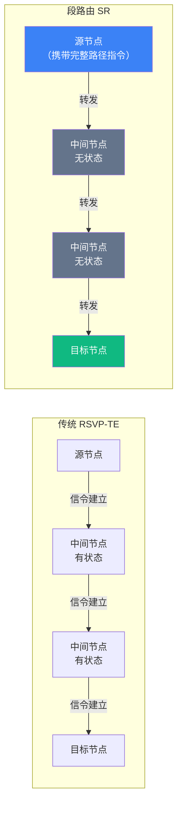
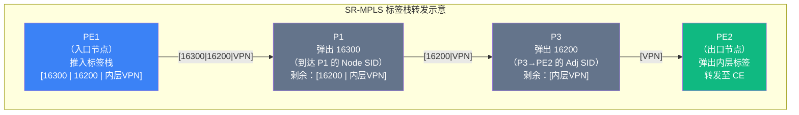
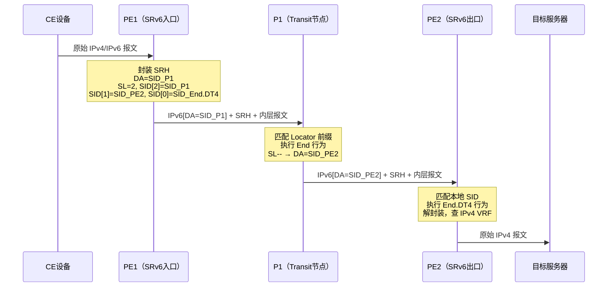
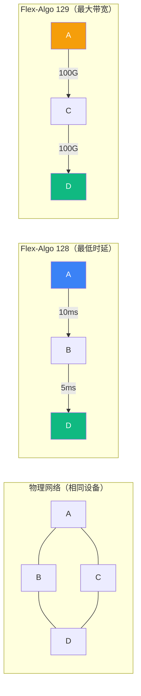
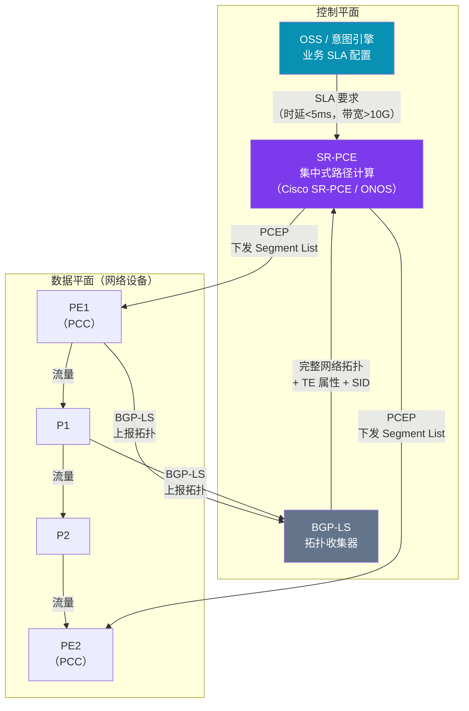

> 📋 **前置知识**：[MPLS技术](/guide/advanced/mpls)、[BGP路由协议](/guide/routing/bgp)、[IPv6基础](/guide/basics/ipv6)
> ⏱️ **阅读时间**：约20分钟

# 段路由：SR-MPLS 与 SRv6 的下一代流量工程

## 导言

传统的流量工程（Traffic Engineering，TE）依赖 RSVP-TE 协议在每一跳维护有状态的路径预留，这在大规模网络中带来了极重的控制平面负担——一旦节点数量增长，状态爆炸（State Explosion）便成为无法回避的工程瓶颈。

段路由（Segment Routing，SR）以"源路由（Source Routing）"为核心哲学，彻底颠覆了这一设计。它让源节点在报文头部编码完整的转发指令序列，而中间节点**无需维护任何路径状态**，仅需执行栈顶指令并弹出标签（或更新指针），即可将报文引导到预定路径。这一设计在保持高度流量工程能力的同时，极大地降低了网络协议的复杂度。

SR 有两种数据面承载方式：
- **SR-MPLS**：复用现有 MPLS 标签栈，平滑演进，适合传统运营商骨干网
- **SRv6**：基于 IPv6 扩展头（Segment Routing Header，SRH），天然融合 IP 网络，向云原生架构靠拢

本文将系统梳理两者的原理差异、控制平面扩展、流量工程能力以及在 5G 传输网与广域网中的实际应用。

---

## 一、段路由的设计哲学

### 1.1 从中间节点有状态到源节点有状态

传统 MPLS-TE 使用 RSVP-TE 信令，沿路径逐跳协商并维护软状态（Soft State）。每条 TE LSP（Label Switched Path）在路径上的每台路由器都存储了 LFIB（Label Forwarding Information Base）条目，节点数量和 LSP 数量呈乘积关系增长。

SR 将状态从网络中心"推"到了边缘：



::: tip 核心优势
SR 彻底消除了对 RSVP-TE 的依赖。中间节点只需支持 IGP 扩展（IS-IS 或 OSPF）和标准 MPLS/IPv6 转发，无需升级信令协议，大大降低了设备和运维成本。
:::

### 1.2 段（Segment）：网络的最小指令单元

"段"是 SR 中的基本抽象单位，每个段代表一个**网络指令**，可以是：

| 段类型 | 英文名称 | 含义 |
|--------|----------|------|
| 节点段 | Node Segment | 将报文路由至指定节点（按最短路径） |
| 邻接段 | Adjacency Segment | 强制从特定接口转发（精确控制链路） |
| 前缀段 | Prefix Segment | 路由至特定前缀 |
| 服务段 | Service Segment | 将报文引导至 VPN、防火墙等增值服务 |

多个段组成**段列表（Segment List）**，从栈顶（最后目的地）按顺序执行，形成一条可编程的显式路径。

---

## 二、SR-MPLS：复用现有 MPLS 基础设施

### 2.1 标签空间与 SRGB

SR-MPLS 使用 MPLS 标签栈承载段列表。每台路由器维护一个 **SRGB（Segment Routing Global Block）**，这是一段保留给 SR 使用的全局标签范围，通常默认为 16000–23999。

节点的 **Node SID（节点段 ID）** 是一个相对于 SRGB 基地址的偏移量（Index）：

```
实际 MPLS 标签 = SRGB 基地址 + Node SID 偏移
例：SRGB = 16000, Node SID = 100 → 标签 = 16100
```

**Adjacency SID（邻接段 ID）** 是本地有效的标签，用于精确指定出接口，数值通常动态分配于 SRGB 之外。

### 2.2 SR-MPLS 转发示例

以下场景中，源节点 PE1 需要将流量沿 PE1→P1→P3→PE2 路径转发（而非最短路径 PE1→P2→PE2）：



::: tip PHP（Penultimate Hop Popping）
倒数第二跳路由器在弹出栈顶标签后，将最后一个标签交由出口节点直接查找 IP FIB，避免两次查表。SR-MPLS 同样支持 PHP 与 Explicit Null 标签选项。
:::

### 2.3 IGP 扩展：IS-IS 与 OSPF SR 扩展

SR-MPLS 通过 IGP 扩展 TLV 分发 SID 信息，无需引入新协议：

- **IS-IS**：SR-Capabilities TLV（2），Prefix-SID sub-TLV，Adjacency-SID sub-TLV
- **OSPF**：Router Information LSA 携带 SR 能力，Extended Prefix/Link Opaque LSA 携带 SID 映射

BGP-LS 可进一步将 IGP 拓扑和 SID 信息上报给 SDN 控制器（如 SR-PCE），实现集中式路径计算。

### 2.4 SR-MPLS 与传统 MPLS-TE 对比

| 维度 | 传统 MPLS-TE（RSVP-TE） | SR-MPLS |
|------|------------------------|---------|
| 信令协议 | RSVP-TE（复杂，有状态） | 无需 RSVP，IGP 扩展即可 |
| 中间节点状态 | 每条 LSP 一个 LFIB 条目 | 仅需全局 SRGB 映射，无路径状态 |
| 可扩展性 | 受限于状态数量 | 高度可扩展 |
| 显式路径 | 受 RSVP 能力限制 | 标签栈深度即路径复杂度 |
| 快速重路由 | FRR 复杂，需预建 LSP | TI-LFA 自动保护，无需额外 LSP |
| 控制平面 | 分布式 + 信令 | 分布式 IGP + 可选 SDN 集中控制 |

---

## 三、SRv6：IPv6 原生的段路由

### 3.1 Segment Routing Header（SRH）

SRv6 将段列表编码到 IPv6 的**扩展头**中，完全复用 IPv6 转发平面，无需 MPLS 标签栈。SRH 结构如下：

```
IPv6 基础头
├─ Next Header: 43（Routing）
├─ Destination Address: 当前活跃 SID（IPv6 地址）
└─ SRH 扩展头
   ├─ Routing Type: 4（SR）
   ├─ Segments Left: 剩余段数（指针，递减）
   ├─ Last Entry: 段列表最大索引
   ├─ Flags / Tag
   └─ Segment List[n..0]（从最后目的地到当前段，倒序排列）
       Segment List[0]: 最终目的地 SID
       Segment List[1]: 倒数第二个 SID
       ...
       Segment List[n]: 首个处理的 SID（当前 IPv6 DA）
```

### 3.2 SID 结构：Locator + Function + Args

SRv6 SID 是一个 128 位的 IPv6 地址，分三个字段：

```
|<----- Locator ------>|<-- Function -->|<--- Args --->|
|  网络位置（可路由）   |  节点行为编码  |  可选参数    |
       /48 或 /64             16位            变长
```

- **Locator**：节点的 IPv6 前缀，网络中可路由，IS-IS/OSPF 通告
- **Function**：指定该 SID 在节点上触发的行为（Endpoint Behavior）
- **Args**：可选参数，如 VPN 标签、流 ID 等

### 3.3 常见 Endpoint 行为

| 行为名称 | 英文缩写 | 描述 |
|----------|----------|------|
| 端点 | End | 更新 SL 指针，更新 DA 为下一个 SID，继续转发 |
| 带出接口的端点 | End.X | 指定下一跳接口（等同 Adjacency SID） |
| IPv4 解封装 | End.DT4 | 解封装并查 IPv4 路由表，用于 L3VPN |
| IPv6 解封装 | End.DT6 | 解封装并查 IPv6 路由表 |
| 带 DT46 | End.DT46 | 同时支持 IPv4/IPv6 解封装 |
| 端点转换 | End.B6.Encaps | 插入 SRH 并封装到 SRv6 隧道 |

### 3.4 SRv6 报文转发流程



### 3.5 SRv6 uSID（微段路由）

标准 SRv6 SID 为 128 位，段列表较长时 SRH 开销显著（每个 SID 16 字节）。**uSID（Micro Segment ID）** 将多个 SID 压缩到单个 128 位地址中，每个 uSID 仅占 16 位（即 /48 Locator + 16 位 uDT）：

```
|<--- 公共前缀 /32 --->|<-uSID1->|<-uSID2->|<-uSID3->|<-uSID4->|
        固定网络前缀       16位      16位       16位       16位
```

uSID 使得一个 IPv6 扩展头可以携带多达 4 个段，大幅压缩报文开销，是 SRv6 规模部署的关键技术。

::: warning SRH 开销注意
在不使用 uSID 的场景中，每增加一个 SID 节点需额外 16 字节头部开销。对于路径较深（超过 5 跳）的 TE 场景，应评估 MTU 限制并考虑部署 uSID 或增大接口 MTU。
:::

---

## 四、SR 流量工程（SR-TE）

### 4.1 显式路径与 Segment List 编程

SR-TE 通过在段列表中**组合 Node SID 与 Adjacency SID**，精确指定流量路径：

- **纯 Node SID 路径**：利用最短路径算法（IGP），允许沿途 ECMP，适合松散约束
- **纯 Adj SID 路径**：精确指定每一跳接口，完全等价于显式路由，适合严格约束
- **混合路径**：Node SID + Adj SID 混合使用，在关键节点精确控制，其余按最短路

### 4.2 Flexible Algorithm（Flex-Algo）

**灵活算法（Flex-Algo）** 允许网络运营商在同一物理网络中定义**多个逻辑拓扑**，每个算法基于不同的度量（时延、带宽、颜色）运行独立的 SPF：



每个 Flex-Algo 有独立的 SID 分配空间，控制器或设备可按业务类型自动选择算法：
- Algo 0：标准 IGP 最短路径（IGP Metric）
- Algo 128：最低时延路径（TE Metric）
- Algo 129：最大可用带宽路径

### 4.3 On-Demand Next Hop（ODN）

**ODN（按需下一跳）** 是 SR-TE 与 BGP 策略的结合。当 PE 节点收到带有颜色（Color）扩展团体的 BGP 路由时，自动触发向 SR-PCE 申请一条满足该颜色约束的 SR-TE Policy，而无需预先配置所有路径。

工作流程：
1. CE 向 PE 宣告前缀，PE 通过 BGP 将该前缀与 Color 扩展团体上报
2. PE 检测到本地没有对应颜色的 SR-TE Policy，向 PCE 发起动态 LSP 请求
3. PCE 计算满足 SLA（如低时延、高带宽）的显式路径，下发 Segment List
4. PE 使用该 SR-TE Policy 作为指向该前缀的下一跳

这实现了**业务驱动的自动路径编程**，是 SD-WAN 和 5G 切片 TE 的核心技术。

### 4.4 PCE 集中式路径计算架构

**PCE（Path Computation Element，路径计算单元）** 作为 SR-TE 的"大脑"，通过 PCEP（PCE Communication Protocol）与路由器交互：



**PCE 工作模式**：
- **有状态 PCE（Stateful PCE）**：实时感知网络中所有 LSP 状态，可主动优化路径
- **被动 PCE（Passive Stateful）**：仅响应 PCC 请求，不主动修改路径
- **PCE 委托（Delegation）**：PCC 将 LSP 控制权委托给 PCE，由 PCE 全权管理

::: tip PCEP 与 BGP-SR-Policy
除 PCEP 外，PCE 也可通过 **BGP SR-Policy**（RFC 9256）向 PE 下发策略，兼容 BGP 路由反射器架构，更适合大规模部署场景。
:::

---

## 五、TI-LFA：SR 原生快速重路由

**拓扑无关无环备份（Topology-Independent Loop-Free Alternate，TI-LFA）** 是 SR 生态中的快速保护机制，相比传统 LFA/RLFA，它能在任意拓扑下实现 50ms 以内的故障切换。

TI-LFA 的工作原理：
1. 节点基于 SPF 计算**当前路径（P-space）**和**故障后路径（Q-space）**
2. 寻找 P-space 和 Q-space 之间的"修复隧道（Repair Tunnel）"
3. 用 SR Segment List 精确编码该修复路径，预置于设备 FIB 中
4. 检测到故障时，本地切换，无需通知邻居，毫秒级生效

::: warning TI-LFA 标签深度
修复隧道的 Segment List 深度取决于网络拓扑，最差情况下可能需要 3 层标签。部分老旧设备对标签栈深度有限制（通常 ≤ 16 层），规划时需确认设备能力。
:::

---

## 六、应用场景

### 6.1 5G 传输网（FlexE 切片）

5G 网络对传输层提出了严格的切片隔离和时延保障要求。SR 结合 FlexE（Flexible Ethernet）实现硬切片：

- **FlexE**：在物理层切分以太网带宽，实现物理隔离的切片通道
- **SR Flex-Algo**：在 IP/MPLS 层按切片定义独立拓扑和路径策略
- **SRv6 + Network Slicing**：每个切片使用不同 SRv6 SID 空间，携带切片 ID（Slice ID）

典型部署：接入层 FlexE 硬切片 + 核心层 SRv6 Flex-Algo 软切片，满足 eMBB、uRLLC、mMTC 不同 SLA。

### 6.2 广域网 TE 优化

运营商骨干网使用 SR-TE + ODN 替代传统 MPLS-TE，典型收益：

| 指标 | 传统 RSVP-TE | SR-TE |
|------|-------------|-------|
| 路径建立时间 | 数秒（信令往返） | 毫秒级（本地计算） |
| 控制平面消息 | O(LSP × 节点) | 极少（仅 IGP 扩展） |
| 路径调整 | 需重路由信令 | PCE 直接下发新 Segment List |
| 多路径 ECMP | 有限 | SR Candidate Path 支持灵活 ECMP |
| 运维复杂度 | 高（RSVP 排障困难） | 低（IGP 拓扑透明） |

### 6.3 数据中心 Underlay

在大规模数据中心，SRv6 作为 Underlay 承载 VxLAN/EVPN 流量：

- 服务器直接生成 SRv6 封装，路径可编程（SmartNIC/DPU 实现）
- 数据中心节点零配置，仅需支持基础 IPv6 转发
- 结合 SRv6 APN（Application-aware Networking）实现应用感知路由

::: danger 互通性注意
SR-MPLS 与 SRv6 的互通需要边界节点执行封装转换（SRv6 to SR-MPLS Mapping）。跨域场景下，应提前规划 SID 映射策略和 BGP-EPE（Egress Peer Engineering）策略，避免路径可见性缺失。
:::

---

## 七、SR 部署最佳实践

### 7.1 SRGB 规划

- 全网统一 SRGB 范围（避免标签冲突）
- Node SID 分配留出扩展余量（建议按 PoP 分段分配）
- Adjacency SID 由设备动态分配，无需统一规划

### 7.2 SRv6 Locator 规划

- Locator 前缀长度建议 /48（为 Function 留 16 位）
- 各节点 Locator 应在同一父前缀下，便于路由聚合
- uSID 部署需统一公共前缀（/32）和 uSID Block（/48）

### 7.3 控制器选型

| 控制器 | 开源/商业 | 特点 |
|--------|----------|------|
| Cisco SR-PCE | 商业 | 深度集成 IOS-XR，支持 ODN |
| ONOS + TAPI | 开源 | 多厂商，适合运营商 SDN |
| OpenDaylight Transportpce | 开源 | 支持 NETCONF/YANG 抽象 |
| Nokia NSP | 商业 | 5G 传输端到端方案 |

### 7.4 渐进迁移策略

::: tip 迁移路径建议
1. **阶段一**：在现有 IGP 中启用 SR 扩展（IS-IS/OSPF SR），分配 Node SID，观察收敛
2. **阶段二**：部署 TI-LFA，替换传统 LDP FRR，验证快速保护
3. **阶段三**：引入 SR-TE Policy，先用于新增业务，保留 RSVP-TE 并行
4. **阶段四**：逐步将 RSVP-TE LSP 迁移至 SR-TE，最终退出 RSVP
5. **阶段五（可选）**：SRv6 引入，用于新建数据中心或 5G 传输专网
:::

---

## 八、知识总结

段路由（SR）并非一场革命，而是一次深思熟虑的**简化**：它继承了流量工程对路径可控性的追求，却抛弃了中间节点有状态带来的复杂性。

| 维度 | SR-MPLS | SRv6 |
|------|---------|------|
| 数据面 | MPLS 标签栈 | IPv6 + SRH 扩展头 |
| 互通性 | 兼容现有 MPLS 设备 | 需支持 SRH 处理 |
| 头部开销 | 每 SID 4 字节 | 每 SID 16 字节（uSID 可压缩） |
| 编程能力 | SID 语义固定 | Function/Args 灵活扩展 |
| 适用场景 | 传统骨干网演进 | 云原生、5G、数据中心新建 |
| 标准化进展 | RFC 8402、RFC 8660 | RFC 8754、RFC 8986、RFC 9252 |

对于企业架构师而言，选择 SR-MPLS 还是 SRv6，本质上是**演进与重建的抉择**：已有大量 MPLS 投资的运营商优先考虑 SR-MPLS 平滑迁移；绿地（Greenfield）新建网络或 5G 传输专网则更适合直接采用 SRv6，享受更大的可编程空间。

---

## 扩展阅读

- [RFC 8402](https://www.rfc-editor.org/rfc/rfc8402) — Segment Routing Architecture
- [RFC 8660](https://www.rfc-editor.org/rfc/rfc8660) — Segment Routing with MPLS Data Plane
- [RFC 8754](https://www.rfc-editor.org/rfc/rfc8754) — IPv6 Segment Routing Header (SRH)
- [RFC 8986](https://www.rfc-editor.org/rfc/rfc8986) — Segment Routing over IPv6 (SRv6) Network Programming
- [RFC 9252](https://www.rfc-editor.org/rfc/rfc9252) — BGP Overlay Services Based on Segment Routing over IPv6 (SRv6)
- [IETF SPRING WG](https://datatracker.ietf.org/wg/spring/documents/) — Source Packet Routing in Networking
