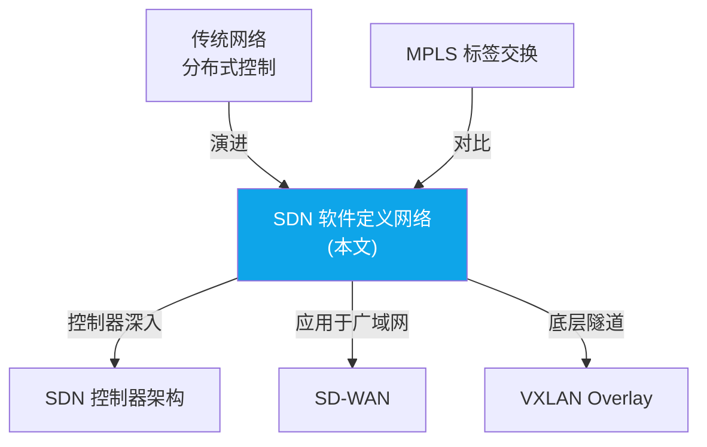

> 📋 **前置知识**：[IP 寻址与路由](/guide/basics/routing)、[网络拓扑详解](/guide/architecture/topology)
> ⏱️ **阅读时间**：约 12 分钟

# SDN 软件定义网络：网络控制的革命

## 导言

软件定义网络（Software-Defined Networking, SDN）代表了网络架构的根本性变革。它将网络控制从分布在每个交换机和路由器的硬件中解耦出来，集中到一个逻辑上集中的软件控制器中。

这种架构分离为网络带来了前所未有的可编程性、灵活性和创新能力。

---

## SDN 的核心概念

### 控制面与数据面分离

<RoughDiagram 
  title="传统网络 vs SDN 架构对比" 
  :width="800" 
  :height="400" 
  :elements="[
    { type: 'text', x: 200, y: 30, text: '传统网络架构' },
    { type: 'text', x: 600, y: 30, text: 'SDN 网络架构' },
    { type: 'rectangle', x: 100, y: 60, width: 200, height: 100, options: { fill: '#ef4444', fillStyle: 'hachure' } },
    { type: 'text', x: 200, y: 90, text: '交换机/路由器' },
    { type: 'text', x: 200, y: 110, text: '控制面+数据面' },
    { type: 'text', x: 200, y: 125, text: '(紧耦合)' },
    { type: 'rectangle', x: 100, y: 180, width: 200, height: 100, options: { fill: '#ef4444', fillStyle: 'hachure' } },
    { type: 'text', x: 200, y: 210, text: '交换机/路由器' },
    { type: 'text', x: 200, y: 230, text: '控制面+数据面' },
    { type: 'text', x: 200, y: 245, text: '(紧耦合)' },
    { type: 'rectangle', x: 500, y: 60, width: 200, height: 80, options: { fill: '#3b82f6', fillStyle: 'cross-hatch' } },
    { type: 'text', x: 600, y: 85, text: 'SDN 控制器' },
    { type: 'text', x: 600, y: 105, text: '(集中控制面)' },
    { type: 'rectangle', x: 450, y: 200, width: 120, height: 60, options: { fill: '#10b981', fillStyle: 'dots' } },
    { type: 'text', x: 510, y: 225, text: '交换机1' },
    { type: 'text', x: 510, y: 240, text: '数据面' },
    { type: 'rectangle', x: 580, y: 200, width: 120, height: 60, options: { fill: '#10b981', fillStyle: 'dots' } },
    { type: 'text', x: 640, y: 225, text: '交换机2' },
    { type: 'text', x: 640, y: 240, text: '数据面' },
    { type: 'line', x: 550, y: 140, x2: 510, y2: 200, options: { stroke: '#8b5cf6', strokeWidth: 3 } },
    { type: 'line', x: 650, y: 140, x2: 640, y2: 200, options: { stroke: '#8b5cf6', strokeWidth: 3 } },
    { type: 'text', x: 525, y: 170, text: 'OpenFlow' },
    { type: 'text', x: 655, y: 170, text: 'Protocol' }
  ]"
/>

**传统网络的问题：**
- **紧耦合**：每个设备独立做控制决策
- **分布式复杂性**：难以实现一致的全局策略
- **厂商锁定**：专有协议和接口限制创新
- **手工配置**：网络变更缓慢且易出错

**SDN 的解决方案：**
- **解耦架构**：控制逻辑集中化，转发功能标准化
- **全局视图**：控制器拥有整个网络的完整拓扑
- **开放接口**：标准化的南向和北向 API
- **可编程性**：通过软件快速实现网络功能

### SDN 的核心组件

<RoughDiagram 
  title="SDN 三层架构模型" 
  :width="700" 
  :height="450" 
  :elements="[
    { type: 'rectangle', x: 50, y: 50, width: 600, height: 80, options: { fill: '#8b5cf6', fillStyle: 'solid' } },
    { type: 'text', x: 200, y: 75, text: '应用层 (Application Layer)' },
    { type: 'text', x: 200, y: 95, text: '网络应用和服务' },
    { type: 'text', x: 450, y: 75, text: '• 负载均衡  • 防火墙' },
    { type: 'text', x: 450, y: 95, text: '• 路由优化  • 监控' },
    { type: 'text', x: 100, y: 115, text: 'REST API' },
    { type: 'line', x: 50, y: 130, x2: 650, y2: 130, options: { stroke: '#374151', strokeWidth: 2 } },
    { type: 'rectangle', x: 50, y: 150, width: 600, height: 80, options: { fill: '#3b82f6', fillStyle: 'cross-hatch' } },
    { type: 'text', x: 200, y: 175, text: '控制层 (Control Layer)' },
    { type: 'text', x: 200, y: 195, text: 'SDN 控制器' },
    { type: 'text', x: 450, y: 175, text: '• 网络拓扑管理' },
    { type: 'text', x: 450, y: 195, text: '• 路径计算和流表下发' },
    { type: 'text', x: 100, y: 215, text: 'OpenFlow/NETCONF' },
    { type: 'line', x: 50, y: 230, x2: 650, y2: 230, options: { stroke: '#374151', strokeWidth: 2 } },
    { type: 'rectangle', x: 50, y: 250, width: 600, height: 80, options: { fill: '#10b981', fillStyle: 'hachure' } },
    { type: 'text', x: 200, y: 275, text: '基础设施层 (Infrastructure Layer)' },
    { type: 'text', x: 200, y: 295, text: '物理和虚拟网络设备' },
    { type: 'text', x: 450, y: 275, text: '• OpenFlow 交换机' },
    { type: 'text', x: 450, y: 295, text: '• 虚拟交换机 (vSwitch)' },
    { type: 'line', x: 350, y: 130, x2: 350, y2: 150, options: { stroke: '#f59e0b', strokeWidth: 3 } },
    { type: 'line', x: 350, y: 230, x2: 350, y2: 250, options: { stroke: '#f59e0b', strokeWidth: 3 } },
    { type: 'text', x: 360, y: 140, text: '北向API' },
    { type: 'text', x: 360, y: 240, text: '南向API' }
  ]"
/>

### OpenFlow 协议深度解析

OpenFlow 是 SDN 最重要的南向协议，定义了控制器与交换机之间的通信规范。

<WideTable 
  title="OpenFlow 协议关键概念详解" 
  :headers="['概念', '定义', '作用', '技术细节']"
  :rows="[
    ['Flow Entry 流表项', '转发规则的最小单位', '定义数据包的匹配条件和处理动作', '包含匹配字段、动作集合、优先级、超时时间等'],
    ['Match Fields 匹配字段', '用于识别数据包的特征字段', '支持L2-L4的精确匹配', '源/目的MAC、IP、端口号、VLAN ID、协议类型等'],
    ['Actions 动作集合', '对匹配数据包执行的操作', '控制数据包的转发行为', 'OUTPUT、DROP、SET_FIELD、PUSH/POP_VLAN等'],
    ['Flow Table 流表', '存储流表项的数据结构', '按优先级顺序处理数据包', '支持多级流表，通过GOTO实现流表间跳转'],
    ['Controller 控制器连接', 'OpenFlow控制器的管理通道', '下发流表和接收packet-in消息', '基于TCP连接，支持TLS加密和多控制器']
  ]"
  :columnWidths="['20%', '25%', '25%', '30%']"
/>

### SDN 控制器架构

<RoughDiagram 
  title="SDN 控制器内部架构" 
  :width="750" 
  :height="400" 
  :elements="[
    { type: 'rectangle', x: 50, y: 50, width: 650, height: 60, options: { fill: '#8b5cf6', fillStyle: 'dots' } },
    { type: 'text', x: 200, y: 70, text: '北向API接口' },
    { type: 'text', x: 500, y: 70, text: 'REST API, Intent API, 自定义API' },
    { type: 'rectangle', x: 50, y: 130, width: 200, height: 100, options: { fill: '#ef4444', fillStyle: 'hachure' } },
    { type: 'text', x: 150, y: 160, text: '网络应用层' },
    { type: 'text', x: 150, y: 175, text: '• 路由应用' },
    { type: 'text', x: 150, y: 190, text: '• 负载均衡' },
    { type: 'text', x: 150, y: 205, text: '• 安全策略' },
    { type: 'rectangle', x: 270, y: 130, width: 200, height: 100, options: { fill: '#f59e0b', fillStyle: 'zigzag' } },
    { type: 'text', x: 370, y: 160, text: '核心服务层' },
    { type: 'text', x: 370, y: 175, text: '• 拓扑管理' },
    { type: 'text', x: 370, y: 190, text: '• 状态管理' },
    { type: 'text', x: 370, y: 205, text: '• 路径计算' },
    { type: 'rectangle', x: 490, y: 130, width: 200, height: 100, options: { fill: '#10b981', fillStyle: 'cross-hatch' } },
    { type: 'text', x: 590, y: 160, text: '平台服务层' },
    { type: 'text', x: 590, y: 175, text: '• 集群管理' },
    { type: 'text', x: 590, y: 190, text: '• 数据存储' },
    { type: 'text', x: 590, y: 205, text: '• 事件处理' },
    { type: 'rectangle', x: 50, y: 250, width: 650, height: 60, options: { fill: '#3b82f6', fillStyle: 'solid' } },
    { type: 'text', x: 200, y: 270, text: '南向API接口' },
    { type: 'text', x: 500, y: 270, text: 'OpenFlow, NETCONF, OVSDB, P4Runtime' },
    { type: 'rectangle', x: 50, y: 330, width: 650, height: 50, options: { fill: '#6b7280', fillStyle: 'hachure' } },
    { type: 'text', x: 375, y: 350, text: '网络设备 (交换机、路由器、虚拟设备)' }
  ]"
/>

---

## SDN 的关键技术

### 流表处理机制

**流表匹配过程：**

1. **包解析**：交换机解析收到的数据包，提取匹配字段
2. **流表查找**：按优先级顺序在流表中查找匹配项
3. **动作执行**：执行匹配流表项定义的动作集合
4. **统计更新**：更新流表项的包计数和字节计数

<WideTable 
  title="OpenFlow 流表处理流程详解" 
  :headers="['步骤', '操作', '技术实现', '性能影响']"
  :rows="[
    ['1. 包接收', '数据包到达入口端口', '硬件解析数据包头部', '硬件线速处理'],
    ['2. 字段提取', '提取匹配所需的包头字段', 'TCAM/哈希表查找', '纳秒级延迟'],
    ['3. 流表匹配', '在多级流表中查找匹配项', '并行管道处理', '单次查找<100ns'],
    ['4. 动作处理', '执行匹配项的动作集合', '硬件动作引擎', '线速转发'],
    ['5. 统计更新', '更新流表项和端口统计', '计数器递增', '无性能影响'],
    ['6. 包转发', '根据动作转发或丢弃数据包', '硬件转发引擎', '线速输出']
  ]"
  :columnWidths="['15%', '25%', '30%', '30%']"
/>

### 控制器高可用架构

<RoughDiagram 
  title="多控制器集群架构" 
  :width="800" 
  :height="350" 
  :elements="[
    { type: 'rectangle', x: 150, y: 50, width: 150, height: 80, options: { fill: '#3b82f6', fillStyle: 'cross-hatch' } },
    { type: 'text', x: 225, y: 85, text: 'Master Controller' },
    { type: 'text', x: 225, y: 105, text: '主控制器' },
    { type: 'rectangle', x: 350, y: 50, width: 150, height: 80, options: { fill: '#f59e0b', fillStyle: 'dots' } },
    { type: 'text', x: 425, y: 85, text: 'Slave Controller' },
    { type: 'text', x: 425, y: 105, text: '备份控制器' },
    { type: 'rectangle', x: 550, y: 50, width: 150, height: 80, options: { fill: '#f59e0b', fillStyle: 'dots' } },
    { type: 'text', x: 625, y: 85, text: 'Slave Controller' },
    { type: 'text', x: 625, y: 105, text: '备份控制器' },
    { type: 'line', x: 300, y: 90, x2: 350, y2: 90 },
    { type: 'line', x: 500, y: 90, x2: 550, y2: 90 },
    { type: 'text', x: 320, y: 80, text: '状态同步' },
    { type: 'text', x: 520, y: 80, text: '状态同步' },
    { type: 'rectangle', x: 100, y: 200, width: 120, height: 80, options: { fill: '#10b981', fillStyle: 'hachure' } },
    { type: 'text', x: 160, y: 235, text: 'OpenFlow' },
    { type: 'text', x: 160, y: 250, text: 'Switch 1' },
    { type: 'rectangle', x: 250, y: 200, width: 120, height: 80, options: { fill: '#10b981', fillStyle: 'hachure' } },
    { type: 'text', x: 310, y: 235, text: 'OpenFlow' },
    { type: 'text', x: 310, y: 250, text: 'Switch 2' },
    { type: 'rectangle', x: 400, y: 200, width: 120, height: 80, options: { fill: '#10b981', fillStyle: 'hachure' } },
    { type: 'text', x: 460, y: 235, text: 'OpenFlow' },
    { type: 'text', x: 460, y: 250, text: 'Switch 3' },
    { type: 'rectangle', x: 550, y: 200, width: 120, height: 80, options: { fill: '#10b981', fillStyle: 'hachure' } },
    { type: 'text', x: 610, y: 235, text: 'OpenFlow' },
    { type: 'text', x: 610, y: 250, text: 'Switch 4' },
    { type: 'line', x: 225, y: 130, x2: 160, y2: 200, options: { stroke: '#ef4444', strokeWidth: 3 } },
    { type: 'line', x: 225, y: 130, x2: 310, y2: 200, options: { stroke: '#ef4444', strokeWidth: 3 } },
    { type: 'line', x: 425, y: 130, x2: 460, y2: 200, options: { stroke: '#6b7280', strokeWidth: 2 } },
    { type: 'line', x: 625, y: 130, x2: 610, y2: 200, options: { stroke: '#6b7280', strokeWidth: 2 } },
    { type: 'text', x: 180, y: 165, text: 'Active' },
    { type: 'text', x: 440, y: 165, text: 'Standby' }
  ]"
/>

### Intent-Based Networking (IBN)

Intent-Based Networking 是 SDN 发展的高级阶段，它允许网络管理员通过声明式的意图（Intent）而不是命令式的配置来管理网络。

<WideTable 
  title="传统配置 vs Intent-Based 配置对比" 
  :headers="['对比维度', '传统配置方式', 'Intent-Based 方式', '优势']"
  :rows="[
    ['配置方式', '命令式配置 告诉网络<strong>如何做</strong>', '声明式意图 告诉网络<strong>想要什么</strong>', '抽象层次更高，易于理解'],
    ['配置示例', '<code>ip route add 192.168.1.0/24 via 10.0.0.1</code>', '<code>connect[app=web, tenant=A] to [app=db, tenant=A]</code>', '业务导向的配置'],
    ['错误处理', '手动检测和修复配置错误', '自动验证意图实现，自动修复偏差', '自愈能力强'],
    ['变更管理', '逐设备手动配置变更', '修改意图，系统自动计算并执行变更', '变更风险低'],
    ['合规性检查', '定期人工审计配置合规性', '持续自动验证网络状态符合意图', '实时合规保障'],
    ['可视化程度', '复杂的设备配置文件', '直观的业务策略可视化', '管理复杂度大幅降低']
  ]"
  :columnWidths="['18%', '28%', '28%', '26%']"
/>

---

## SDN 的实际应用

### 数据中心网络

**传统数据中心网络的挑战：**
- 东西向流量爆炸式增长
- 虚拟机动态迁移需求
- 多租户隔离要求
- 负载均衡和流量工程复杂性

**SDN 在数据中心的应用：**

<WideTable 
  title="SDN 数据中心应用场景" 
  :headers="['应用场景', '传统方案痛点', 'SDN 解决方案', '技术实现']"
  :rows="[
    ['虚拟机迁移', '需要重新配置网络 VLAN 扩展复杂', '自动网络策略跟随 无感知迁移', 'OpenFlow 动态流表更新 集中式 MAC 学习'],
    ['多租户网络隔离', 'VLAN 数量限制 (4094) 配置管理复杂', '软件定义的虚拟网络 灵活的隔离策略', 'VXLAN/GRE 隧道 基于流表的精确隔离'],
    ['负载均衡', '专用硬件设备 扩展性受限', '分布式软件负载均衡 弹性扩容', 'ECMP + 一致性哈希 动态权重调整'],
    ['流量工程', '基于OSPF/BGP权重 粗粒度控制', '基于应用的精确流控 实时流量调度', '细粒度流分类 多路径选择算法'],
    ['网络监控', '被动监控 故障后响应', '主动监控 预防性维护', 'sFlow/NetFlow 集成 实时性能分析']
  ]"
  :columnWidths="['20%', '25%', '25%', '30%']"
/>

### 广域网优化

SDN 在广域网中的应用主要体现在 SD-WAN 解决方案中，它将 SDN 的理念扩展到企业的分支网络连接。

### 网络虚拟化

**网络虚拟化的核心技术：**

1. **隧道技术**：VXLAN、GRE、STT
2. **虚拟交换机**：Open vSwitch、VMware vSphere Distributed Switch
3. **网络控制器**：OpenDaylight、ONOS、VMware NSX

---

## SDN 的挑战与局限

### 性能挑战

<WideTable 
  title="SDN 性能挑战分析" 
  :headers="['性能维度', '潜在问题', '影响程度', '解决方案']"
  :rows="[
    ['控制器延迟', '首包处理需要控制器介入', '中等 (首包延迟 10-50ms)', '流表预下发 本地智能缓存'],
    ['控制器性能瓶颈', '大规模网络的控制器处理能力', '高 (影响网络扩展性)', '控制器集群 负载分担'],
    ['OpenFlow 处理开销', 'TCAM 资源限制 复杂匹配规则', '中等 (影响转发性能)', '流表优化算法 硬件加速'],
    ['网络可靠性', '控制器单点故障风险', '高 (影响网络稳定性)', '多控制器热备 快速故障切换'],
    ['规模扩展性', '大型网络的状态同步开销', '高 (限制网络规模)', '分层控制架构 域间协调']
  ]"
  :columnWidths="['20%', '30%', '25%', '25%']"
/>

### 安全考虑

SDN 带来新的安全挑战：

1. **控制器安全**：控制器成为攻击的重点目标
2. **控制通道安全**：OpenFlow 通信需要加密保护
3. **应用安全**：恶意应用可能危害整个网络
4. **策略一致性**：确保安全策略在整个网络中一致执行

---

## 主要的 SDN 控制器平台

### OpenDaylight (ODL)

**特点：**
- Linux Foundation 主导的开源项目
- 模块化架构，插件式扩展
- 支持多种南向协议
- 企业级功能丰富

**架构模块：**

<WideTable 
  title="OpenDaylight 核心模块" 
  :headers="['模块名称', '功能描述', '技术实现', '应用场景']"
  :rows="[
    ['MD-SAL', '模型驱动的服务抽象层', 'YANG 模型定义 数据树存储', '模块间通信 数据一致性'],
    ['NETCONF', '网络配置协议支持', 'RFC 6241 实现 YANG 数据模型', '设备配置管理 状态监控'],
    ['OpenFlow Plugin', 'OpenFlow 协议栈', 'OF 1.0-1.5 支持 多版本兼容', '流表管理 设备控制'],
    ['OVSDB', 'Open vSwitch 管理', 'OVSDB 协议实现 虚拟交换机控制', '虚拟化环境 云网络管理'],
    ['LISP Flow Mapping', 'LISP 协议映射服务', '标识符到定位符映射 分布式缓存', '网络虚拟化 移动性支持'],
    ['Group Policy', '基于组的策略管理', '声明式策略模型 自动策略渲染', '多租户网络 安全策略']
  ]"
  :columnWidths="['20%', '25%', '25%', '30%']"
/>

### ONOS (Open Network Operating System)

**特点：**
- 运营商级的性能和可靠性
- 分布式核心架构
- 强一致性数据存储
- 丰富的北向应用生态

### 商业控制器方案

**主要厂商和产品：**
- **Cisco ACI**：应用中心化基础设施
- **VMware NSX**：网络虚拟化和安全平台
- **Juniper Contrail**：云网络平台
- **Huawei Agile Controller**：敏捷网络控制器

---

## SDN 的发展趋势

### 云原生 SDN

随着容器和 Kubernetes 的普及，SDN 正在向云原生方向演进：

1. **容器网络接口 (CNI)**：标准化容器网络插件
2. **服务网格 (Service Mesh)**：应用层的 SDN
3. **eBPF 技术**：内核级的可编程网络

### 边缘计算与 SDN

边缘计算场景对 SDN 提出新要求：
- **低延迟控制**：毫秒级的控制响应
- **分布式智能**：边缘节点的自主决策能力
- **云边协同**：中心云与边缘的协调控制

### AI/ML 增强的 SDN

人工智能技术与 SDN 的结合：
- **智能路由**：基于 ML 的路径预测和优化
- **异常检测**：网络异常的自动识别
- **自动调优**：网络参数的动态优化
- **预测性维护**：故障预测和预防性处置

---

## 总结与实践建议

### SDN 适用场景

<WideTable 
  title="SDN 实施场景评估" 
  :headers="['场景类型', '适用度', '关键收益', '实施建议']"
  :rows="[
    ['数据中心网络', '★★★★★', '动态资源调度 多租户隔离 自动化运维', '从叶脊架构开始 逐步引入 SDN 控制'],
    ['企业园区网', '★★★☆☆', '策略统一管理 网络可视化 安全增强', '混合部署 渐进式迁移'],
    ['分支网络连接', '★★★★☆', '成本降低 敏捷部署 集中管控', '采用 SD-WAN 方案 云化控制器'],
    ['运营商网络', '★★★☆☆', 'NFV 支撑 服务创新 网络切片', '从边缘开始 核心网逐步演进'],
    ['云网络服务', '★★★★★', '弹性扩缩容 资源池化 服务自动化', '原生云设计 微服务架构']
  ]"
  :columnWidths="['25%', '15%', '30%', '30%']"
/>

### 实施路线图

1. **评估阶段**（1-2 个月）
   - 现网架构分析
   - SDN 需求评估
   - 技术方案选型

2. **试点阶段**（3-6 个月）
   - 小规模 POC 验证
   - 性能和功能测试
   - 运维流程适配

3. **推广阶段**（6-12 个月）
   - 分区域分批部署
   - 应用迁移和适配
   - 监控和优化

4. **优化阶段**（持续）
   - 网络性能调优
   - 新功能开发
   - 运维自动化完善

SDN 代表了网络技术的未来发展方向，但成功实施需要充分的规划、合适的技术选型和循序渐进的部署策略。

## 与其他技术的关系

*SDN 是从传统分布式网络向集中化、可编程网络演进的关键一步，也是理解 SD-WAN 的前置知识。*

## 总结与下一步

| 维度 | 要点 |
|------|------|
| 核心价值 | 控制面与数据面分离，实现网络可编程化和集中管理 |
| 适用场景 | 数据中心网络、云计算平台、大规模网络自动化 |
| 局限性 | 控制器单点风险、南向接口标准化不足、传统设备兼容问题 |

> 📖 **下一步学习**：[SDN 控制器架构](/guide/sdn/controllers) — 深入了解 SDN 的"大脑"如何实现与选型