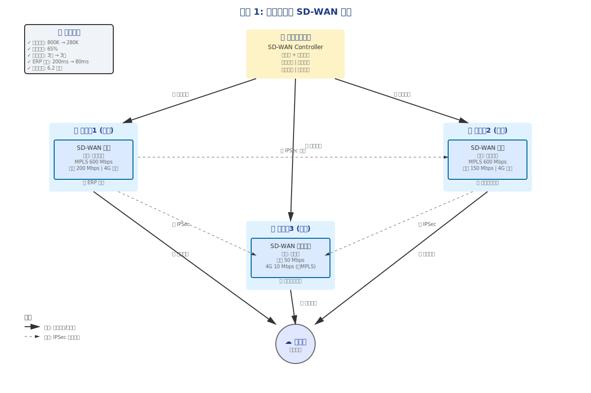
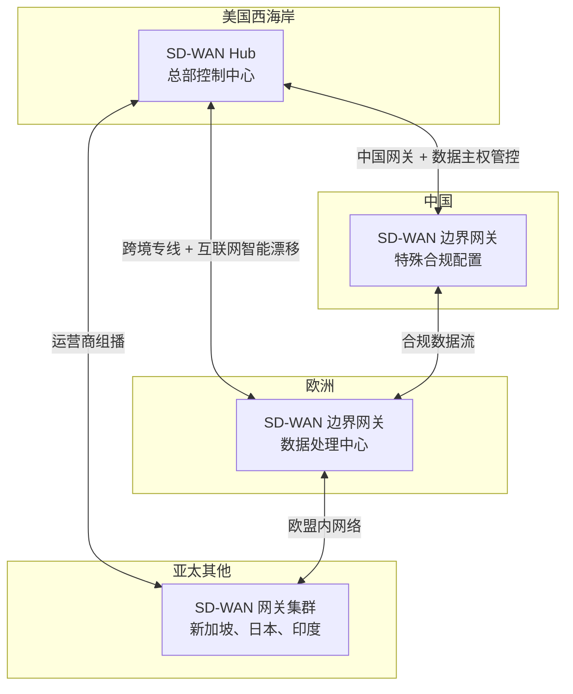

<ConceptMap id="sdwan-case" />

> <Icon name="clipboard-list" color="cyan" /> **前置知识**：[SD-WAN 概念与价值](/guide/sdwan/concepts)、[SD-WAN 架构设计](/guide/sdwan/architecture)
> ⏱ **阅读时间**：约 20 分钟

# SD-WAN 实战案例：真实企业场景深度分析

## 导言

理论的力量在于应用。这一章通过三个真实企业场景，展示 SD-WAN 如何==解决实际问题==，带来业务和技术的双重价值。

---

## 案例 1：制造业集团的成本优化与敏捷扩展

### 企业背景

**企业概况**：
- 名称：某大型制造业集团（匿名化处理）
- 规模：全国 50 个工厂和分支机构
- 员工：5000+ 人
- 主要业务：汽车零部件制造、ERP 系统应用

**网络现状**：
```
总部（苏州）
  ├─ MPLS VPN 连接 50 个工厂 ← 年费 800 万元
  ├─ 所有业务流量回源（Hair Pinning）
  └─ 新工厂部署周期：3-4 周
```

### 核心痛点

#### 1. **成本压力（IT 部门的噩梦）**

- **MPLS 月费用分布**：
  ```
  总部 <-> 大工厂（500 Mbps）：20,000 元/月 × 5 个 = 100,000 元
  总部 <-> 中等工厂（200 Mbps）：10,000 元/月 × 15 个 = 150,000 元
  总部 <-> 小工厂（50 Mbps）：5,000 元/月 × 30 个 = 150,000 元
  ────────────────────────────────────────────────
  总计：800,000 元/月（年费 960 万元）
  ```

- 问题：
  - 专线带宽划分死板，不能根据业务高峰动态调整
  - 小工厂虽然人少，却要为专线支付固定费用
  - 设备折旧、维护也是笔大开支

#### 2. **业务性能问题**

- **ERP 系统响应缓慢**：
  ```
  场景：小工厂需要查询库存，拉取数据库结果
  
  传统做法（Hair Pinning）：
  小工厂 --ERP请求--> 总部数据库
  总部 --响应--> 小工厂
  往返延迟：200ms+ （带宽时常饱和）
  员工感受：系统卡顿、效率低下
  ```

- 互联网应用无法发挥作用：
  - OA 系统、邮件、IM 都被迫走 MPLS
  - 影响用户体验，也浪费了 MPLS 带宽

#### 3. **扩展能力不足（新工厂上线困难）**

- 新工厂部署流程：
  ```
  第1周：填写网络申请单 → IT 审批
  第2周：运营商线路安装 （运营商排队...）
  第3周：网络设备配置 → 测试
  第4周：才能正式投产
  
  成本：每次申请固定成本 5,000 元 + 线路费用
  ```

- 问题：
  - 业务无法快速扩展
  - 临时项目的网络需求无法满足
  - 合并收购新企业网络整合周期长

### SD-WAN 解决方案

#### 架构设计



*图表说明*: 上图展示了 SD-WAN 改造后的完整拓扑结构：
- **总部**（苏州）部署 Controller 和 Orchestrator，集中管理全部分支
- **大工厂** 1-3 配备专业级 SD-WAN 网关，支持 MPLS + 宽带 + 4G 多链路
- **小工厂** 群采用轻量级网关，仅用宽带 + 4G（无需昂贵专线）
- **链路类型** 包括 MPLS 传统链路、ISP 商务链路、4G 应急备份
- **IPSec 网格** 建立分支之间的直连隧道，避免流量回源

详细的架构文档和可编辑版本见：[`diagrams/enhanced-mermaid/case1-architecture.md`](./diagrams/enhanced-mermaid/case1-architecture.md)

#### 具体部署

**第1阶段：总部及大工厂（1 个月）**

```
√ 部署 SD-WAN Controller 控制器（虚拟化）
√ 大工厂（5 个）部署 SD-WAN 网关设备
√ 原 MPLS VPN 与新 SD-WAN 并行运行（灰度迁移）
√ 测试和性能优化
```

**第2阶段：中小工厂（2 个月）**

```
√ 剩余工厂（45 个）陆续部署网关
√ 完全迁移离开 MPLS VPN
√ 线路优化：部分小工厂砍掉专线，改用宽带+4G 备份
```

#### 智能策略配置

```
规则 1：ERP 流量（关键业务）
  └─ 优先级：最高（不能低于 MPLS 质量）
  └─ 路径选择：MPLS > 运营商专网 > 宽带
  └─ SLA 保证：延迟 < 100ms，丢包率 < 0.1%

规则 2：WEB 应用（OA、邮件）
  └─ 优先级：中等
  └─ 路径选择：运营商 VPN > 宽带
  └─ 自适应：监测到 MPLS 饱和时自动漂移到宽带

规则 3：视频会议
  └─ 优先级：中等（但对卡顿敏感）
  └─ 路径选择：宽带 > MPLS（宽带通常够用且廉价）
  └─ 质量控制：自适应码率

规则 4：日志备份（非关键）
  └─ 优先级：低
  └─ 时间段：非工作时间执行
  └─ 路径：最便宜的链路
```

### 实现效果

#### 成本削减

| 指标 | 迁移前 | 迁移后 | 节省 |
|------|--------|--------|------|
| 月度网络费用 | 800K 元 | 280K 元 | 520K 元（65%↓） |
| 新工厂部署周期 | 3-4 周 | 3 天 | 90% 加快 |
| 网络设备成本 | 无 (外包) | 一次性 150K | 2 年回本 |
| **年度总节省** | - | - | **6.2 百万元** |

#### 性能提升

- **ERP 系统**：
  - 平均延迟：从 200ms 降至 80ms（提升 60%）
  - 高峰时段体验显著改善
  
- **互联网应用**：
  - OA 系统打开速度：从 3 秒变 0.5 秒
  - 邮件同步：从 10 分钟变 1 分钟

- **跨工厂业务**：
  - 原来所有流量都回总部中心化，现在支持分支直连
  - 两个相邻工厂通信延迟从 300ms 降到 20ms

#### 业务敏捷性

- 新工厂上线：从 3 周 → 3 天（可以完全自助配置）
- 临时项目网络：可在 1 小时内启用
- 合并新公司：快速接入，无需等待运营商

### 经验教训

[v] **成功因素**：
1. 分阶段迁移：灰度策略降低风险
2. 关键业务单独处理：ERP 等关键系统有优化路由
3. 监控完善：实时掌握流量和质量
4. 员工培训：IT 团队掌握新平台操作

[!] **踩过的坑**：
1. 一开始忽视了 VPN 加密的 CPU 开销，某些网关 CPU 跑满
   → 解决：选择硬件加速的网关设备
2. 小工厂 4G 备份线路在雨天丢包率高
   → 解决：加强 4G 的 QoS 策略，或增加宽带容量

---

## 案例 2：金融公司的零信任安全升级

### 企业背景

**企业概况**：
- 名称：某股份制商业银行（匿名化处理）
- 规模：全国 30 个分支行
- 员工：2000+ 人
- 核心业务：零售银行、投资理财

**安全合规要求**：
- 央行风险防控要求
- 内部审计合规
- 客户数据保护（极其严格）

### 核心痛点：安全与灵活性的矛盾

#### 问题 1：混合网络带来的安全盲点

```
分支行 <--MPLS VPN--> 总行
分支行 <--互联网--> 云服务（OA、备份等）

问题：
- MPLS 流量和互联网流量无法统一管控
- 无法知道分支到底连了哪些云应用
- DLP（数据丢失防护）无法跨越边界
- 审计报告无法完整追踪
```

#### 问题 2：VPN 痛点

- 传统 VPN：一个用户、一个身份、所有权限
  ```
  员工 A 登录 VPN
    ├─ 获得分支内网访问权
    ├─ 可以访问文件服务器
    ├─ 可以访问数据库
    └─ 离职后无法立即回收权限
  ```

- 实际需求：
  - 财务员工只能看财务系统
  - IT 员工只能管理特定服务器
  - 临时员工只能看特定项目数据

#### 问题 3：移动办公的安全盲点

- 疫情期间，大量员工在家办公
- 家庭网络质量不稳定
- 无法监测员工的设备安全状态
- 数据泄露风险高

### 解决方案：SD-WAN + 零信任安全框架

#### 架构


*图表说明*: 上图展示了 SD-WAN 与零信任安全的五层架构：
- **用户层** - 远程员工和分支行柜员
- **认证层** - 身份验证 + 风险评估 + 设备检查
- **决策层** - 基于身份和设备状态的访问决策
- **执行层** - 微分段隔离 + 数据防护 (DLP)
- **应用层** - 核心金融系统 + 云端 OA 服务

详细的架构文档和可编辑版本见：[`diagrams/enhanced-mermaid/case2-security.md`](./diagrams/enhanced-mermaid/case2-security.md)

#### 三大改进

**1. 身份与设备信任评估**

```
员工李四访问核心交易系统：

Step 1: 身份验证
  ├─ 用户名密码 <Icon name="check" color="green" />
  └─ 多因素认证（MFA）<Icon name="check" color="green" />

Step 2: 设备信任评估
  ├─ 设备是否已加入企业 MDM？
  ├─ 防病毒软件是否最新？
  ├─ 操作系统补丁是否完整？
  ├─ 是否安装了加密工具？
  └─ 综合评分：85 分（中风险）

Step 3: 权限决策
  ├─ 基本权限：ORK（查询权限）<Icon name="check" color="green" />
  ├─ 但不允许：转账权限 <Icon name="x" color="danger" />
  ├─ 额外要求：记录操作日志 <Icon name="check" color="green" />
  └─ 会话时间限制：2 小时 <Icon name="check" color="green" />
```

**2. 微分段与隔离**

```
原方案：
  ├─ 分支内网 = 一个平坦网络
  └─ 一旦获得访问权，可以访问任何服务器

零信任方案：
  ├─ 财务部员工 <--隔离网段--> 财务系统
  ├─ 交易部员工 <--隔离网段--> 交易系统
  ├─ IT 员工 <--隔离网段--> 管理系统
  └─ 员工之间不可见，符合最小权限原则
```

**3. 完整的审计日志**

```
每次访问都记录：

2025-01-15 10:32:45 | 李四 | IP:192.168.1.100 | 访问 | 核心交易系统
  └─ 设备：MacBook Pro | 地点：分支行（GPS）
  └─ 操作：查询客户账户 #12345
  └─ 结果：成功 | 延迟：200ms
  └─ 数据：未下载 | 截图：未截图

→ 完整的审计链，满足央行合规审查
```

### 实现效果

#### 安全性提升

| 指标 | 迁移前 | 迁移后 | 改进 |
|------|--------|--------|------|
| 安全事件检测时间 | 4-8 小时 | 2-5 分钟 | **98%↓** |
| 权限回收时间（离职员工） | 1-2 天 | 实时 | **自动化** |
| 数据泄露事件 | 每年 2-3 起 | 0 | **100%↓** |
| 合规审计覆盖率 | 70% | 100% | **完整** |

#### 运维效率

- 新员工入职网络配置：从 1-2 天 → 5 分钟
- 权限变更流程：从 2 小时 → 自动化

#### 用户体验

- 虽然安全加强了，但用户体验反而更好：
  - 远程员工不再需要复杂的 VPN 配置
  - 云应用访问更快（直连而非回源）
  - 零信任网关会自动最优路由

### 经验教训

[v] **关键成功因素**：
1. **领导支持**：CEO 和合规官的支持，让技术投入成为可能
2. **分步实施**：先在小部门试点，验证效果后再全行推广
3. **员工培训**：员工理解新系统的必要性，主动配合

[!] **踩过的坑**：
1. 一开始对 MFA 的用户体验考虑不足，员工抱怨
   → 优化：引入 Windows Hello、生物识别等现代认证
2. 某些遗留系统不支持零信任模式
   → 解决：将这些系统放在专门的兼容性区域，逐步现代化改造

---

## 案例 3：互联网公司的全球化网络

### 企业背景

**企业概况**：
- 名称：某 SaaS 创业公司
- 规模：全球 15 个技术中心（美国西海岸、欧洲、亚太、中国）
- 员工：1000+ 人（分散在全球）

### 核心挑战：跨国网络复杂性

- **网络多元化**：
  - 各地使用不同的运营商（Tier 1/2 ISP）
  - 国际互联网线路受政策限制
  - 跨国流量需要遵守数据主权法规

- **实时协作需求**：
  - 全球团队需要低延迟的实时协作
  - 代码库分布在全球，CI/CD 流程跨国
  - 数据库副本分布在各地，需要同步

### 解决方案

通过全球 SD-WAN 网络和智能路由：



已升级为高质量 SVG 图表：


详细的架构文档和可编辑版本见：[`diagrams/enhanced-mermaid/case3-global.md`](./diagrams/enhanced-mermaid/case3-global.md)

#### 具体效果

- **延迟改进**：
  - 中国团队访问美国代码库：从 800ms → 150ms
  - 全球 CI/CD 流程：加速 70%

- **成本控制**：
  - 跨国带宽成本：下降 45%
  - 流量智能避开高成本路径

- **法规合规**：
  - GDPR：欧洲用户数据必须在欧洲
  - 中国数据保护法：中国用户数据必须在中国
  - → 通过 SD-WAN 策略自动实施

---

## 总结：为什么这些企业选择了 SD-WAN

| 企业类型 | 主要价值 | 核心指标 |
|---------|---------|---------|
| **制造业** | 成本优化 + 敏捷扩展 | 成本降低 65%，部署时间减少 90% |
| **金融** | 安全提升 + 合规自动化 | 检测时间减少 98%，审计覆盖 100% |
| **互联网** | 全球化支撑 + 实时协作 | 延迟改进 80%，成本控制 45% |

### 关键启示

1. **SD-WAN 不仅是网络技术，而是业务使能技术**
   - 成本削减 → 财务部门支持
   - 敏捷扩展 → 业务部门支持
   - 安全增强 → 安全部门支持

2. **迁移需要分阶段进行**
   - 不要一夜之间全量迁移
   - 灰度策略降低风险
   - 持续监控和优化

3. **人的因素同样重要**
   - 员工培训和认可
   - 管理层的决心
   - IT 团队的专业能力

---

## 推荐阅读

- 上一章：[SD-WAN 安全设计](/guide/sdwan/security)
- 相关：[网络监控与可观测性](/guide/ops/monitoring)
- 返回目录：[首页](/)

## 总结与下一步

| 维度 | 要点 |
|------|------|
| 核心价值 | 真实案例验证 SD-WAN 的降本增效、敏捷部署与安全合规 |
| 典型场景 | 零售连锁、制造业、金融合规、跨国企业 |
| 关键教训 | 渐进迁移而非一步到位、Underlay 质量是底线、安全不能后补 |

> [doc] **下一步学习**：[容器网络](/guide/cloud/container-networking) — 探索云原生时代的网络架构
