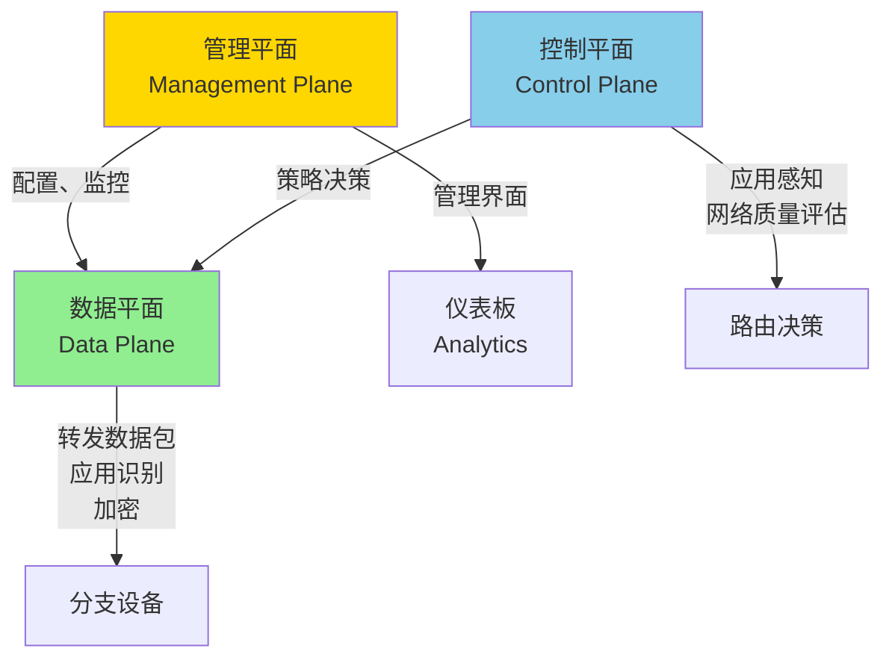
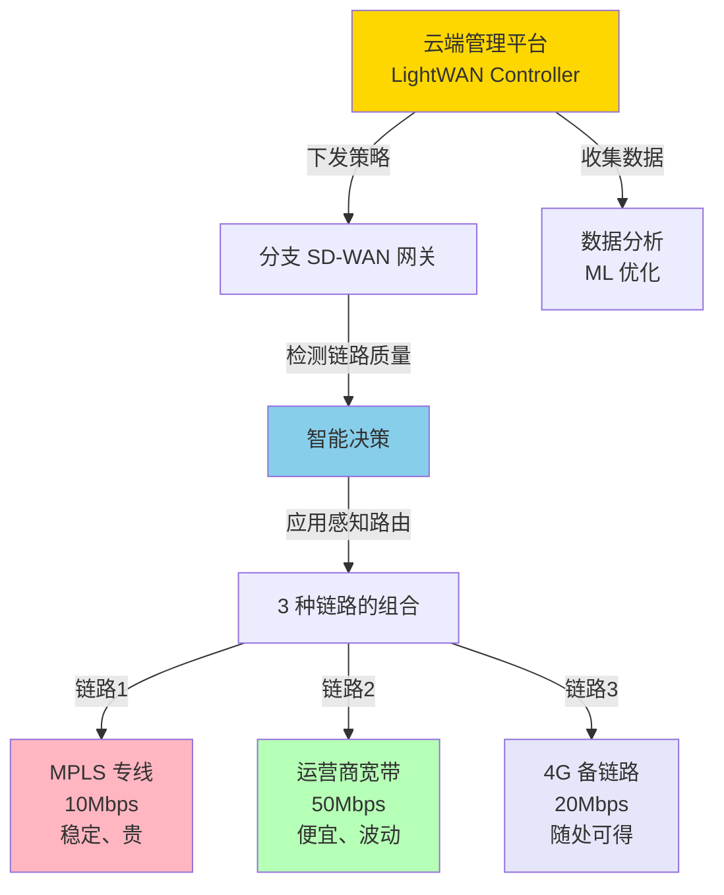
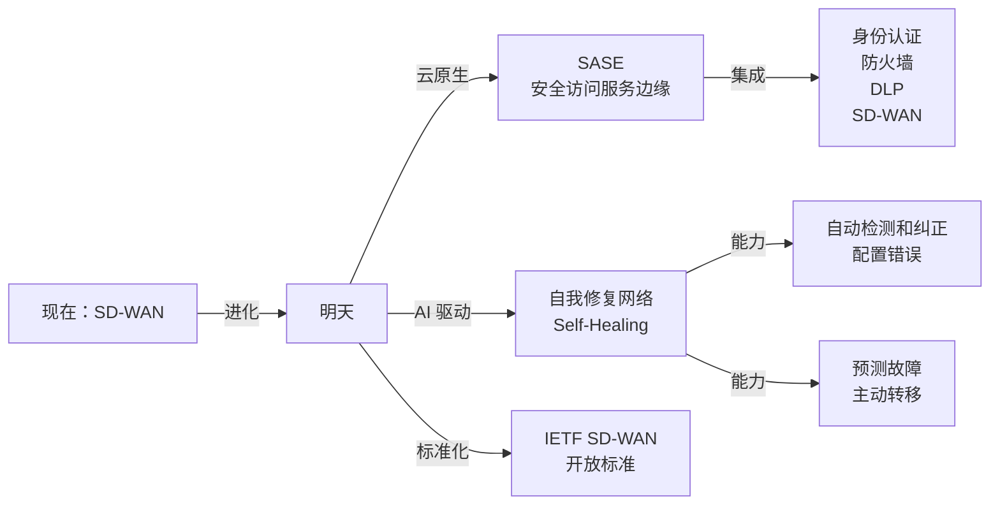

# SD-WAN：企业网络的深层变革

## 导言：从 MPLS 到 SD-WAN 的经济学

2010 年，Cisco 的一个部门面临一个尴尬的现实：

他们有数百个分支机构，每个分支都需要 MPLS 专线连接回总部。成本高达每月 $500 万。

有人提问："我们为什么不能用普通的宽带？"

回答："因为宽带不安全，延迟不稳定，服务质量无保证。"

但随着云计算的兴起，数据流向改变了。原来所有分支的流量都流向总部（中央数据中心），现在流量直接指向 AWS、Azure、SaaS 应用。

**如果分支访问 Office 365，却必须从总部往返，那纯粹是浪费。**

这个矛盾催生了 **SD-WAN**——用软件定义的方式重新架构企业网络。

---

## 第一部分：SD-WAN 的商业逻辑

### 成本对比

```
传统企业网络（MPLS）：

  总部 → 30 个分支
  每个分支需要：
    - 主链路：MPLS 专线 10Mbps → $2000/月
    - 备链路：MPLS 专线 5Mbps → $1000/月
    
  总成本 = 30 × ($2000 + $1000) = $90,000/月
         = $1,080,000/年

SD-WAN：

  每个分支需要：
    - 主链路：宽带 50Mbps → $200/月
    - 备链路：4G 移动网络 → $100/月
    - SD-WAN 设备（摊销）→ $300/月
    
  总成本 = 30 × ($200 + $100 + $300) = $18,000/月
         = $216,000/年
  
  加上集中管理平台（云端）→ $5000/月
  
  总成本 = $18,000 + $5,000 = $23,000/月
         = $276,000/年

节省：$1,080,000 - $276,000 = $804,000/年 （75% 削减！）
```

但成本只是故事的一半。关键是**使用模式的改变**：

```
MPLS 时代的流量（星形拓扑）：

分支 1 → 总部 → 互联网 / 云服务
分支 2 → 总部 → 互联网 / 云服务
分支 3 → 总部 → 互联网 / 云服务

问题：
  - 所有 Office 365 流量都经总部（往返延迟 200ms）
  - 总部成为瓶颈（特别是到云的出口）

SD-WAN 时代的流量（网状拓扑）：

分支 1 → 互联网 / 云服务（直连）
分支 2 → 互联网 / 云服务（直连）
分支 3 → 互联网 / 云服务（直连）

分支 1 ↔ 分支 2（直连）
分支 2 ↔ 分支 3（直连）

优势：
  ✓ 延迟大幅下降（20ms 而非 200ms）
  ✓ 总部不再是瓶颈
  ✓ 更好的用户体验
```

---

## 第二部分：SD-WAN 的架构

### 三个平面分离



**管理平面（Management Plane）**：

```
功能：
  - 配置 SD-WAN 设备（远程管理）
  - 监控网络健康状态
  - 收集性能指标和日志
  - 用户身份验证和授权

实现：
  - 云端 SaaS 平台
  - 从 SD-WAN 设备定期上报数据
  - 管理员通过 Web 界面或 API 管理

厂商例子：
  - Cisco Meraki
  - Fortinet FortiGate（虽然边界模糊）
  - Citrix SD-WAN
  - VMware Velocloud

开源：
  - OpenDaylight（仅控制平面）
```

**控制平面（Control Plane）**：

```
功能：
  - 实时监测网络链路质量（延迟、丢包、带宽）
  - 应用识别（是视频会议还是文件传输？）
  - 路由决策（这个应用应该走哪条链路？）
  - 策略实施（某条链路故障时如何转移？）

工作流：

  SD-WAN 设备 1 发送报文给 SD-WAN 设备 2
  ↓
  控制器测量延迟（ping）、丢包率（发送探测包）
  ↓
  发现链路质量下降
  ↓
  立即做出决策：
    "这个应用（Zoom）需要低延迟"
    "链路 A 延迟 100ms，链路 B 延迟 50ms"
    "转向链路 B"
  ↓
  通知 SD-WAN 设备更新转发表
  ↓
  后续包自动走链路 B

这一切发生在 200ms 内！
（vs OSPF 需要 2000ms）
```

**数据平面（Data Plane）**：

```
功能：
  - 根据控制平面的决策转发流量
  - 应用识别（DPI，Deep Packet Inspection）
  - 加密和解密（VPN 隧道）
  - QoS 应用（优先级标记）
  - 日志记录（上报给管理平面）

工作流：

  包到达 SD-WAN 设备
  ↓
  DPI 检查（看包内容，识别应用）
    - HTTP 头包含 "zoom" → 这是 Zoom
    - DNS 查询 "api.office.com" → 这是 Office 365
    - 端口 22 且 SSH 握手 → 这是 SSH
  ↓
  根据应用匹配策略
  ↓
  加密（可选）
  ↓
  选择出口链路
  ↓
  转发
```

---

## 第三部分：LightWAN 的架构（案例）



**LightWAN 的三层架构**：

```
第 1 层：站点（Site）
  - 物理分支机构或云环境（AWS VPC、Azure）
  - 每个站点有一个 SD-WAN 网关
  - 网关负责所有本站点的流量转发和加密

第 2 层：管道（Pipe）
  - 两个站点之间的虚拟链路
  - 可以基于多条物理链路（MPLS、宽带、4G）
  - 管道可以自动选择最优的底层链路

第 3 层：策略（Policy）
  - 应用级的转发规则
  - "Office 365 流量走宽带"
  - "VoIP 走 MPLS"
  - "云备份走 4G（费用低）"

这三层的分离使得网络：
  ✓ 模块化（可以独立配置站点、管道、策略）
  ✓ 灵活（策略改变，网络自动适应）
  ✓ 易扩展（新增站点或链路，无需重新配置其他部分）
```

---

## 第四部分：SD-WAN 选型的 10 个关键问题

当你开始评估 SD-WAN 产品时，问这些问题：

```
1. 支持多少种链路类型？
   好产品：MPLS、宽带、4G、卫星、MPLS VPN
   差产品：只支持少数几种

2. 应用识别（DPI）能力如何？
   好产品：识别 500+ 种应用
   差产品：只能识别 HTTP/HTTPS，其他靠猜测

3. 路由决策的延迟？
   好产品：< 200ms 感知到链路故障，< 500ms 完成转移
   差产品：> 2s（用户感受到网络抖动）

4. 支持哪些加密协议？
   好产品：IPSec、Wireguard、专有加密
   差产品：仅 IPSec

5. 和云的集成？
   好产品：支持 AWS VPC、Azure VNet、GCP 的原生集成
   差产品：需要手动配置

6. 管理界面的易用性？
   好产品：Web UI 清晰，1 个管理员能管 1000 个站点
   差产品：配置复杂，需要网络专家

7. 故障转移的自动化程度？
   好产品：完全自动，无需人工干预
   差产品：需要手动触发或中间人观察

8. 支持 QoS 吗？
   好产品：支持基于应用的 QoS，保证关键应用的带宽
   差产品：不支持

9. 成本模型？
   好产品：基于站点数量，不基于带宽（鼓励用宽带）
   差产品：基于带宽，这样会限制分支的网络使用

10. 支持混合链路吗？
   好产品：MPLS + 宽带 + 4G 同时运行，互相备份
   差产品：只能一条主链路 + 一条备链路
```

---

## 第五部分：迁移的陷阱

### 常见误区 1：以为可以完全替代 MPLS

```
❌ 错误想法：
   "SD-WAN 便宜，就用 SD-WAN 替代所有 MPLS"

✓ 正确做法：
   分层使用：
   - VoIP、视频会议 → MPLS（QoS 保证）
   - Office 365、邮件 → SD-WAN（成本优先）
   - 文件备份 → 4G（成本最优）
   
   原因：
     MPLS 的 SLA 是 99.99%（全年宕机 5 分钟）
     宽带的 SLA 是 99.5%（全年宕机 3.6 小时）
     关键业务不能完全依赖宽带
```

### 常见误区 2：忽视应用的复杂性

```
❌ 错误想法：
   "SD-WAN 很聪明，会自动选择最优路由"

✓ 正确做法：
   不同应用有不同需求：
   
   VoIP：
     需求：低延迟（< 100ms）
     选择：MPLS 专线
   
   视频会议（Zoom）：
     需求：低延迟 + 充足带宽
     选择：宽带 50Mbps
   
   云备份（Veeam）：
     需求：充足带宽但无 QoS 要求
     选择：4G（最便宜）
   
   这些都需要手工配置策略
```

### 常见误区 3：低估了迁移的复杂性

```
❌ 错误想法：
   "买个 SD-WAN 盒子，插上电，就能用"

✓ 正确做法：
   迁移流程：
   
   月 1：评估和规划
     - 测试宽带质量
     - 制定应用分级
     - 设计冗余策略
   
   月 2-3：试点
     - 选择 2-3 个非关键分支
     - 运行 8 周，验证稳定性
     - 微调策略
   
   月 4-6：分步迁移
     - 每周迁移 5 个分支
     - 密切监控性能
     - 保持 MPLS 链路可用
   
   月 6+：优化
     - 分析流量模式
     - 调整策略以最大化成本效益
     - 逐步关闭旧的 MPLS 链路

总时间：6-12 个月（对 30 个分支）
人员投入：1 个全职工程师 + 网络管理团队支持
```

---

## 第六部分：SD-WAN 的未来



**三个发展方向**：

1. **SASE（安全访问服务边缘）**：
   - 不只是 SD-WAN，还包括防火墙、DLP、威胁检测
   - 从"提供连接"升级到"提供安全连接"
   - 典型产品：Zscaler、Cloudflare Zero Trust

2. **AI 驱动的自我优化**：
   - 不需要人工制定策略，AI 学习应用行为并自动优化
   - 机器学习预测故障
   - 自动调整参数以满足 SLA

3. **开放标准**：
   - IETF 制定了 SD-WAN 的标准（RFC 8665-8671）
   - 未来可能出现开源 SD-WAN 网关
   - 降低供应商锁定风险

---

## 总结

SD-WAN 不只是技术进步，更是商业模式的转变：

**从**：集中式、专有的、昂贵的网络
**到**：分布式、开放的、经济的网络

**从**：网络等同于链路（MPLS 专线）
**到**：网络等同于策略（应用感知路由）

**从**：被动的故障恢复（等待告警）
**到**：主动的性能优化（实时调整）

---

## 推荐阅读

- [IPSec 和 VPN](../security/ipsec.md)
- [MPLS 对比](../advanced/mpls.md)
- [企业网络设计](../ops/network-design.md)