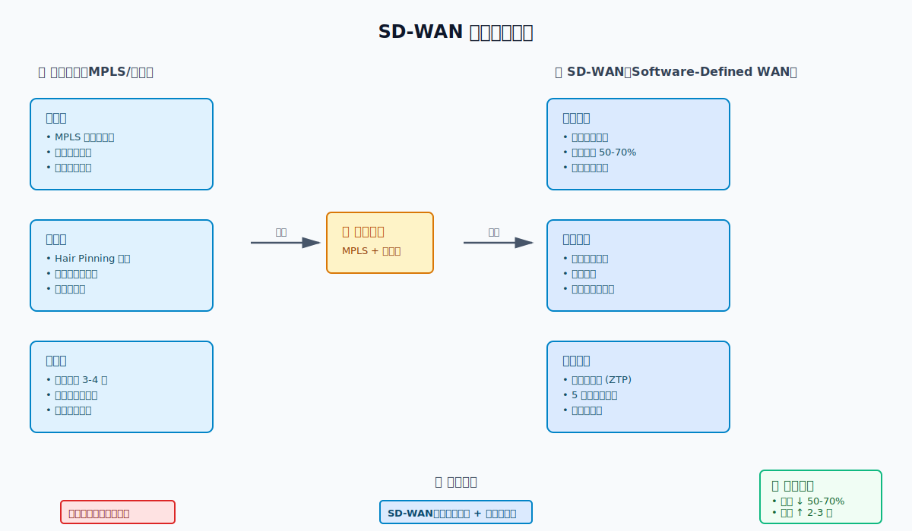
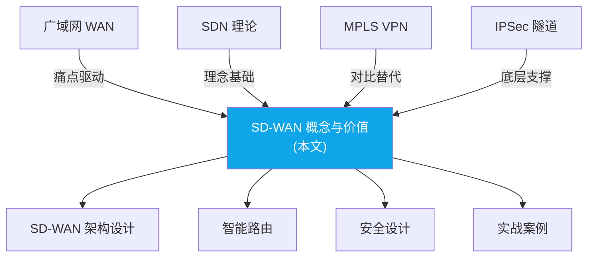

> 📋 **前置知识**：[广域网 (WAN)](/guide/enterprise/wan)、[SDN 基础理论](/guide/sdn/fundamentals)
> ⏱️ **阅读时间**：约 18 分钟

# SD-WAN 概念与价值

> **学习目标**: 理解 SD-WAN 诞生的背景、核心价值和工作原理，能够向非技术人员解释为什么需要 SD-WAN。

---

## 🤔 开场问题：你遇到过这些痛点吗？

想象你是一家连锁零售企业的网络负责人，全国有 200 个门店：

**场景 1**: CEO 打电话抱怨："视频会议卡得要命！"  
你查了一下，门店有 MPLS 和宽带两条链路，MPLS 专线延迟稳定但带宽只有 10Mbps，宽带有 100Mbps 但延迟波动大。传统路由器只会看 IP 地址，不知道这是视频流量，把它扔到了拥塞的宽带链路上。

<RoughDiagram 
  title="传统企业网络架构" 
  :width="700" 
  :height="350" 
  :elements="[
    { type: 'rectangle', x: 200, y: 50, width: 300, height: 80, options: { fill: '#10b981', fillStyle: 'hachure' } },
    { type: 'text', x: 350, y: 85, text: '总部数据中心（北京）' },
    { type: 'text', x: 350, y: 105, text: '- 核心应用服务器' },
    { type: 'text', x: 350, y: 120, text: '- 数据库与云存储' },
    { type: 'line', x: 350, y: 130, x2: 350, y2: 200 },
    { type: 'text', x: 400, y: 165, text: '专线/MPLS VPN' },
    { type: 'text', x: 400, y: 180, text: '(费用贵，部署慢)' },
    { type: 'rectangle', x: 100, y: 220, width: 200, height: 80, options: { fill: '#ef4444', fillStyle: 'zigzag' } },
    { type: 'text', x: 200, y: 250, text: '上海分公司（100人）' },
    { type: 'rectangle', x: 400, y: 220, width: 200, height: 80, options: { fill: '#ef4444', fillStyle: 'zigzag' } },
    { type: 'text', x: 500, y: 250, text: '深圳分公司（80人）' },
    { type: 'line', x: 300, y: 230, x2: 350, y2: 200 },
    { type: 'line', x: 400, y: 230, x2: 350, y2: 200 }
  ]"
/>

**场景 3**: IT 团队累死累活  
新开一个门店，需要工程师现场配置路由器、防火墙、VPN，耗时 2-3 天。200 个门店轮流升级固件，要折腾几个月。

**这些问题，传统网络解决不了吗？**

<!-- ThinkingQuestion
  question="为什么传统路由器无法根据应用类型（视频/文件/网页）选择链路？"
  hint="想一下传统路由器的工作原理：它只看 IP 报文的目的地址，能看到端口号吗？能识别应用吗？"
  answer="**传统路由器的局限性**：

1. **仅基于三层转发** - 只看目的 IP 地址和路由表，不关心上层应用
2. **无 DPI 能力** - 没有深度包检测（Deep Packet Inspection），看不到应用层协议
3. **静态路由策略** - 路由表固定，无法根据链路质量动态调整

#### 2. **性能问题：不是"快"，而是"智能"**

**问题**：
- 所有分支的流量都必须回源到总部（Hair Pinning）
  ```
  上海分支想访问深圳分支的服务？
  流量走向：上海 → 总部(北京) → 深圳
  延迟：200ms+ （原本只需 50ms）
  ```

- 互联网应用（SaaS、云服务）被迫走专线
  ```
  员工想用 Office 365？
  传统做法：上海 → 总部 → 互联网出口 → Office 365 云端
  结果：延迟高、体验差
  ```

**痛点**：
- 员工抱怨网络慢，特别是跨地区的协作
- 无法充分利用廉价的宽带，反而要用昂贵的专线
- 云应用的部署受到网络制约

#### 3. **灵活性不足**

**问题**：
- 网络扩展需要复杂的规划和审批
- 新建分支至少等待 2-4 周才能有网络
- 无法快速响应业务变化

**痛点**：
- 疫情期间，企业需要让员工在家远程工作，但 VPN 容量不足，而扩容需要数周
- 临时项目需要临时网络，但申请流程繁琐
- 合并收购后整合网络成本巨大

#### 4. **管理复杂性**

**问题**：
- 需要维护复杂的**防火墙、IDS/IPS、WAN 优化器、DPI** 等各种硬件
  ```
  硬件清单：
  - 每个分支都要配置硬件防火墙
  - 需要 WAN 优化器加速
  - 需要 DPI（深度包检测）来识别应用
  - 需要路由器来做流量工程
  ```

- 配置和维护这些设备需要专业的网络工程师
- 跨地域的配置策略同步困难

**痛点**：
- 网络故障难以定位
- 无法统一可视化管理所有分支网络
- 新策略的部署需要逐个登录设备配置

---

## 什么是 SD-WAN？

### 定义

**SD-WAN（Software-Defined Wide Area Network）** 是一种**架构方法和技术框架**，它用**软件控制器**代替了传统的硬件驱动网络，实现对广域网的**集中管理、灵活控制和智能优化**。

关键词：**软件控制、集中管理、智能路由**

### 核心理念对比

```
传统 WAN：                         SD-WAN：
┌──────────────────┐              ┌──────────────────┐
│ 硬件驱动          │              │ 软件驱动          │
│ - 路由器决定路由  │              │ - 控制器决定策略  │
│ - 静态配置        │              │ - 动态适应         │
│ - 本地化管理      │              │ - 集中式管理      │
│ - 昂贵设备        │              │ - 廉价硬件        │
└──────────────────┘              └──────────────────┘
```

### SD-WAN 的架构

<RoughDiagram 
  title="SD-WAN 网络架构" 
  :width="800" 
  :height="400" 
  :elements="[
    { type: 'rectangle', x: 300, y: 30, width: 200, height: 60, options: { fill: '#3b82f6', fillStyle: 'cross-hatch' } },
    { type: 'text', x: 400, y: 55, text: 'SD-WAN Controller' },
    { type: 'text', x: 400, y: 70, text: '(集中管理平台)' },
    { type: 'line', x: 350, y: 90, x2: 250, y2: 150 },
    { type: 'line', x: 450, y: 90, x2: 550, y2: 150 },
    { type: 'text', x: 300, y: 125, text: '管理接口' },
    { type: 'text', x: 520, y: 125, text: '管理接口' },
    { type: 'rectangle', x: 150, y: 160, width: 200, height: 120, options: { fill: '#10b981', fillStyle: 'dots' } },
    { type: 'text', x: 250, y: 185, text: '上海分支 SD-WAN CPE' },
    { type: 'text', x: 180, y: 210, text: '• 宽带 (互联网)' },
    { type: 'text', x: 180, y: 225, text: '• 4G/5G LTE' },
    { type: 'text', x: 180, y: 240, text: '• (可选) 专线' },
    { type: 'text', x: 180, y: 255, text: '• 隧道加密' },
    { type: 'rectangle', x: 450, y: 160, width: 200, height: 120, options: { fill: '#10b981', fillStyle: 'dots' } },
    { type: 'text', x: 550, y: 185, text: '深圳分支 SD-WAN CPE' },
    { type: 'text', x: 480, y: 210, text: '• 宽带 (互联网)' },
    { type: 'text', x: 480, y: 225, text: '• 4G/5G LTE' },
    { type: 'text', x: 480, y: 240, text: '• (可选) 专线' },
    { type: 'text', x: 480, y: 255, text: '• 隧道加密' },
    { type: 'curve', x: 350, y: 220, x2: 450, y2: 220, options: { stroke: '#f59e0b', strokeWidth: 3 } },
    { type: 'text', x: 400, y: 210, text: 'IPSec/GRE隧道' }
  ]"
/>

**三个关键角色**：

1. **控制器（Controller）** — 大脑
   - 收集网络状态信息（延迟、丢包、带宽）
   - 制定策略（哪些流量走哪条链路）
   - 下发配置到所有 CPE

2. **CPE（Customer Premises Equipment）** — 边缘网关
   - 可以是专用硬件，也可以是软件（虚拟 CPE）
   - 执行控制器的指令
   - 监控本地网络状况并上报
   - 加密和隧道封装

3. **应用策略库（Policy Database）** — 规则
   - 定义不同应用的优先级
   - 定义路由规则
   - 定义安全策略

---

## SD-WAN 能解决的问题

### 问题 1：成本

**传统方案**：依赖昂贵的专线

**SD-WAN 方案**：
- 可以用**普通宽带**（互联网连接）代替昂贵的专线
- 充分利用多条链路的冗余
- 按需付费，灵活扩展

**成本对比**：

<WideTable 
  title="传统WAN与SD-WAN成本对比（100个分支）" 
  :headers="['项目', '传统WAN', 'SD-WAN', '节省比例']"
  :rows="[
    ['专线/连接成本', '每分支 1-3万元/月<br/>年费用: 120-360万元', '每分支 2000-5000元/月<br/>年费用: 24-60万元', '75-85%'],
    ['硬件设备', '防火墙、优化器等<br/>200-300万元', 'CPE设备 3000-5000元/台<br/>30-50万元', '83-88%'],
    ['管理控制', '分布式管理<br/>人力成本高', '集中控制器<br/>20-50万元/年', '60-70%'],
    ['总运营成本', '320-660万元/年', '74-160万元/年', '<strong>60-80%</strong>'],
    ['部署时间', '2-4周/分支', '1-3天/分支', '90%+'],
    ['运维复杂度', '高（分散管理）', '低（集中管理）', '显著降低']
  ]"
  :columnWidths="['20%', '35%', '30%', '15%']"
/>

### 问题 2：性能与用户体验

**传统方案**：Hair Pinning，所有流量回源

**SD-WAN 方案**：
```
场景 1：分支间通信
传统：上海 → 北京 → 深圳 (延迟 200ms+)
SD-WAN：上海 ↔ 深圳 (直接隧道，延迟 50ms)

场景 2：云应用访问
传统：员工 → 北京总部 → 互联网出口 → SaaS 应用
SD-WAN：员工 → 直接从本地互联网出口 → SaaS 应用
        (称为"本地断网" Local Breakout)
```

**性能提升**：
- 延迟降低 50-70%
- 云应用访问速度提升 3-5 倍

### 问题 3：灵活性与敏捷性

**传统方案**：部署新分支需要 2-4 周

**SD-WAN 方案**：
```
第一天：订购一条宽带线路（或用现有 4G）
第二天：收货 SD-WAN CPE 设备
第三天：插电、连接、配置（15 分钟）
       控制器自动识别设备并应用策略
第四天：新分支正常工作
```

**敏捷优势**：
- 新分支上线时间从周级降到天级
- 灾难恢复更快
- 支持临时网络快速部署

### 问题 4：管理与可视化

**传统方案**：分散管理，难以获得全局视图

**SD-WAN 方案**：
```
一个中央控制台就能看到：
┌────────────────────────────────────────┐
│  全球网络拓扑实时可视化                  │
├────────────────────────────────────────┤
│  每个分支的:                            │
│  - 互联网连接状态                       │
│  - 延迟、丢包、带宽利用率                │
│  - 应用性能                            │
│  - 安全事件                            │
├────────────────────────────────────────┤
│  跨分支应用性能分析                      │
│  - 哪个分支访问云应用最慢？              │
│  - 哪条链路经常拥塞？                   │
└────────────────────────────────────────┘
```

**管理优势**：
- 策略一次编写，全网同步
- 故障快速定位
- 自动化运维（自动故障转移、自动路由优化）

### 问题 5：安全性

**传统方案**：依赖集中的防火墙和 DPI

**SD-WAN 方案**：
- **CPE 级别的加密**：所有流量端到端加密（IPSec/MACsec）
- **零信任架构**：即使是分支间的流量也需要身份验证
- **集中安全策略**：在控制器上统一定义，全网一致
- **云安全集成**：与云安全服务集成（如 Zscaler、Palo Alto）

**安全提升**：
- 即使使用互联网链路，数据也是加密的
- 支持复杂的安全策略（基于用户、应用、设备的细粒度控制）

---

## 为什么说 SD-WAN 是必然的未来？

### 1. 云迁移大趋势

```
2015 年的企业网络：
- 80% 应用在数据中心
- 20% 应用在云

2025 年的企业网络：
- 20% 应用在数据中心
- 80% 应用在云（SaaS、公有云、混合云）
```

**问题**：
- 传统网络是为"数据中心中心化"设计的
- 云应用分散在互联网上，不再回源总部
- Hair Pinning 模式完全不适应云时代

**SD-WAN 的解决方案**：
- DPI 识别应用（看 SNI、端口、协议特征）
- 给视频打上 'latency-sensitive' 标签
- 自动选择延迟最低的链路（通常是 MPLS）
- 给文件下载分配带宽更大但延迟稍高的宽带链路"
-->

---

## 💡 SD-WAN 的本质：软件定义 + 应用感知

### 一图胜千言



上图展示了从传统网络到 SD-WAN 的演进过程，以及核心价值的对比。

### 传统 WAN 的痛点

<RoughDiagram 
  title="SD-WAN 在 OSI 模型中的创新" 
  :width="700" 
  :height="450" 
  :elements="[
    { type: 'rectangle', x: 50, y: 50, width: 600, height: 60, options: { fill: '#ef4444', fillStyle: 'hachure' } },
    { type: 'text', x: 100, y: 75, text: '应用层 - 应用感知网络' },
    { type: 'text', x: 100, y: 90, text: 'SD-WAN Controller理解应用特性，实现应用驱动路由' },
    { type: 'rectangle', x: 50, y: 120, width: 600, height: 60, options: { fill: '#f59e0b', fillStyle: 'zigzag' } },
    { type: 'text', x: 100, y: 145, text: '传输层 - 智能传输优化' },
    { type: 'text', x: 100, y: 160, text: 'TCP优化、UDP for VoIP、动态协议选择' },
    { type: 'rectangle', x: 50, y: 190, width: 600, height: 60, options: { fill: '#10b981', fillStyle: 'cross-hatch' } },
    { type: 'text', x: 100, y: 215, text: '网络层 - 软件定义路由' },
    { type: 'text', x: 100, y: 230, text: '基于策略的智能路由，超越传统IP目标路由' },
    { type: 'rectangle', x: 50, y: 260, width: 600, height: 60, options: { fill: '#3b82f6', fillStyle: 'dots' } },
    { type: 'text', x: 100, y: 285, text: '链路层 - 实时质量感知' },
    { type: 'text', x: 100, y: 300, text: '持续监控带宽、延迟、丢包、抖动指标' },
    { type: 'rectangle', x: 50, y: 330, width: 600, height: 60, options: { fill: '#8b5cf6', fillStyle: 'solid' } },
    { type: 'text', x: 100, y: 355, text: '物理层 - 异构链路聚合' },
    { type: 'text', x: 100, y: 370, text: '宽带+4G+专线的智能融合与负载均衡' }
  ]"
/>

### SD-WAN 的变革

```
┌─────────────────────────────────────────────────────┐
│ SD-WAN 网状架构（Any-to-Any）                        │
└─────────────────────────────────────────────────────┘

           ┌──→ Internet / 云服务
分支 A ────┤
           └──→ 分支 B / C（直连）
           
           ┌──→ Internet / 云服务
分支 B ────┤
           └──→ 分支 A / C（直连）

           ┌──→ Internet / 云服务
分支 C ────┤
           └──→ 分支 A / B（直连）

优势：
✅ 云服务直连，延迟降低 50-80%
✅ 分支间直接通信（VoIP 通话不绕总部）
✅ 混用 MPLS + 宽带 + 4G，成本降低 40-70%
✅ 零接触部署（Zero-touch Provisioning）
✅ 应用感知路由（视频走 MPLS，下载走宽带）
```

---

## 📊 成本对比：真实案例

某零售企业 200 个门店的 WAN 成本分析：

### 方案一：传统 MPLS

| 项目 | 单价 | 数量 | 月成本 | 年成本 |
|------|------|------|--------|--------|
| 主链路 (MPLS 10M) | 4,000 元 | 200 | 80 万 | 960 万 |
| 备链路 (MPLS 5M) | 2,000 元 | 200 | 40 万 | 480 万 |
| 路由器维护 | 500 元 | 200 | 10 万 | 120 万 |
| **总计** | - | - | **130 万/月** | **1560 万/年** |

<WideTable 
  title="不同规模企业采用SD-WAN的收益分析" 
  :headers="['企业规模', '主要收益', '投资回报周期', '关键驱动因素']"
  :rows="[
    ['<strong>小企业</strong><br/>(&lt; 10分支)', '• 快速部署新分支<br/>• 低成本网络连接<br/>• 简化运维管理<br/>• 云应用加速', '6-12个月', '成本控制<br/>敏捷部署'],
    ['<strong>中型企业</strong><br/>(10-100分支)', '• 网络成本节省60-80%<br/>• 应用性能显著提升<br/>• 运维自动化<br/>• 统一网络管理', '12-18个月', '成本优化<br/>性能提升<br/>管理简化'],
    ['<strong>大型企业</strong><br/>(&gt; 100分支)', '• 全球网络统一管控<br/>• 云迁移战略加速<br/>• 复杂网络简化<br/>• 数字化转型支撑', '18-24个月', '战略转型<br/>全球统一<br/>云优先']
  ]"
  :columnWidths="['15%', '45%', '20%', '20%']"
/>

---

## ⚙️ SD-WAN 的核心技术

### 1. Overlay 网络

```
传统网络（Underlay）:
┌────────────┐
│ 应用数据   │
├────────────┤
│ IP 层      │  ← 直接暴露在物理网络
├────────────┤
│ 物理链路   │  ← MPLS / Internet
└────────────┘

SD-WAN（Overlay）:
┌────────────┐
│ 应用数据   │
├────────────┤
│ IPSec 隧道 │  ← 加密的虚拟网络
├────────────┤
│ IP 层      │  ← 可以是任何物理网络
├────────────┤
│ 物理链路   │  ← MPLS / 宽带 / 4G / 5G
└────────────┘
```

**Overlay 的价值**：
- 物理层随便换（今天宽带，明天 5G），上层应用无感知
- 自建虚拟专网，不依赖运营商
- 跨多个 ISP 建立统一网络

### 2. 应用感知路由

```python
# 伪代码：SD-WAN 的路由决策
def choose_link(packet):
    # 1. 识别应用
    app = identify_application(packet)  # DPI 深度包检测
    
    # 2. 查询应用策略
    if app == "Microsoft Teams":
        requirements = {"max_latency": 50, "min_bandwidth": 2}
    elif app == "File Transfer":
        requirements = {"min_bandwidth": 10, "max_cost": True}
    elif app == "Database Sync":
        requirements = {"max_latency": 20, "security": "high"}
    
    # 3. 测量链路质量
    links = [
        {"name": "MPLS", "latency": 30, "bandwidth": 10, "cost": 5000},
        {"name": "宽带", "latency": 80, "bandwidth": 100, "cost": 500},
        {"name": "4G", "latency": 120, "bandwidth": 20, "cost": 300}
    ]
    
    # 4. 智能选择
    best_link = select_best_link(requirements, links)
    
    return best_link

# 结果：
# Teams 视频 → MPLS (低延迟)
# 文件下载 → 宽带 (高带宽 + 低成本)
# 数据库同步 → MPLS (低延迟 + 高安全性)
```

### 3. 零接触部署（ZTP）

```
传统部署流程：
1. 工程师带设备到现场
2. 连接网络，配置 IP 地址
3. 手动输入路由表、VPN 配置
4. 测试连通性
5. 耗时：2-3 天

SD-WAN 零接触部署：
1. 快递设备到门店
2. 店员插上电源 + 网线
3. 设备自动拨号，连接云管理平台
4. 云端下发配置（IP、隧道、策略）
5. 自动建立 VPN，完成上线
6. 耗时：30 分钟

关键技术：
- 设备出厂预配置云管理平台地址
- 首次启动自动 DHCP 获取 IP
- 通过 HTTPS 连接云平台认证
- 云端根据设备序列号下发配置
```

---

## 🏢 真实案例：某跨国零售企业

### 背景

- 全球 500 个门店
- 原有架构：MPLS Hub-Spoke
- 年度 WAN 成本：$6M USD
- 痛点：云服务访问慢、新店开张周期长

### SD-WAN 改造方案

**阶段一（试点，3 个月）**
- 选择 10 个门店部署 SD-WAN
- 保留 MPLS 作为备份
- 观察性能和稳定性

**阶段二（推广，6 个月）**
- 逐步覆盖所有门店
- MPLS 降级为备份链路（带宽减半）
- 主力使用宽带 + 4G

**阶段三（优化，持续）**
- 关闭部分门店的 MPLS
- 全部使用互联网链路 + SD-WAN 加密

### 效果

| 指标 | 改造前 | 改造后 | 改善幅度 |
|------|--------|--------|----------|
| WAN 年成本 | $6M | $2.1M | ↓ 65% |
| 云服务延迟 | 180ms | 35ms | ↓ 80% |
| 新店上线周期 | 3 天 | 2 小时 | ↓ 92% |
| 故障平均恢复时间 | 4 小时 | 15 分钟 | ↓ 94% |
| 运维人力 | 12 人 | 5 人 | ↓ 58% |

<!-- ThinkingQuestion
  question="如果你是这家企业的 CTO，如何说服 CFO 批准 SD-WAN 项目的预算？"
  hint="CFO 关心的是 ROI（投资回报率）和风险。从财务角度组织论据。"
  answer="**CFO 说服策略**（电梯演讲 60 秒版）：

**开场（问题）**：
'我们每年在 WAN 上花 600 万美元，但用户抱怨云服务慢，新店开张要等 3 天。这笔钱花得值吗？'

**方案（SD-WAN）**：
'SD-WAN 可以让我们用普通宽带替代昂贵的 MPLS，同时提供更好的性能和灵活性。'

**财务数据（ROI）**：
1. **成本节省**：年度 WAN 成本从 $6M 降至 $2.1M，每年节省 $3.9M
2. **初期投资**：设备 + 部署 + 平台费用约 $800K
3. **回本周期**：$800K ÷ $3.9M/年 = 2.5 个月
4. **5 年 ROI**：($3.9M × 5年 - $800K) ÷ $800K = 2337%

**风险控制**：
1. 先试点 10 个门店，证明可行性再推广
2. 保留 MPLS 作为备份，确保业务连续性
3. 分阶段实施，随时可以回退

**额外价值**：
1. 新店上线从 3 天缩短到 2 小时 → 加快业务扩张
2. 云服务延迟降低 80% → 提升员工效率
3. 运维人力减少 58% → IT 团队可以做更有价值的工作

**一句话总结**：
'10 个月回本，5 年省下 1950 万美元，同时提升用户体验和业务敏捷性。这是我见过最划算的 IT 投资之一。'"
-->

---

## 🎯 SD-WAN 的适用场景

### ✅ 适合 SD-WAN 的企业

1. **多分支机构**
   - 零售连锁（门店 > 50）
   - 餐饮连锁
   - 银行网点

2. **云服务重度用户**
   - 使用 Office 365、Salesforce、AWS
   - SaaS 应用占流量 > 60%

3. **成本敏感型**
   - MPLS 成本占 IT 预算 > 20%
   - 希望用宽带替代专线

4. **业务扩张快**
   - 频繁开新店/新办公室
   - 需要快速部署网络

### ❌ 不适合 SD-WAN 的场景

1. **超高安全要求**
   - 军事、政府机密部门
   - 要求物理隔离的行业

2. **分支极少**
   - 只有 1-2 个办公室
   - 部署 SD-WAN 的成本 > 收益

3. **对延迟极度敏感**
   - 高频交易（微秒级延迟）
   - SD-WAN 加密会增加 5-10ms 延迟

---

## 📚 知识检查点

在继续学习 SD-WAN 架构之前，确保你能回答这些问题：

1. **概念理解**
   - [ ] 能用一句话解释什么是 SD-WAN
   - [ ] 能说出 SD-WAN 相比传统 WAN 的 3 个核心优势
   - [ ] 理解 Overlay 和 Underlay 的区别

2. **商业价值**
   - [ ] 能计算 SD-WAN 的 ROI
   - [ ] 能向非技术人员解释为什么需要 SD-WAN
   - [ ] 知道哪些行业最适合 SD-WAN

3. **技术原理**
   - [ ] 理解应用感知路由的工作原理
   - [ ] 知道零接触部署的流程
   - [ ] 了解 SD-WAN 如何保证安全性

---

## 🚀 下一步

学完本章，你应该已经理解了 **为什么** 需要 SD-WAN。

接下来，我们将深入探讨：

→ **[SD-WAN 架构与控制面](/guide/sdwan/architecture)** - 三平面分离、Controller/Orchestrator 的职责  
→ **[智能路由与流量优化](/guide/sdwan/routing)** - DPI 技术、路径选择算法、流量工程  
→ **[SD-WAN 安全设计](/guide/sdwan/security)** - IPSec 加密、分段隔离、与 SASE 的关系  

---

<div style="text-align: center; margin-top: 3rem; padding: 2rem; background: rgba(10, 14, 39, 0.9); border: 2px solid var(--neon-cyan); border-radius: 12px;">
  <p style="font-family: var(--font-display); font-size: 1.2rem; color: var(--neon-cyan); margin: 0;">
    💡 记住：SD-WAN 不是技术炫技，而是用软件解决企业网络的真实痛点
  </p>
</div>

## 与其他技术的关系



*SD-WAN 是 SDN 理念在广域网场景的落地实践，它综合了隧道技术（IPSec/GRE）、智能路由和集中管理，解决传统 MPLS VPN 的成本与灵活性问题。*

## 总结与下一步

| 维度 | 要点 |
|------|------|
| 核心价值 | 降低 WAN 成本 40-60%、提升应用体验、实现零接触部署 |
| 适用场景 | 多分支企业、混合云接入、跨国组网、零售/制造连锁 |
| 局限性 | 依赖 Underlay 质量、厂商锁定风险、安全合规需额外设计 |

> 📖 **下一步学习**：[SD-WAN 架构与控制面](/guide/sdwan/architecture) — 深入 SD-WAN 的三平面架构设计
