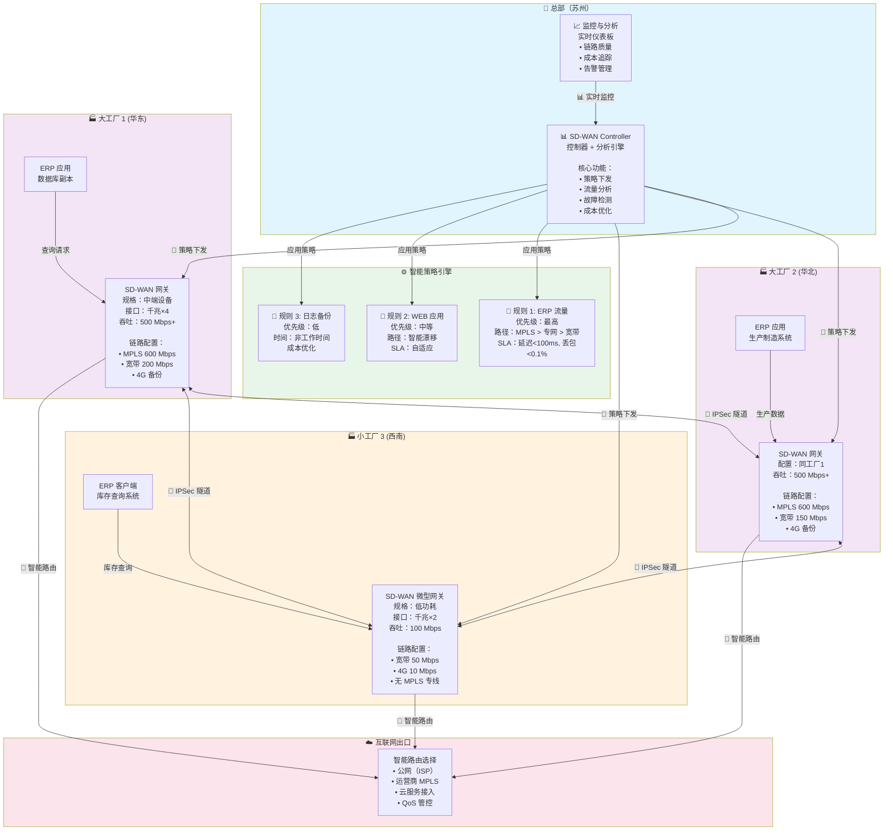

# 案例 1：制造业集团 SD-WAN 架构（改进版）

## 网络拓扑 - 增强版



## 流量路径示例

### 案例场景 1：ERP 查询（高优先级）

```
小工厂3 员工查询库存数据库（总部）

传统 MPLS（迁移前）:
小工厂 --(回源)--> 总部 --(回源)--> 小工厂
延迟: 200ms+，高成本

SD-WAN 优化后:
小工厂3 --[QoS优先级最高]--> GW3
GW3 --[MPLS隧道优先]--> GW1
GW1 --[本地访问]--> ERP数据库
延迟: 80ms，自动选路，成本最优
```

### 案例场景 2：OA 应用（中等优先级）

```
大工厂内员工访问邮件系统

触发：
① 办公高峰期，MPLS 可能饱和
② SD-WAN 检测到 MPLS 链路 >80% 利用率
③ 自动漂移到宽带链路
④ OA 系统仍然可用，用户无感知

好处:
✓ 保护 MPLS 链路给关键业务
✓ 利用宽带的成本优势
✓ 网络自动优化，运维无需干预
```

## 成本效益对比

| 维度 | 迁移前（MPLS） | 迁移后（SD-WAN） | 节省 |
|------|--------------|----------------|------|
| **月度费用** | 800K 元 | 280K 元 | 520K ↓ |
| **年度成本** | 960 万 | 336 万 | **624 万** |
| **新工厂部署周期** | 3-4 周 | 3 天 | 90%↓ |
| **ERP 延迟** | 200ms | 80ms | 60%↓ |
| **设备投资** | 0（外包） | 150K（一次性） | 2 年回本 |

---

**关键收获**：
- 成本降低的同时，性能反而提升
- 灰度迁移策略降低风险
- 自动化运维，人力成本下降
