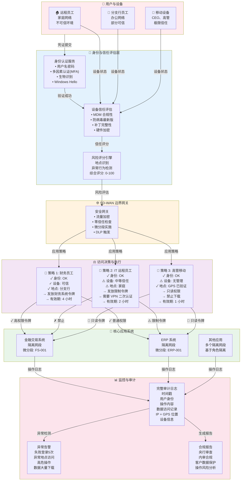
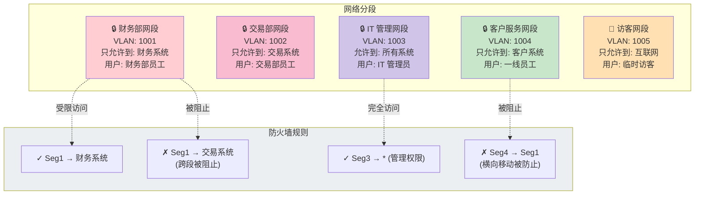
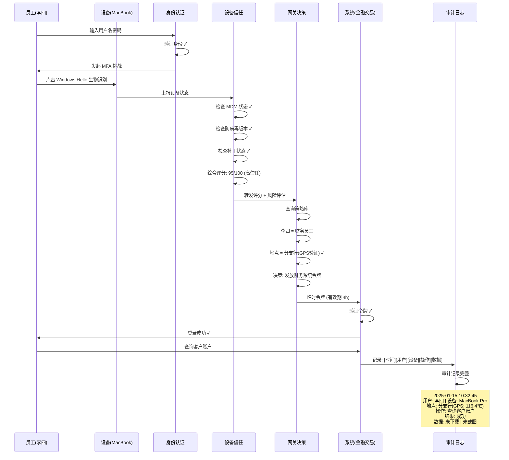

# 案例 2：金融公司零信任安全框架（改进版）

## 零信任架构全景图

## 微分段隔离策略

## 认证流程详解

## 实现效果对比

| 维度 | 迁移前 | 迁移后 | 改进 |
|------|--------|--------|------|
| **安全事件检测** | 4-8 小时 | 2-5 分钟 | **98% ↓** |
| **权限回收时间** | 1-2 天 | 实时 | **自动化** |
| **数据泄露事件** | 年均 2-3 起 | 0 | **100% 消除** |
| **合规审计覆盖** | 70% | 100% | **完整可追溯** |
| **新员工入职配置** | 1-2 天 | 5 分钟 | **96% ↓** |
| **离职员工权限回收** | 手工流程 | 自动 | **即时撤销** |

---

**关键收获**：
- 零信任不是"不信任任何人"，而是"验证所有访问"
- 自动化政策执行，降低人工错误风险
- 完整的审计链，满足央行合规要求
- 安全性提升，用户体验反而更好
