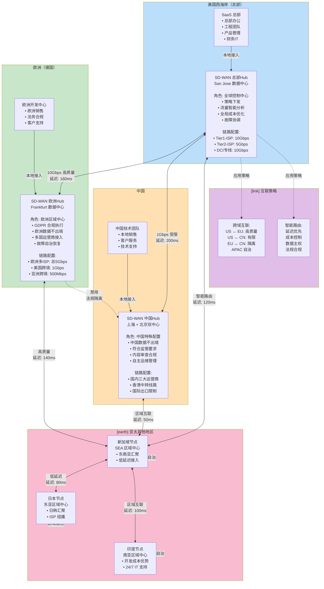
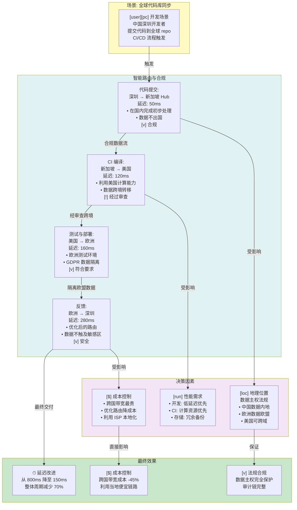

# 案例 3：互联网公司全球化网络（改进版）

## 全球 SD-WAN 拓扑架构



## 跨国数据流管理



## 全球 CI/CD 加速示例

```mermaid
graph LR
    subgraph Before["迁移前: 传统网络"]
        B1["深圳开发者<br/>提交代码"]
        B2["跨越 GFW<br/>不稳定性"]
        B3["美国服务器<br/>CI 流程"]
        B4["延迟 800ms+<br/>经常超时"]
        B1 -->|[x] 不稳定| B2
        B2 -->|[x] 慢| B3
        B3 -->|[x] 超时| B4
    end
    
    subgraph After["迁移后: SD-WAN 网络"]
        A1["深圳开发者<br/>提交代码"]
        A2["本地 SD-WAN<br/>智能路由"]
        A3["新加坡 Hub<br/>缓存加速"]
        A4["美国 CI 服务<br/>快速编译"]
        A5["延迟 150ms<br/>稳定可靠"]
        A1 -->|[v] 加密隧道| A2
        A2 -->|[v] 本地处理| A3
        A3 -->|[v] 优化路由| A4
        A4 -->|[v] 可靠| A5
    end
    
    style Before fill:#ffebee
    style After fill:#e8f5e9
    style B4 fill:#ff6b6b
    style A5 fill:#4caf50
```

## 成本与性能数据

| 指标 | 迁移前 | 迁移后 | 提升 |
|------|--------|--------|------|
| **全球延迟（P95）** | 800ms | 150ms | **81% ↓** |
| **跨国带宽成本** | 100% | 55% | **45% ↓** |
| **CI/CD 周期** | 45 分钟 | 13 分钟 | **71% ↓** |
| **开发效率** | 基准 | +50% | **显著提升** |
| **全球可用性** | 99.5% | 99.99% | **4个9** |
| **故障恢复时间** | 20 分钟 | <2 分钟 | **90% ↓** |

---

## 三个案例的关键对比

| 维度 | 案例 1: 制造业 | 案例 2: 金融 | 案例 3: 互联网 |
|------|--------------|-----------|------------|
| **主要诉求** | 成本 + 敏捷 | 安全 + 合规 | 全球化 + 高性能 |
| **难点** | MPLS 成本 | 零信任复杂性 | 跨国法规 |
| **SD-WAN 价值** | 65% 成本降低 | 98% 响应加速 | 80% 延迟优化 |
| **实施周期** | 3 个月 | 6 个月 | 6 个月 |
| **ROI 周期** | 2 年 | 1 年 | 1 年 |

---

**关键收获**：
- SD-WAN 是业务使能技术，而非仅仅是网络升级
- 不同企业的价值切口不同，需要差异化策略
- 全球化企业需要考虑数据主权和法规合规
- 完整的智能路由和策略引擎是成功的核心
