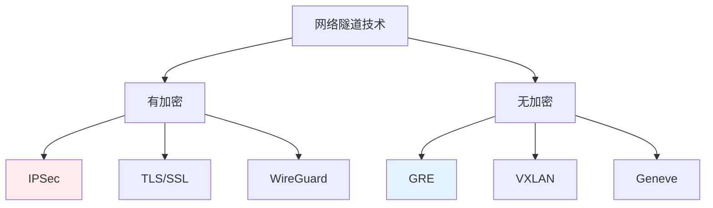
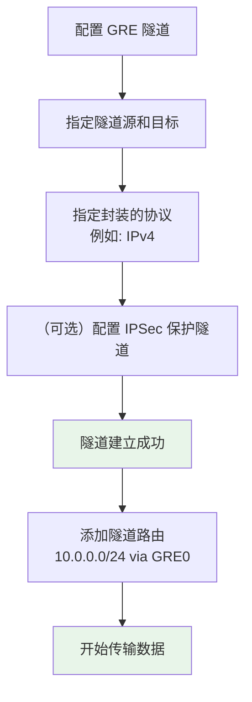
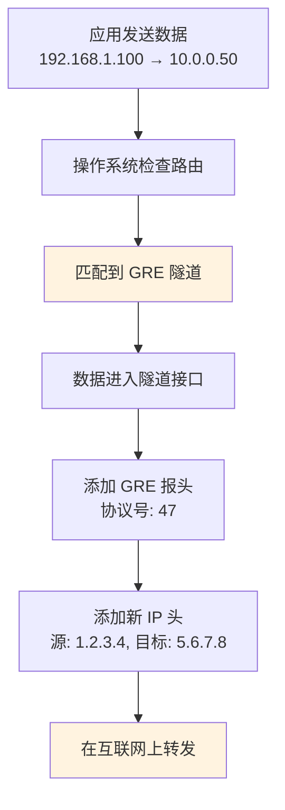
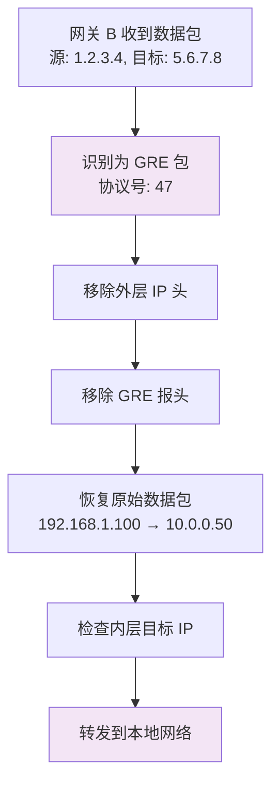
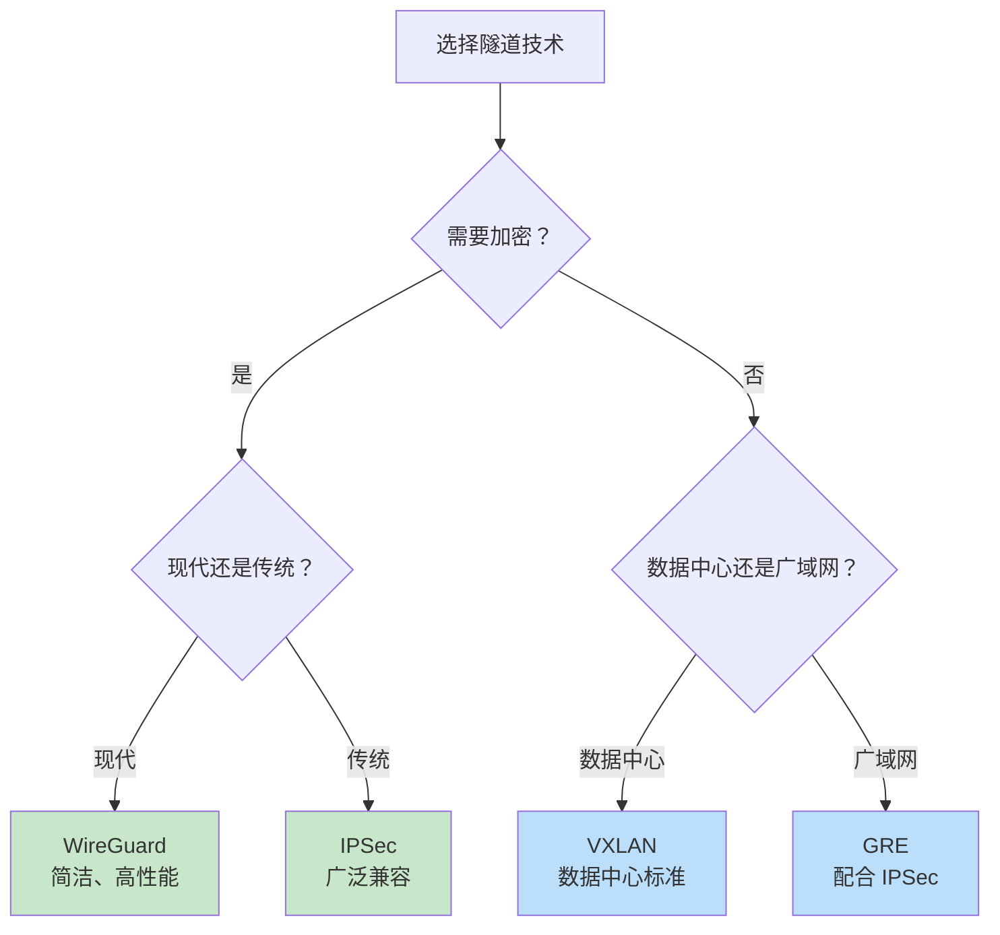
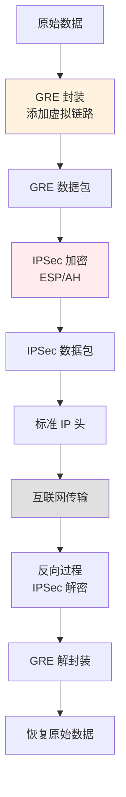

# GRE 和网络隧道：虚拟通道的艺术

## 导言

如果 IPSec 是**加密的铠甲**，那么 **GRE（通用路由封装）** 就是**虚拟的管道**。

GRE 不加密，但它能在互联网上创建虚拟的直连链路。与 IPSec 结合使用时，GRE 提供灵活性，IPSec 提供安全性——这是经典的组合。

---

## 什么是 GRE？

**GRE（Generic Routing Encapsulation，通用路由封装）** 是一种**隧道协议**，它能把一种协议的数据包封装在另一种协议内部来传输。

### GRE 的核心特点

```
┌─────────────────────────────────────┐
│ GRE 的特点                          │
├─────────────────────────────────────┤
│ [v] 无加密 — 速度快，开销小          │
│ [v] 灵活 — 支持多种协议                │
│ [v] 简单 — 配置相对容易                │
│ [x] 无安全性 — 需要配合 IPSec      │
│ [x] 开销有 — 增加报文大小              │
└─────────────────────────────────────┘
```

### GRE 的地位



---

## GRE 隧道的原理

### 基本概念

GRE 就是"套娃"：

```
原始数据包：
┌─────────────────────────────┐
│ 源 IP: 192.168.1.100        │
│ 目标 IP: 10.0.0.50          │
│ 协议: TCP                    │
│ 数据: HTTP 请求              │
└─────────────────────────────┘

第一层套娃（GRE 封装）：
┌──────────────────────────────────────┐
│ GRE 头（新的协议号：47）            │
├──────────────────────────────────────┤
│ 原始数据包（完整保留）              │
└──────────────────────────────────────┘

第二层套娃（IP 头）：
┌──────────────────────────────────────┐
│ 新的源 IP: 1.2.3.4（网关 A）        │
│ 新的目标 IP: 5.6.7.8（网关 B）      │
├──────────────────────────────────────┤
│ GRE 头 + 原始数据包                  │
└──────────────────────────────────────┘

最终在互联网上传输的就是这个二层封装的包
```

### GRE 报头格式

```
0                   1                   2                   3
0 1 2 3 4 5 6 7 8 9 0 1 2 3 4 5 6 7 8 9 0 1 2 3 4 5 6 7 8 9 0 1
+-+-+-+-+-+-+-+-+-+-+-+-+-+-+-+-+-+-+-+-+-+-+-+-+-+-+-+-+-+-+-+-+
|C|       Version       |         Protocol Type                 |
+-+-+-+-+-+-+-+-+-+-+-+-+-+-+-+-+-+-+-+-+-+-+-+-+-+-+-+-+-+-+-+-+
│        可选字段（根据 Flag）                                │
+-+-+-+-+-+-+-+-+-+-+-+-+-+-+-+-+-+-+-+-+-+-+-+-+-+-+-+-+-+-+-+-+

关键字段：
- C（Checksum Present）: 是否有校验和
- 版本: GRE 版本（通常是 0）
- 协议类型: 封装的协议（如 0x0800 = IPv4, 0x86dd = IPv6）
```

### GRE 隧道的建立过程



---

## GRE 隧道的工作流程

### 数据进入隧道



### 数据从隧道出口



---

## 网络隧道的类型和对比

### 四种主要隧道技术对比

```
┌─────────────────────────────────────────────────────┐
│ 隧道技术对比                                        │
├──────────┬──────────┬──────────┬─────────┬─────────┤
│ 技术     │ 加密     │ 开销     │ 应用    │ 复杂度  │
├──────────┼──────────┼──────────┼─────────┼─────────┤
│ GRE      │ [x] 无     │ 小 [pkg]    │ 灵活    │ 简 (grn)   │
│ IPSec   │ [v] 有     │ 中 [pkg][pkg] │ 安全    │ 复 (red)   │
│ VXLAN    │ [x] 无     │ 中 [pkg][pkg] │ 数据中心│ 中 (ylw)   │
│ WireGuard│ [v] 有     │ 中 [pkg][pkg] │ 现代VPN│ 简 (grn)   │
└──────────┴──────────┴──────────┴─────────┴─────────┘
```

### 隧道技术的选择



---

## GRE + IPSec：完美搭档

### 为什么要组合使用？

**单独 GRE 的问题**：
- <Icon name="x-circle" color="danger" /> 不加密，数据暴露
- <Icon name="x-circle" color="danger" /> 任何人都能截获和篡改

**单独 IPSec 的问题**：
- <Icon name="x-circle" color="danger" /> 配置复杂
- <Icon name="x-circle" color="danger" /> 不支持多播（组播）
- <Icon name="x-circle" color="danger" /> 某些网络应用不兼容

**GRE + IPSec 的优势**：
- <Icon name="check-circle-2" color="green" /> GRE 提供灵活性和多播支持
- <Icon name="check-circle-2" color="green" /> IPSec 提供加密和认证
- <Icon name="check-circle-2" color="green" /> 配置相对简单

### 组合的工作流程



### 配置示例

```
网络拓扑：
总部（北京）          分支（上海）
公网 IP: 1.2.3.4     公网 IP: 5.6.7.8
内网: 192.168.1.0/24 内网: 10.0.0.0/24

配置步骤：

步骤 1：创建 GRE 隧道
━━━━━━━━━━━━━━━━━━━━
interface GRE1
 tunnel source 1.2.3.4
 tunnel destination 5.6.7.8
 tunnel mode gre ip
 ip address 172.16.0.1 255.255.255.0
!

步骤 2：配置 IPSec 保护
━━━━━━━━━━━━━━━━━━━━
crypto ipsec transform-set IPSEC-TS esp-aes 256 esp-sha-hmac
crypto ipsec profile GRE-PROTECT
 set transform-set IPSEC-TS
!

tunnel protection ipsec profile GRE-PROTECT
!

步骤 3：配置路由
━━━━━━━━━━━━━━━━━━━━
ip route 10.0.0.0 255.255.0.0 172.16.0.2
!

结果：
- 流量经过 GRE → IPSec → 互联网 → IPSec 解密 → GRE 解封装
- 加密完整，灵活可靠
```

---

## 实际应用场景

### 场景 1：SD-WAN 之前的多分支连接

```
总部（北京）
    │
    ├─ GRE+IPSec → 上海分支
    ├─ GRE+IPSec → 深圳分支
    └─ GRE+IPSec → 广州分支

特点：
[v] 成本低（使用互联网链路）
[v] 灵活（容易添加新分支）
[v] 安全（GRE+IPSec）
```

### 场景 2：跨越 NAT 的连接

```
总部（NAT 后面）  ←→  GRE+IPSec  ←→  分支（公网）

GRE 作用：
- 虚拟直连链路，绕过 NAT 限制
- IPSec 加密通过 NAT（需要 NAT-T）
```

### 场景 3：多播/组播网络

```
某些应用需要多播（如 IPTV）：
- 单独 IPSec 不支持多播
- GRE 可以携带多播流量
- 组合方案：GRE 传输多播，IPSec 加密
```

---

## GRE 的优缺点对比

### 优点 <Icon name="check-circle-2" color="green" />

```
┌──────────────────────────────┐
│ GRE 的优点                    │
├──────────────────────────────┤
│ [v] 协议简单，易于理解         │
│ [v] 配置简单，参数少           │
│ [v] 开销小，性能好             │
│ [v] 支持多播/广播             │
│ [v] 能承载多种协议             │
│ [v] 广泛支持（所有操作系统）   │
└──────────────────────────────┘
```

### 缺点 <Icon name="x-circle" color="danger" />

```
┌──────────────────────────────┐
│ GRE 的缺点                    │
├──────────────────────────────┤
│ [x] 不加密，数据暴露           │
│ [x] 不认证，易被伪造           │
│ [x] 不防重放，易被重放攻击     │
│ [x] 需要配合 IPSec 才安全     │
│ [x] MTU 减小（报头开销）       │
│ [x] 故障排查困难（黑盒）       │
└──────────────────────────────┘
```

---

## 隧道的 MTU 问题

### 什么是 MTU？

**MTU（Maximum Transmission Unit）** 是链路能传输的最大数据包大小。

### 隧道带来的 MTU 减小

```
原始 MTU：1500 字节

添加 GRE 报头：
原始数据: 1500 B
- GRE 报头: 4 B
- 新 IP 头: 20 B
= 需要 1500 + 24 = 1524 B
[x] 超过 1500，必须分片或丢弃

解决方案：
1. 在隧道端设置 MTU = 1476（1500 - 24）
2. 启用 Path MTU Discovery（PMTUD）
3. 使用 GRE over TCP（通过 TCP 的 GRE）

最终结果：
有效数据: 1476 B（从 1500 B 减少）
```

---

## 故障排查

### 常见问题

| 问题 | 原因 | 解决 |
|-----|------|------|
| 隧道 up 但无数据 | 路由不匹配 | 检查隧道路由配置 |
| 隧道建立失败 | 源/目标 IP 不可达 | ping 检查公网连通性 |
| 数据流量断断续续 | MTU 问题 | 检查隧道 MTU 配置 |
| 隧道性能差 | 加密开销（IPSec） | 选择更轻量的加密算法 |
| 某些应用不工作 | 多播不通 | GRE 支持多播，IPSec 可能不支持 |

### 排查命令

```bash
# 检查 GRE 隧道状态
show interface tunnel 0
> output: Tunnel0 is up, line protocol is up

# 测试隧道连通性
ping 172.16.0.2 （隧道对端）
> Reply from 172.16.0.2: ...

# 检查 MTU
ping -df -s 1472 10.0.0.1
> 如果丢包说明 MTU 不足

# 查看隧道统计
show interface tunnel 0 | include bytes
> In/Out 字节数统计
```

---

## 总结

**GRE 是什么**：
- 隧道协议，无加密
- 灵活，低开销，支持多播

**GRE 怎么工作**：
- 第一层套娃：添加 GRE 报头
- 第二层套娃：添加 IP 报头
- 对端反向解套

**何时使用 GRE**：
- 需要虚拟直连链路
- 支持多播的场景
- 配合 IPSec 加密

**GRE + IPSec**：
- GRE 提供灵活性
- IPSec 提供安全性
- 是 SD-WAN 之前的标准方案

---

## 推荐阅读

- 上一章：[IPSec 协议详解](/guide/security/ipsec)
- 下一章：[MPLS 多协议标签交换](/guide/advanced/mpls)
