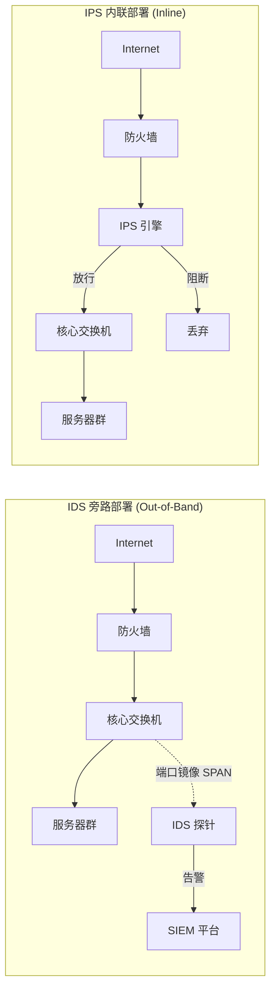
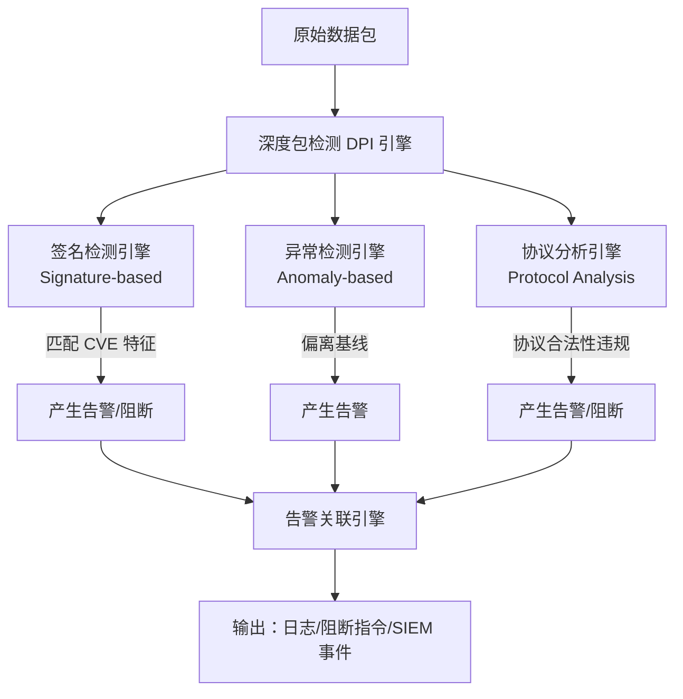
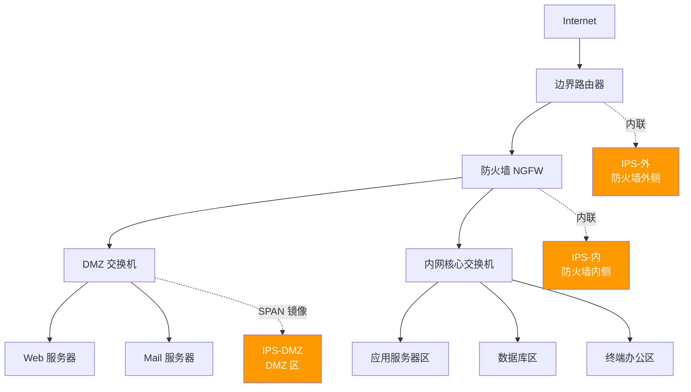
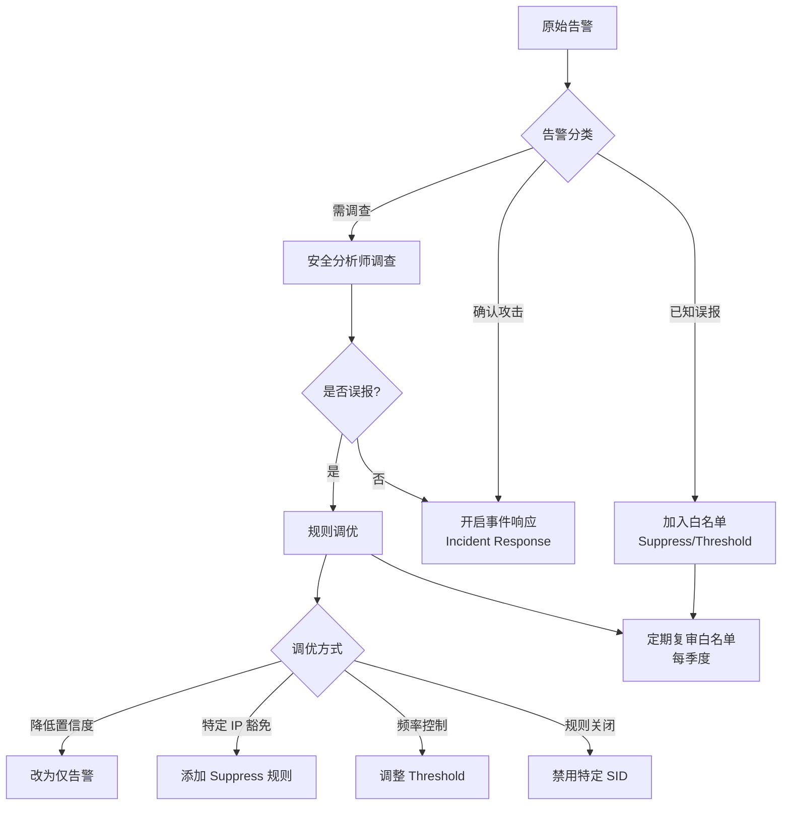
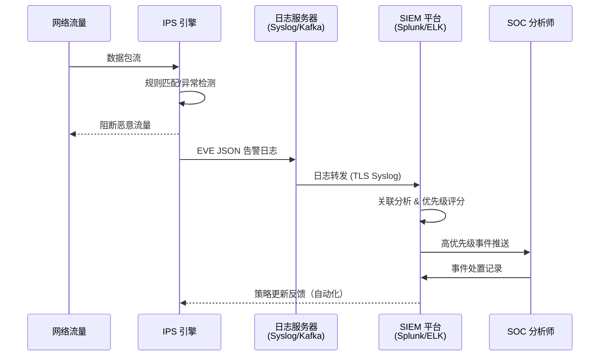

> 📋 **前置知识**：[防火墙技术](/guide/security/firewall)、[网络安全架构](/guide/attacks/security-arch)
> ⏱️ **阅读时间**：约18分钟

# IDS/IPS：入侵检测与防御系统深度解析

入侵检测系统（Intrusion Detection System，IDS）与入侵防御系统（Intrusion Prevention System，IPS）是企业纵深防御（Defense in Depth）体系的核心感知层。防火墙依赖端口与协议规则过滤流量，而 IDS/IPS 则深入分析数据包内容，识别已知攻击签名与异常行为，将网络安全防线从"边界封堵"推进到"内容感知"层次。

---

## 第一层：IDS 与 IPS 的核心区别

### 检测（Detection）vs 阻断（Prevention）

最根本的区别在于响应方式：

| 维度 | IDS | IPS |
|------|-----|-----|
| 响应方式 | 告警（Alert）、记录日志 | 主动阻断（Block）、丢弃报文 |
| 部署模式 | 旁路（Out-of-Band） | 内联（Inline） |
| 对业务影响 | 零影响，流量不经过 IDS | 误报可能阻断正常业务 |
| 延迟引入 | 无 | 微秒级处理延迟 |
| 典型场景 | 取证分析、合规审计 | 实时阻断攻击、零日防护 |



::: tip 最佳实践
在生产环境初次部署 IPS 时，建议先以 **IDS 模式（仅检测、不阻断）** 运行 2～4 周，充分收集误报（False Positive）数据并完成规则调优，再切换到阻断模式。这可避免因误报导致的业务中断。
:::

### 旁路与内联部署的网络影响

旁路部署通过交换机的**端口镜像（SPAN，Switched Port Analyzer）**或**网络分流器（Network TAP，Test Access Point）**获取流量副本。TAP 比 SPAN 更可靠——SPAN 在交换机高负载时可能丢弃镜像包，而硬件 TAP 对原始流量完全透明。

内联部署使 IPS 成为数据路径上的"串联节点"，需要关注：
- **可用性**：IPS 故障时须支持 Fail-Open（故障放行）或 Fail-Close（故障阻断）策略
- **吞吐量**：IPS 处理能力须匹配链路带宽，避免成为瓶颈
- **冗余**：高可用场景需双机热备（Active-Passive 或 Active-Active）

---

## 第二层：检测引擎原理

IDS/IPS 的核心竞争力在于检测引擎，主流引擎融合三类技术：



### 2.1 签名检测（Signature-based Detection）

签名检测是最成熟的技术，基于已知攻击的**特征模式（Pattern）**进行匹配，准确率高、误报率低。

**工作原理：**
1. 维护一个规则库（Rule Database），每条规则描述一类攻击的流量特征
2. 对每个数据包（或重组后的流）执行模式匹配
3. Snort 使用 Aho-Corasick 多模式匹配算法，Suricata 则利用多核与 SIMD 指令集加速

**局限性：** 对未知攻击（Zero-Day）和变形攻击（Polymorphic Attack）无效，规则库须持续更新。

### 2.2 异常检测（Anomaly-based Detection）

异常检测不依赖已知签名，而是通过**建立正常行为基线（Baseline）**，对偏离基线的行为发出告警。

**技术手段：**

| 方法 | 原理 | 示例 |
|------|------|------|
| 统计分析 | 监控流量速率、连接数等统计量 | 每秒 SYN 包突增 → SYN Flood |
| 机器学习 | 训练正常流量模型，检测离群点 | 异常的数据外传量 |
| 协议行为分析 | 学习正常协议交互序列 | HTTP 方法分布异常 |

::: warning 注意
异常检测的**误报率远高于签名检测**。机器学习模型需要足够的训练数据，且在业务流量模式变化时（如大促、版本发布）需重新训练，否则会产生大量误报，导致安全团队"告警疲劳"（Alert Fatigue）。
:::

### 2.3 协议分析（Protocol Analysis）

协议分析引擎按照 RFC 规范对协议进行**合法性验证**，检测协议滥用与畸形报文攻击。

例如：
- HTTP 请求头中存在非法字节序列 → SQL 注入探测
- DNS 响应包异常大（> 512 字节且无 EDNS）→ DNS 放大攻击
- TLS Client Hello 包含已知恶意指纹（JA3 Hash）→ C2 通信

---

## 第三层：部署架构详解

### 3.1 网络 IDS/IPS（NIDS/NIPS）

NIDS/NIPS 部署在网络关键节点，对经过的网络流量进行监控。部署位置的选择决定了可见性（Visibility）与防护范围：



**各位置防护特点：**

- **防火墙外侧（Internet 侧）**：可见全量互联网流量，但大量噪声导致告警量巨大，处理负载高
- **防火墙内侧（内网侧）**：只检测已穿越防火墙的流量，误报更少，重点发现绕过防火墙的攻击
- **DMZ 区**：保护面向公网暴露的服务器，检测针对 Web/邮件服务的应用层攻击

### 3.2 主机 IDS/IPS（HIDS/HIPS）

HIDS/HIPS 以 Agent 形式运行在每台主机上，监控：
- 文件完整性（File Integrity Monitoring，FIM）：检测关键系统文件被篡改
- 系统调用（Syscall）：检测异常进程行为，如进程注入、提权
- 注册表变更（Windows）：检测恶意软件持久化
- 日志审计：本地安全日志的实时分析

典型开源方案：**OSSEC**、**Wazuh**；商业方案：**CrowdStrike Falcon**、**Carbon Black**。

### 3.3 云原生 IPS（Cloud WAAP）

传统 IPS 在云环境面临挑战：东西向流量（East-West Traffic）难以全量镜像，虚拟机弹性伸缩导致部署复杂。云原生方案演进为：

- **WAF（Web Application Firewall）**：专注于 HTTP/HTTPS 应用层防护，覆盖 OWASP Top 10
- **WAAP（Web Application and API Protection）**：WAF + Bot 防护 + API 安全 + DDoS 缓解
- **云厂商原生方案**：AWS Network Firewall、Azure Network Watcher、阿里云云防火墙

---

## 第四层：Snort/Suricata 规则实战

Snort 与 Suricata 是企业最广泛部署的开源 IDS/IPS 引擎，规则语法高度兼容。

### 4.1 规则结构

每条规则由**规则头（Rule Header）**和**规则选项（Rule Options）**组成：

```
动作 协议 源IP 源端口 方向 目的IP 目的端口 (选项1; 选项2; ...)
```

**完整示例：**

```snort
# 检测 EternalBlue (MS17-010) SMB 漏洞利用
alert tcp $EXTERNAL_NET any -> $HOME_NET 445 (
    msg:"ET EXPLOIT MS17-010 SMBv1 EternalBlue Vulnerability Probe";
    flow:established,to_server;
    content:"|FF|SMB";
    content:"|73 00|";
    distance:1;
    within:4;
    content:"|05 00|";
    distance:56;
    within:2;
    threshold:type both, track by_src, count 3, seconds 60;
    classtype:attempted-admin;
    sid:2024218;
    rev:4;
    metadata:affected_product Windows, attack_target Server;
)
```

### 4.2 关键选项详解

| 选项 | 说明 | 示例 |
|------|------|------|
| `msg` | 告警描述信息 | `msg:"SQL Injection Attempt"` |
| `flow` | 流方向与状态 | `flow:established,to_server` |
| `content` | 字节内容匹配 | `content:"SELECT"` |
| `pcre` | 正则表达式匹配 | `pcre:"/union\s+select/i"` |
| `distance` / `within` | 相对位置限定 | `distance:0; within:10` |
| `threshold` | 触发频率控制 | `type both, track by_src, count 5, seconds 10` |
| `classtype` | 攻击分类 | `classtype:web-application-attack` |
| `sid` | 规则唯一标识 | `sid:9000001` |
| `rev` | 规则版本号 | `rev:1` |

### 4.3 实战规则示例

**检测 SQL 注入（SQL Injection）探测：**

```snort
alert http $EXTERNAL_NET any -> $HTTP_SERVERS $HTTP_PORTS (
    msg:"CUSTOM SQL Injection UNION SELECT Detected";
    flow:established,to_server;
    http.uri;
    pcre:"/(\%27|\'|--|%23|#).*(\bunion\b.*\bselect\b|\bselect\b.*\bfrom\b)/Ui";
    classtype:web-application-attack;
    sid:9000001;
    rev:1;
)
```

**检测 DNS 隧道（DNS Tunneling）数据外传：**

```snort
alert dns $HOME_NET any -> any 53 (
    msg:"CUSTOM Possible DNS Tunneling - Long Subdomain";
    dns.query;
    pcre:"/^[a-z0-9\-]{50,}\./";
    threshold:type both, track by_src, count 10, seconds 60;
    classtype:policy-violation;
    sid:9000002;
    rev:1;
)
```

**检测暴力破解 SSH（Brute Force）：**

```snort
alert tcp $EXTERNAL_NET any -> $SSH_SERVERS 22 (
    msg:"CUSTOM SSH Brute Force Attempt";
    flow:established,to_server;
    content:"SSH-";
    depth:4;
    threshold:type both, track by_src, count 10, seconds 30;
    classtype:attempted-user;
    sid:9000003;
    rev:2;
)
```

::: tip 最佳实践
自定义规则的 `sid` 请使用 **1000000 以上**的数值，避免与 Snort VRT（Vulnerability Research Team）官方规则和 ET（Emerging Threats）规则库冲突。本地规则建议从 9000000 起步，并建立内部规则编号管理台账。
:::

### 4.4 Suricata 专属增强

Suricata 在 Snort 规则基础上扩展了大量关键字，尤其在应用层检测方面更强：

```yaml
# suricata.yaml 关键配置
af-packet:
  - interface: eth0
    threads: 4
    cluster-id: 99
    cluster-type: cluster_flow
    defrag: yes

detect:
  profile: high
  custom-values:
    toclient-groups: 3
    toserver-groups: 25

outputs:
  - eve-log:
      enabled: yes
      filetype: regular
      filename: /var/log/suricata/eve.json
      types:
        - alert:
            metadata: yes
            tagged-packets: yes
        - flow
        - http
        - dns
        - tls
```

---

## 第五层：企业级运营与调优

### 5.1 误报（False Positive）管理方法论

误报管理是 IDS/IPS 运营中最耗时的工作，需要系统化的方法论：



**Snort/Suricata 白名单配置示例：**

```
# suppress.conf - 抑制特定误报规则
# 对内网扫描工具豁免漏洞扫描告警
suppress gen_id 1, sig_id 2010935, track by_src, ip 10.10.1.50/32

# 对 WAF 服务器豁免 SQL 注入告警（WAF 转发清洗后流量）
suppress gen_id 1, sig_id 9000001, track by_src, ip 172.16.100.10/32

# 全局调整高频规则触发阈值
threshold gen_id 1, sig_id 9000003, type both, track by_src, count 20, seconds 60
```

### 5.2 告警优先级与 SIEM 集成



**告警严重级别映射：**

| IPS 分类 | SIEM 优先级 | 响应 SLA | 典型攻击 |
|----------|-------------|----------|----------|
| 关键（Critical） | P1 | 15 分钟内响应 | 勒索软件 C2、RCE 漏洞利用 |
| 高危（High） | P2 | 1 小时内响应 | SQL 注入成功、暴力破解成功 |
| 中危（Medium） | P3 | 4 小时内响应 | 端口扫描、漏洞探测 |
| 低危（Low） | P4 | 24 小时内处理 | 协议异常、信息泄露 |

### 5.3 NGFW 集成 IPS vs 独立 IPS

现代下一代防火墙（Next-Generation Firewall，NGFW）已内置 IPS 模块，企业需要根据实际情况选择：

| 维度 | NGFW 集成 IPS | 独立专用 IPS |
|------|---------------|--------------|
| 部署复杂度 | 低，单一平台 | 高，独立设备 |
| 检测能力 | 通用，规则库较小 | 深度专业，规则库完整 |
| 吞吐量 | 受 NGFW 整体性能限制 | 专用芯片，性能更高 |
| 成本 | 较低（功能复用） | 较高（独立采购） |
| 适用场景 | 中小企业、分支机构 | 数据中心、高流量核心 |

::: tip 最佳实践
**推荐组合**：边界 NGFW 启用集成 IPS（防护南北向流量），数据中心核心部署专用 IPS（防护东西向流量与高价值资产）。两者规则库同步，SIEM 统一收集告警，实现分层纵深防御。
:::

### 5.4 加密流量检测（TLS 解密）

随着 HTTPS 流量占比超过 90%，不解密则 IPS 对加密流量几乎盲目。TLS 解密（SSL/TLS Inspection）是必要能力：

**解密架构：**
1. **正向代理（Forward Proxy）**：IPS 充当中间人（Man-in-the-Middle），对出站 HTTPS 流量解密检测
2. **被动解密（Passive Decryption）**：将服务器私钥导入 IPS，对进站流量解密（仅支持 RSA 密钥交换，TLS 1.3 的 ECDHE 不适用）
3. **镜像 + 解密代理**：结合硬件 TAP 与专用 SSL 解密设备（如 F5 SSL Orchestrator）

::: warning 注意
TLS 解密涉及**隐私与合规**风险，需注意：
- 金融、医疗等受监管行业须评估数据保护法规要求
- 解密策略应排除网银、医疗等敏感站点（Category-based Bypass）
- 解密设备自身成为高价值攻击目标，需严格安全加固
:::

### 5.5 性能调优要点

::: danger 避坑
**切勿将 IPS 置于超出处理能力的链路上**。IPS 在高负载时会优先保障流量转发（Fail-Open），悄无声息地跳过检测——这比没有 IPS 更危险，因为你以为有防护实则没有。务必在部署前完成吞吐量基准测试（Benchmarking）。
:::

**性能优化策略：**

1. **规则集裁剪**：仅启用与实际业务相关的规则分类，禁用无关规则（如纯 Windows 环境禁用 Linux 特定规则）
2. **流量预过滤（Fast Pattern Matching）**：Suricata 使用 `fast_pattern` 关键字，优先用长且稀少的内容做初筛，减少全规则匹配
3. **多线程调优**：Suricata 的 `af-packet` 多线程配置须与 CPU 核心数、网卡队列数对齐
4. **硬件加速**：DPDK（Data Plane Development Kit）、RSS（Receive Side Scaling）分流，高端场景使用 FPGA/ASIC 加速的商业设备

```bash
# Suricata 性能基准测试
suricata -c /etc/suricata/suricata.yaml \
  --pcap-file /path/to/test.pcap \
  --runmode autofp \
  -v

# 查看运行状态与丢包率
suricatasc -c "iface-stat eth0"
```

---

## 总结：企业 IDS/IPS 体系建设路线图

| 阶段 | 目标 | 关键动作 |
|------|------|----------|
| **基础建设** | 全网流量可见性 | 部署 NIDS（IDS 模式）+ HIDS Agent |
| **规则调优** | 降低误报率至可接受水平 | 2～4 周误报数据收集，白名单配置 |
| **阻断上线** | 实现实时防护 | 高置信度规则切换阻断模式 |
| **SIEM 集成** | 统一告警运营 | EVE JSON → Kafka → SIEM 关联分析 |
| **加密流量** | 消除检测盲区 | TLS 解密策略配置与隐私合规评估 |
| **持续优化** | 降低运营成本 | ML 辅助告警分类、自动化规则更新 |

IDS/IPS 不是"一次部署、永久运行"的设备，而是需要持续运营投入的安全能力。规则库的及时更新、误报的持续调优、与 SIEM/SOAR 的深度集成，才能让 IDS/IPS 真正成为企业安全体系中的"有效感知层"，而非徒增噪音的"告警机器"。
