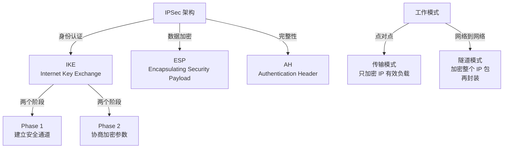
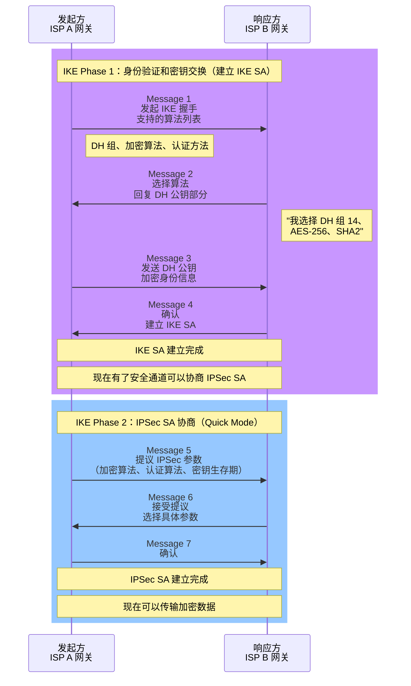

# IPSec：网络层的隐形盾牌

## 导言：为什么 IPSec 还活着？

VPN 产品琳琅满目（OpenVPN、Wireguard、Tailscale...），但 IPSec 仍然是企业网络的标准。为什么？

因为 IPSec 工作在**网络层（第 3 层）**，它对应用程序**完全透明**。你不需要修改任何应用代码，甚至不需要告诉应用"我在用 VPN"。

```
OpenVPN vs IPSec：

OpenVPN：
  应用 → OpenVPN 应用层 VPN → 网络 → 目标
  需要安装 OpenVPN 客户端
  对游戏、老旧软件可能有兼容性问题

IPSec：
  应用 → IP 层（自动加密）→ 网络 → 目标
  操作系统级别支持
  应用无感知，完全透明
  
正因如此，IPSec 是：
  [v] ISP 用来连接分支机构
  [v] 政府用来保护机密通信
  [v] 企业 VPN 的标准选择
```

---

## 第一部分：IPSec 的架构

IPSec 由多个协议组成：



### 传输模式 vs 隧道模式

```
传输模式（Transport Mode）：

原始包：[IP 报头][TCP 报头][数据]

加密后：[IP 报头][ESP 报头][TCP 报头][数据][ESP 尾][认证]

特点：
  [v] 开销小（只加密上层协议）
  [v] 不改变 IP 报头（防火墙友好）
  [x] 报头泄露（能看到源 IP、目标 IP、端口号）
  
用途：
  - 端到端 VPN（两台电脑直接通信）
  - Wireguard 使用这种模式


隧道模式（Tunnel Mode）：

原始包：[IP 报头][TCP 报头][数据]

加密后：[新 IP 报头]
        [ESP 报头]
        [原 IP 报头][TCP 报头][数据]
        [ESP 尾][认证]

特点：
  [v] 完全隐藏原始包（包括源/目标 IP）
  [x] 开销大（多了一层 IP 报头）
  [v] 支持非直连的路由器（重新封装 IP 报头）
  
用途：
  - VPN 网关之间（站点到站点）
  - 隐藏内网 IP 地址（安全性好）
  
企业 VPN 几乎都用隧道模式
```

---

## 第二部分：IKE 协议详解

IKE 是 IPSec 的"配对仪式"。两个通信方在真正传输数据前，要完成两个阶段的握手。



### Phase 1 的关键算法

```
DH（Diffie-Hellman）密钥交换：
  两方各生成一个随机数（私钥）
  通过公开交换，推导出共同密钥
  即使攻击者看到了整个交换过程，也无法推导出共同密钥
  
  DH 组别：
    Group 1 (768 位) - 过时，不安全
    Group 2 (1024 位) - 过时
    Group 5 (1536 位) - 过时
    Group 14 (2048 位) - 现代标准
    Group 20 (3072 位) - 高安全
    Group 21 (2048 位，曲线) - 新式（椭圆曲线更高效）

加密算法：
    DES - 过时
    3DES - 还能用但不推荐
    AES-128 - 现代标准
    AES-192 - 更安全
    AES-256 - 最安全

认证算法（HMAC）：
    MD5 - 过时，易碰撞
    SHA-1 - 过时
    SHA-256 - 现代标准
    SHA-512 - 更安全
```

---

## 第三部分：ESP vs AH

```
AH（Authentication Header）：
  
┌─────────────────────┐
│AH 报头              │
├─────────────────────┤
│认证数据             │（HMAC）
│（用于完整性检查）    │
├─────────────────────┤
│原始 IP 包           │
└─────────────────────┘

功能：只提供"完整性验证"和"身份验证"，不加密
特点：
  [v] 轻量级
  [x] 数据还是明文，隐私性差


ESP（Encapsulating Security Payload）：

┌──────────────────────┐
│ESP 报头              │
├──────────────────────┤
│加密的有效负载        │
│（原始 IP 包）         │
├──────────────────────┤
│ESP 尾（填充）         │
├──────────────────────┤
│认证数据（HMAC）      │
└──────────────────────┘

功能：加密 + 完整性检查
特点：
  [v] 既保密又验证
  [v] 功能完整
  [v] 开销适中

现实中，99% 的 IPSec 部署都用 ESP
因为它既要安全（加密），也要验证（完整性）
AH 已经被淘汰
```

---

## 第四部分：真实配置示例

### Linux（使用 strongSwan）

```bash
# 安装
sudo apt-get install strongswan strongswan-swanctl

# 配置文件：/etc/swanctl/conf.d/site-to-site.conf

connections {
  office-branch {
    # 本地端
    local_addrs = 203.0.113.1    # ISP A 网关 IP
    remote_addrs = 198.51.100.1  # ISP B 网关 IP
    
    local {
      auth = psk  # 预共享密钥
      id = office
    }
    
    remote {
      auth = psk
      id = branch
    }
    
    # IKE 配置
    version = 2  # IKEv2
    proposals = aes256-sha256-modp2048  # Phase 1
    
    # IPSec 配置
    children {
      office-branch-tunnel {
        local_ts = 10.1.0.0/16   # 公司总部的私网段
        remote_ts = 10.2.0.0/16  # 分支的私网段
        
        esp_proposals = aes256-sha256  # 加密 + 认证
        rekey_time = 3600s        # 1 小时重新协商
        
        mode = tunnel             # 隧道模式
      }
    }
  }
}

secrets {
  ike-office-branch {
    secret = "super_secret_key_12345"
  }
}

# 启动
sudo swanctl -c

# 检查连接
sudo swanctl -l
```

### Cisco 路由器配置

```
!
! ISAKMP（IKE） Phase 1 配置
!
crypto isakmp policy 10
  encryption aes 256
  hash sha256
  authentication pre-share
  group 14
  lifetime 28800

crypto isakmp key super_secret_key_12345 address 198.51.100.1

!
! IPSec Phase 2 配置
!
crypto ipsec transform-set SITE-TO-SITE esp-aes 256 esp-sha-hmac
  mode tunnel

!
! 定义哪些流量需要加密
!
access-list 101 permit ip 10.1.0.0 0.0.255.255 10.2.0.0 0.0.255.255

!
! 应用 IPSec
!
crypto map SITE-TO-SITE 10 ipsec-isakmp
  set peer 198.51.100.1
  set transform-set SITE-TO-SITE
  match address 101
  set pfs group14
  set lifetime 3600

interface GigabitEthernet0/0/0
  crypto map SITE-TO-SITE

!
! 验证
!
show crypto isakmp sa
show crypto ipsec sa
show crypto engine connections active
```

---

## 第五部分：常见故障和排查

### Phase 1 失败的原因

```
错误症状："Unable to establish ISAKMP SA"

检查清单：
  1. 网络连接
     ping 对端 IP（203.0.113.1 ↔ 198.51.100.1）
     
  2. 防火墙
     允许 UDP 500（IKE）
     允许 UDP 4500（NAT-T，如果使用）
     允许 IP Protocol 50（ESP）
     
  3. 预共享密钥
     两端密钥必须完全相同
     检查特殊字符、空格
     
  4. IKE 提议匹配
     # 在 strongSwan 上
     sudo swanctl -l
     
     在 Cisco 上
     show crypto isakmp policy
     
     通常是加密算法不匹配：
       一端：aes256-sha256
       另一端：aes128-sha1
     → 无法协商

  5. 认证方法
     检查是 psk（预共享）还是 RSA 签名
     
  6. 时钟同步
     两个设备的系统时间相差不能超过 1 分钟
     （IKE 报文有时间戳）
```

### Phase 2 失败

```
错误："Quick Mode negotiation failed"

通常原因：
  1. 内网网段不匹配
     ISP A: local_ts = 10.1.0.0/16
     ISP B: remote_ts = 10.2.0.0/16
     
     但如果两端配置反了：
     ISP A 说："我要保护 10.1.0.0/16"
     ISP B 说："我要保护 10.3.0.0/16"
     → 无法建立 Child SA
     
  2. ACL 不匹配
     access-list 101 permit ip 10.1.0.0 0.0.255.255 10.2.0.0 0.0.255.255
     必须精确匹配两端的私网段
     
  3. PFS（Perfect Forward Secrecy）设置不同
     一端启用 PFS，另一端不启用
```

### 常见的性能问题

```
症状：IPSec 隧道建立成功，但吞吐量很低（本应 100Mbps，实际 10Mbps）

原因和解决：

1. CPU 限制
   原因：加密/解密是 CPU 密集操作
   诊断：top 命令看 CPU 使用率，esp/ah 进程占用 100%
   解决：
     [v] 启用硬件加速（AES-NI 指令集）
     [v] 降低加密强度（AES-128 而非 AES-256）
     [v] 升级更强的 CPU
   
2. MTU 问题
   原因：IPSec 报头增加开销，导致包超过 MTU
        如果路径不支持分片，包被丢弃
   诊断：ping -M do -s 1400 目标
        看是否能通过
   解决：
     [v] 调整 MTU = 1500 - IPSec开销（通常50-60字节）
        ip link set dev eth0 mtu 1440
     [v] 启用 Path MTU Discovery
     [v] 防火墙允许 ICMP "Fragmentation Needed"

3. 重传过多
   原因：IPSec 报文丢失，需要重新协商
   诊断：show crypto engine connections active
        看 #pkts compressed 和 #pkts dropped
   解决：
     [v] 检查网络质量（丢包、延迟）
     [v] 增加 IKE 超时时间
     [v] 改用 UDP 4500（NAT-T），穿透更好
```

---

## 总结

IPSec 是网络层 VPN 的王者，但配置复杂：

1. **两个阶段**：IKE Phase 1（身份认证）+ Phase 2（密钥协商）
2. **两种模式**：传输模式（轻）vs 隧道模式（重但全隐）
3. **两类算法**：ESP（加密+完整性）vs AH（仅完整性）

**关键要点**：

- IPSec 对应用透明，但配置需要精细
- ESP 是现代标准，AH 基本淘汰
- 隧道模式是企业首选
- 故障排查从 Phase 1 开始，逐步深入

---

## 推荐阅读

- [SD-WAN 和 IPSec 集成](../sdwan/concepts.md)
- [网络诊断工具](../ops/packet-analysis.md)