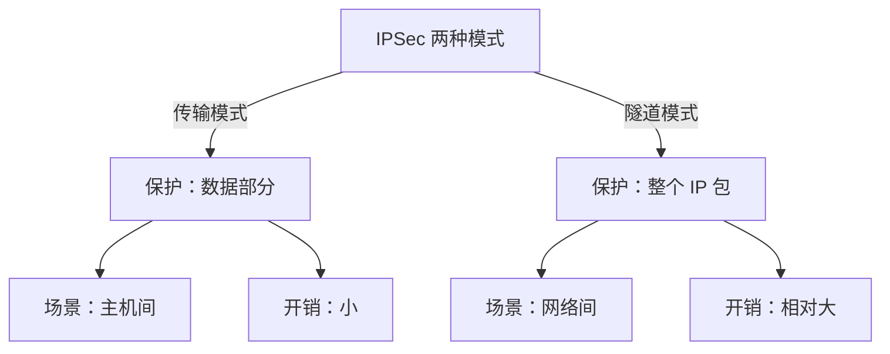
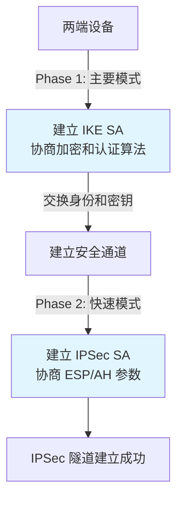
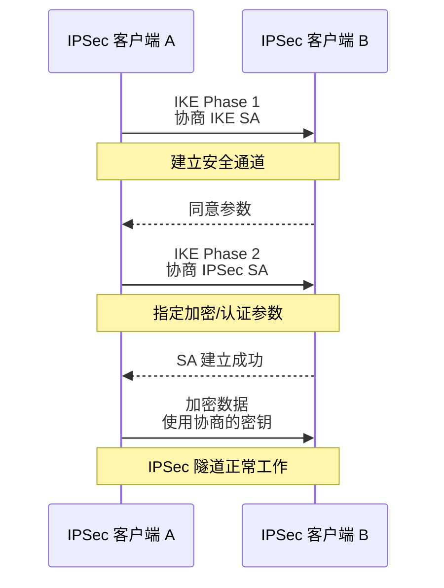
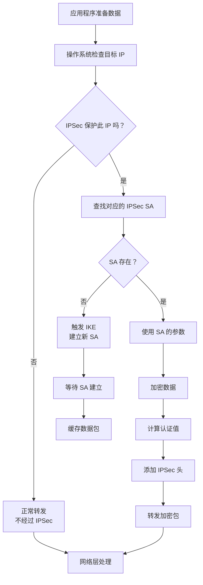
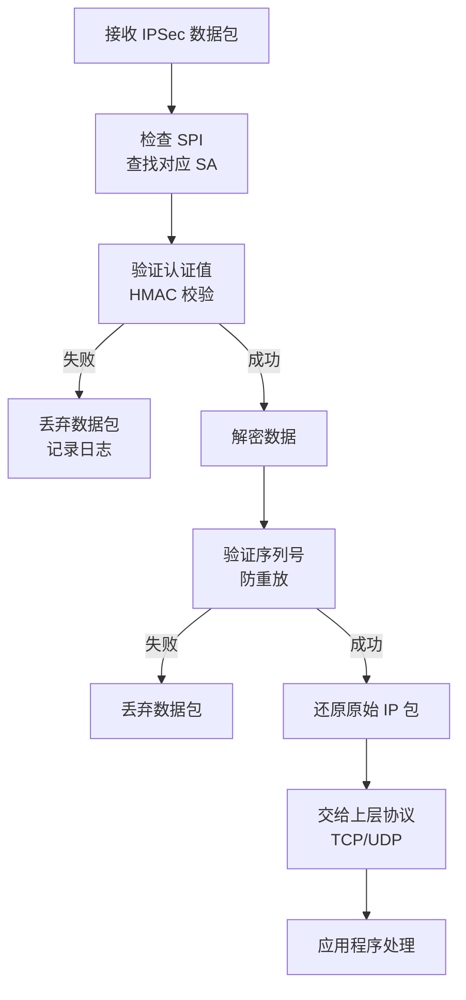
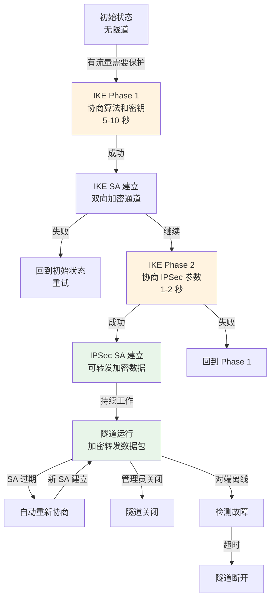

# IPSec 协议详解：加密通道的铜墙铁壁

## 导言

如果说 TCP/IP 是网络的"骨架"，那么 **IPSec** 就是保护数据的"铠甲"。

在 SD-WAN、VPN、站点间连接等场景中，IPSec 无处不在。理解 IPSec 的工作原理，是理解现代网络安全的基础。

---

## IPSec 是什么？

**IPSec（Internet Protocol Security）** 是一个**网络层的安全协议**，用于加密和认证 IP 数据包。

### 工作位置

```
应用层
  ↓
传输层（TCP/UDP）
  ↓
网络层 ← IPSec 在这里工作
  ↓
链接层
  ↓
物理层
```

### 核心功能

| 功能 | 说明 | 对应协议 |
|-----|------|---------|
| **保密性** | 加密数据，防止窃听 | ESP (Encapsulating Security Payload) |
| **完整性** | 验证数据未被篡改 | AH (Authentication Header) |
| **身份验证** | 验证对方身份 | IKE (Internet Key Exchange) |
| **防重放** | 防止数据包被重放 | 序列号机制 |

---

## IPSec 的两种模式

### 1. 传输模式（Transport Mode）

**用途**：主机间的点对点通信

**保护内容**：只保护数据部分（payload）

```
┌─────────────────────────────────────┐
│      IP 头                           │
├─────────────────────────────────────┤
│ IPSec 头（AH/ESP）                  │
├─────────────────────────────────────┤
│ 原始数据（加密）                     │
└─────────────────────────────────────┘
```

**应用场景**：
- 客户端到服务器的 VPN
- 远程员工回家连接

### 2. 隧道模式（Tunnel Mode）

**用途**：网络间的通道，通常用于网关/路由器

**保护内容**：整个 IP 包（头 + 数据）都被加密

```
┌─────────────────────────────────────┐
│ 新 IP 头（公网地址）                 │
├─────────────────────────────────────┤
│ IPSec 头（AH/ESP）                  │
├─────────────────────────────────────┤
│ 原始 IP 头 + 数据（全部加密）        │
└─────────────────────────────────────┘
```

**应用场景**：
- 分支网络与总部的连接（最常见）
- SD-WAN 隧道
- Site-to-Site VPN

**对比**：



---

## IPSec 的三大协议

### 1. AH（Authentication Header）— 纯认证

**职责**：验证数据完整性和来源

**特点**：
- 只认证，不加密
- 开销小
- 单独使用较少

**报文格式**：

```
┌──────────────────────────────────┐
│ 下一报头 | 负载长度 | 保留       │
├──────────────────────────────────┤
│ SPI（安全参数索引，32 位）       │
├──────────────────────────────────┤
│ 序列号（防重放）                  │
├──────────────────────────────────┤
│ 认证数据（HMAC-MD5 或 HMAC-SHA） │
└──────────────────────────────────┘
```

### 2. ESP（Encapsulating Security Payload）— 加密 + 认证

**职责**：加密数据，提供认证

**特点**：
- 功能最全
- 现代 IPSec 的首选
- 开销相对较大

**报文格式**：

```
┌─────────────────────────────────────┐
│ SPI | 序列号 | 保留                 │
├─────────────────────────────────────┤
│ 加密数据（原始数据 + 填充）        │
├─────────────────────────────────────┤
│ 填充长度 | 下一协议                 │
├─────────────────────────────────────┤
│ 认证数据（完整性校验）              │
└─────────────────────────────────────┘
```

**加密过程**：


### 3. IKE（Internet Key Exchange）— 密钥管理

**职责**：安全地协商密钥和算法参数

**流程**：



---

## IPSec SA（安全关联）

**SA** 是 IPSec 的"合同"——双方同意用什么算法、密钥、参数来通信。

### SA 的要素

每个 SA 包含：

```
┌──────────────────────────────┐
│ 密钥（对称密钥）             │
│ 加密算法（AES、DES）         │
│ 认证算法（HMAC-SHA1）        │
│ 生命周期（多久更新密钥）     │
│ SPI（标识这个 SA）          │
│ 反向 SA（返回路由参数）      │
└──────────────────────────────┘
```

### SA 的建立过程



---

## 加密与认证算法

### 常见加密算法

```
┌──────────────────────────────────────────┐
│ 算法 | 密钥长度 | 安全性 | 性能 | 现状   │
├──────────────────────────────────────────┤
│ DES | 56 位 | 低 🔴 | 快 | 已弃用 |
│ 3DES | 168 位 | 中 🟡 | 一般 | 逐步淘汰 |
│ AES-128 | 128 位 | 高 🟢 | 快 | 主流 |
│ AES-192 | 192 位 | 高 🟢 | 快 | 推荐 |
│ AES-256 | 256 位 | 很高 🟢 | 快 | 军用 |
│ Chacha20 | 256 位 | 高 🟢 | 很快 | 新兴 |
└──────────────────────────────────────────┘
```

### 常见认证算法

```
┌─────────────────────────────────────────────┐
│ 算法 | 输出长度 | 安全性 | 计算速度 | 现状 |
├─────────────────────────────────────────────┤
│ MD5 | 128 位 | 低 🔴 | 快 | 弃用 |
│ SHA1 | 160 位 | 中 🟡 | 中 | 逐步淘汰 |
│ SHA256 | 256 位 | 高 🟢 | 中 | 主流 |
│ SHA384 | 384 位 | 高 🟢 | 中 | 推荐 |
│ SHA512 | 512 位 | 很高 🟢 | 中 | 军用 |
└─────────────────────────────────────────────┘
```

---

## IPSec 的工作流程

### 完整的数据传输过程



### 接收端处理



---

## IPSec 隧道的建立和维护

### 隧道生命周期



### 隧道参数示例

```
隧道名称：HQ-to-Branch-Shanghai
━━━━━━━━━━━━━━━━━━━━━━━━━━━━━
IKE 参数：
  ├─ 版本：IKEv2（推荐）
  ├─ 加密：AES-256-GCM
  ├─ 认证：SHA-384
  ├─ DH 组：Group 20（椭圆曲线）
  └─ SA 生命周期：28,800 秒（8 小时）

IPSec 参数：
  ├─ 协议：ESP（推荐）
  ├─ 模式：隧道模式
  ├─ 加密：AES-256
  ├─ 认证：HMAC-SHA256
  └─ SA 生命周期：3,600 秒（1 小时）

流量参数：
  ├─ 本地子网：192.168.1.0/24
  ├─ 远端子网：10.0.0.0/24
  ├─ 协议：全部（IP）
  └─ 优先级：100

当前状态：✓ 活跃
数据包已通过：1,245,867
加密字节数：456,123,456 B
隧道建立时间：2 小时 34 分
```

---

## IPSec 的优缺点

### 优点 ✅

```
┌─────────────────────────────────────┐
│ 优点                                 │
├─────────────────────────────────────┤
│ ✓ 国际标准，广泛支持                │
│ ✓ 工作在网络层，对上层应用透明     │
│ ✓ 可保护任何上层协议                │
│ ✓ 强大的加密和认证能力              │
│ ✓ 完整的密钥管理机制（IKE）        │
│ ✓ 支持多种加密算法，灵活配置       │
│ ✓ 已在企业网络中验证多年            │
└─────────────────────────────────────┘
```

### 缺点 ❌

```
┌──────────────────────────────────────┐
│ 缺点                                  │
├──────────────────────────────────────┤
│ ✗ 配置复杂，参数众多                │
│ ✗ 故障排查困难，黑盒化              │
│ ✗ IKE 协商慢（几秒钟）              │
│ ✗ CPU 开销大（加密/解密）          │
│ ✗ NAT 穿透困难（IPSec over NAT）   │
│ ✗ 不支持压缩（传统 IPSec）         │
│ ✗ 不支持 QoS 标记（加密后丢失）   │
└──────────────────────────────────────┘
```

---

## IPSec 在现代网络中的应用

### 1. Site-to-Site VPN（站点间 VPN）

```
总部（北京）             分支（上海）
┌──────────────┐        ┌──────────────┐
│ 内网         │        │ 内网         │
│192.168.1.0/24│        │ 10.0.0.0/24  │
└──────────────┘        └──────────────┘
       ↓                       ↓
┌──────────────┐        ┌──────────────┐
│ IPSec 网关   │        │ IPSec 网关   │
│ 1.2.3.4      │←——IPSec 隧道——→│ 5.6.7.8      │
└──────────────┘        └──────────────┘
       ↓                       ↓
    互联网              互联网
```

### 2. SD-WAN 隧道

```
SD-WAN Controller
        ↑
    管理接口
        ↓
┌──────────────┐
│ 分支 CPE     │
│ IPSec 隧道   │
└──────────────┘
   ↑    ↑
   │    └─IPSec→ 其他分支
   │
   └─IPSec→ 总部网关
```

### 3. 远程访问 VPN

```
远程员工（在家）
       ↓
  VPN 客户端
  IPSec 传输模式
       ↓
┌──────────────┐
│ 公司 VPN 网关│
└──────────────┘
       ↓
    公司网络
```

---

## 故障排查

### 常见问题

| 问题 | 可能原因 | 排查方法 |
|-----|---------|---------|
| 隧道建立失败 | IKE 参数不匹配 | 查看 IKE 日志，对比两端配置 |
| 隧道建立成功但无法传输数据 | IPSec SA 参数错误 | 验证加密/认证算法 |
| 隧道频繁断开 | 防火墙阻止 IKE/ESP | 检查防火墙规则，开放 UDP 500 和 4500 |
| 性能低 | CPU 不足或算法重 | 降低加密强度，或升级硬件 |
| NAT 后无法建立隧道 | IKE-NAT 问题 | 启用 NAT-T（IPSec NAT Traversal） |

---

## 总结

**IPSec 是什么**：
- 网络层的安全协议
- 提供加密、认证、防重放

**IPSec 怎么工作**：
- IKE 协商参数和密钥
- ESP 进行加密和认证
- SA 维护会话状态

**何时使用 IPSec**：
- Site-to-Site VPN
- SD-WAN 隧道
- 远程访问
- 任何需要加密网络连接的场景

**需要注意**：
- 配置复杂，需要仔细对比参数
- 性能开销不小
- 故障排查需要理解深层原理

---

## 推荐阅读

- 下一章：[GRE 和网络隧道](/guide/security/gre)
- 相关章节：[加密与认证](/guide/attacks/encryption)
