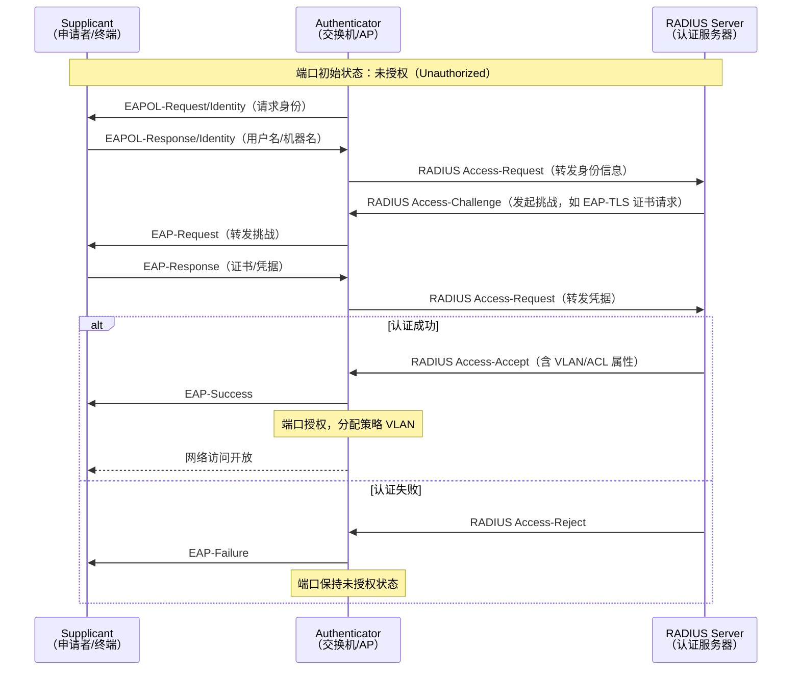
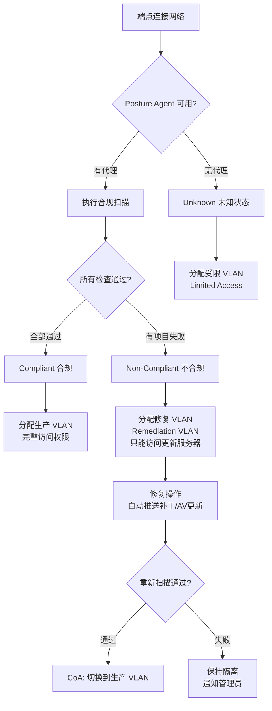
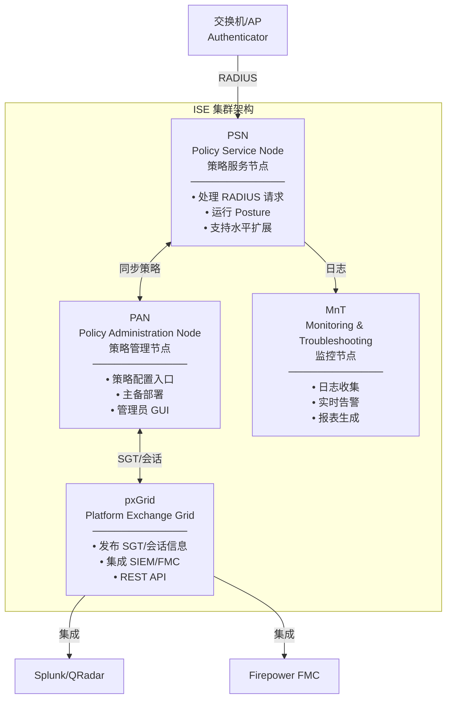
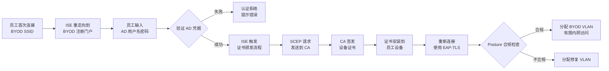

> <Icon name="clipboard-list" color="cyan" /> **前置知识**：[零信任安全](/guide/security/zero-trust)、[Wi-Fi安全](/guide/wireless/wifi-security)
> ⏱ **阅读时间**：约18分钟

# 网络准入控制（NAC）：端点合规管理与零信任实践

2021年，一家制造企业遭受了一次代价高昂的勒索软件攻击。攻击者的入口？一台承包商带进来的笔记本电脑，没有安装防病毒软件，补丁停留在三年前的版本。这台设备插入会议室网口的那一刻，就拿到了和员工电脑完全相同的内网访问权限。

这个问题不罕见。当你的网络有 500 个网口、200 个 Wi-Fi AP、每天来来往往的访客和承包商，你怎么知道谁能连接？连上来的设备是否安全？权限应该给多大？

这正是网络准入控制（NAC，Network Access Control）要解决的三个问题：**身份验证（Who）、合规核查（Healthy）、权限管控（How much）**。

---

## 第一部分：NAC 解决什么问题

### 传统网络的信任问题

```
传统网络边界模型：

                    ┌─────────────────────────────────────┐
                    │           企业内网                   │
                    │                                     │
  网口 ──→ 交换机 ──→  所有设备获得相同访问权限             │
  Wi-Fi AP ──→     │  员工 PC [v]                          │
                    │  访客设备 [v]  （不应该有内网权限）     │
                    │  感染病毒的笔记本 [v] （危险）          │
                    │  承包商设备 [v]  （权限过大）           │
                    └─────────────────────────────────────┘

问题所在：
  ├─ 物理接入 = 完全信任  →  任何人插上网线就进了内网
  ├─ 没有身份验证         →  不知道是谁的设备
  ├─ 没有合规检查         →  不知道设备是否安全
  └─ 没有细粒度权限       →  访客和员工权限相同
```

NAC 在这个模型上加了一道门禁：

```
NAC 模型：

  设备尝试接入
       ↓
  [认证] ── 你是谁？证书？用户名密码？
       ↓
  [合规] ── 系统补丁打了吗？防病毒在运行吗？
       ↓
  [授权] ── 根据身份+合规状态 → 分配对应 VLAN 和权限
       ↓
  ┌─────────────────────────────────┐
  │  员工+合规       →  内网 VLAN   │
  │  员工+不合规     →  修复 VLAN   │
  │  访客           →  访客 VLAN   │
  │  未知设备       →  拒绝或隔离   │
  └─────────────────────────────────┘
```

::: tip NAC 与防火墙的区别
防火墙控制的是流量的方向（东西向/南北向），NAC 控制的是端点能否进入网络，以及进入哪个网络。两者互补，不互替。
:::

---

## 第二部分：802.1X 认证机制

802.1X 是 NAC 的技术基础，它定义了一个基于端口的网络访问控制（Port-Based Network Access Control）框架。

### 三个角色

```
802.1X 角色划分：

┌──────────────┐         ┌──────────────┐         ┌──────────────────┐
│  Supplicant  │         │ Authenticator│         │Authentication    │
│  申请者      │◄───────►│  认证者      │◄────────►│Server 认证服务器 │
│              │  EAPOL  │              │  RADIUS  │                  │
│ 终端设备     │         │ 交换机/AP    │         │  Cisco ISE       │
│ (PC/手机)    │         │ (网络设备)   │         │  Aruba ClearPass │
└──────────────┘         └──────────────┘         └──────────────────┘

EAPOL：EAP over LAN（局域网上的可扩展认证协议）
RADIUS：Remote Authentication Dial-In User Service（远程认证拨号用户服务）
```

认证者（交换机或 AP）在认证完成前，只开放一个极小的通道：只允许 EAPOL 帧通过。认证成功后，才真正"打开端口"。

### 完整认证序列



### EAP 方法选择

不同场景使用不同的 EAP（Extensible Authentication Protocol，可扩展认证协议）方法：

```
EAP 方法对比：

EAP-TLS（Transport Layer Security）
  ├─ 客户端证书 + 服务器证书，双向认证
  ├─ 安全性最高
  ├─ 需要 PKI 基础设施
  └─ 适用：企业托管设备（域机器）

PEAP-MSCHAPv2（Protected EAP）
  ├─ 服务器证书 + 用户名密码
  ├─ 安全性中等（依赖密码强度）
  ├─ 无需客户端证书，部署简单
  └─ 适用：BYOD 初始阶段

EAP-TTLS/PAP
  ├─ 在 TLS 隧道内传输 PAP 凭据
  ├─ 可对接 LDAP/AD 目录
  └─ 适用：混合系统环境

MAB（MAC Authentication Bypass，MAC 地址绕过认证）
  ├─ 用设备 MAC 地址作为凭据
  ├─ 适用于不支持 802.1X 的设备（打印机、IP 电话、IoT）
  └─ 安全性低，应配合 DHCP 探测使用
```

::: warning MAB 的安全风险
MAB 认证依赖 MAC 地址，而 MAC 地址可以被伪造（MAC Spoofing）。对于关键系统，MAB 应配合 DHCP 指纹识别、流量行为分析等补偿控制使用，不能作为唯一的认证手段。
:::

---

## 第三部分：端点合规评估（Posture Assessment）

认证只回答了"你是谁"，合规评估（Posture Assessment）回答"你的设备安全吗"。

### 合规检查项

```
Posture 检查矩阵：

类别              检查项                              合规标准示例
──────────────────────────────────────────────────────────────────
操作系统          OS 版本 + 补丁级别                  Win 11 + KB5031354 以上
防病毒            AV 软件运行状态 + 病毒库日期         Defender/SEP/趋势科技，库 < 7天
磁盘加密          BitLocker/FileVault 状态            系统盘 100% 加密
防火墙            主机防火墙开启状态                   所有规则文件启用
证书              机器证书有效性                       域 CA 签发，未过期
EDR 代理          Crowdstrike/SentinelOne 运行状态    代理在线，传感器版本合格
VPN 客户端        规定 VPN 客户端版本                  Cisco AnyConnect 4.10+
```

### 三种合规状态



### 修复 VLAN 设计

```
修复网络隔离设计：

生产网络（VLAN 10）          修复网络（VLAN 99）
─────────────────           ─────────────────────
  内网服务器                   Windows Update
  文件共享                     SCCM/Intune 推送
  打印机                       防病毒更新服务器
  Internet（完整）             有限 Internet（仅更新）

修复流程：
  不合规设备 → VLAN 99 → 自动下载更新 → Posture 重新验证
                                          ↓
                              合规 → CoA → 切换 VLAN 10
                              不合规 → 保持 VLAN 99 + 告警
```

::: tip 无代理（Agentless）Posture
对于无法安装代理的设备（BYOD、访客），可以使用 ISE 的 Temporal Agent——用户首次访问时，浏览器下载一个临时小程序运行扫描，扫描完成后自动删除。这比永久代理部署简单，但检查能力有限。
:::

---

## 第四部分：动态策略——CoA、dACL 与 SGT

认证和合规只是策略的输入，真正让策略"动"起来的是三个机制。

### CoA（Change of Authorization，授权变更）

```
CoA 工作原理：

正常情况：
  设备 ──→ 交换机 ──→ ISE：认证通过 → VLAN 10
  
发现威胁后（Posture 重评估 / 安全事件）：
  ISE ──→ 交换机：RADIUS CoA-Request
                  发送新的授权属性（VLAN 99）
  交换机 ──→ 设备：重新认证或直接切换 VLAN
  
结果：
  设备无感知，几秒内从 VLAN 10 切换到 VLAN 99（隔离）

CoA 触发场景：
  ├─ Posture 检查失败（补丁过期）
  ├─ SIEM 检测到异常行为告警
  ├─ 管理员手动隔离
  └─ 访客账号到期
```

### dACL（Downloadable ACL，可下载访问控制列表）

比 VLAN 更细粒度的控制方式——不改变 VLAN，只限制流量：

```
dACL 示例（承包商设备策略）：

permit tcp any host 192.168.100.50 eq 443    # 允许访问项目服务器 HTTPS
permit tcp any host 192.168.100.50 eq 22     # 允许 SSH 到项目服务器
deny   ip  any 192.168.0.0 0.0.255.255       # 拒绝所有其他内网访问
permit ip  any any                            # 允许 Internet

ISE 在 RADIUS Access-Accept 中携带 dACL 名称：
  Cisco-AVPair = "ip:inacl#1=permit tcp any host 192.168.100.50 eq 443"

交换机接收后应用在接入端口的 ingress 方向。
```

### SGT（Security Group Tag，安全组标签）

思科 TrustSec 架构的核心，彻底脱离 IP 地址进行策略：

```
SGT 工作流：

ISE 分配 SGT：
  员工 + 合规    → SGT 10 (Employee)
  承包商         → SGT 20 (Contractor)
  服务器群       → SGT 50 (Datacenter)
  支付系统       → SGT 60 (PCI)

交换机在数据帧中打上 SGT 标签（802.1AE MACsec）

防火墙/交换机 SGT 策略矩阵：
  
        →  Employee(10)  Contractor(20)  Datacenter(50)  PCI(60)
Employee(10)   Allow        Deny           Allow           Deny
Contractor(20) Deny         Allow          Partial         Deny
Datacenter(50) Allow        Partial        Allow           Deny

优势：策略与 IP 地址解耦，移动设备不影响策略，
      管理 100 个 SGT 比管理 1000 条 IP ACL 简单得多。
```

---

## 第五部分：Cisco ISE 架构与策略设计

Cisco ISE（Identity Services Engine）是当前企业市场占有率最高的 NAC 平台。

### ISE 节点类型



### 策略集（Policy Set）设计

ISE 策略分三层：

```
ISE 策略层级：

第一层：Policy Set（策略集）
  └─ 按接入位置分类，确定走哪个策略集
  例：
    ├─ "有线接入" → 匹配 NAS-Port-Type = Ethernet
    ├─ "无线接入" → 匹配 NAS-Port-Type = Wireless-802.11
    └─ "VPN 接入" → 匹配 NAS-IP-Address = VPN-GW

第二层：Authentication Policy（认证策略）
  └─ 决定用什么方法认证
  例：
    ├─ 规则1：MAB → 查 Internal Endpoints 数据库
    └─ 规则2：802.1X → 查 Active Directory

第三层：Authorization Policy（授权策略）
  └─ 决定给什么权限
  例（按优先级）：
    ├─ 规则1：AD组=IT_Admin + Posture=Compliant → IT_Admin_VLAN + dACL_Full
    ├─ 规则2：AD组=Employee + Posture=Compliant → Employee_VLAN + dACL_Standard
    ├─ 规则3：AD组=Employee + Posture=NonCompliant → Remediation_VLAN
    ├─ 规则4：EndpointGroup=Corp_Printer → Printer_VLAN + MAB_Permit
    └─ 默认：→ Guest_VLAN（拒绝内网访问）
```

::: warning 策略集顺序至关重要
ISE 策略按从上到下的顺序匹配，命中第一条即停止。宽泛的规则放在下面，精确的规则放在上面。新增规则前务必审查顺序，错误的顺序可能导致全员拒绝或全员放行。
:::

---

## 第六部分：访客网络设计

访客接入是 NAC 中逻辑最复杂、运营成本最高的部分。

### 访客门户（Guest Portal）架构

```
访客接入流程：

1. 访客连接 "Corp-Guest" SSID
2. 获取 IP（DHCP，访客段）
3. 浏览器访问任意网页 → 被重定向到 ISE 访客门户

4. 门户类型选择：
   ├─ 自助注册（Self-Registration）
   │     访客填写姓名+邮箱 → 系统发送临时账号
   │     
   ├─ 担保人制（Sponsored）
   │     访客填写信息 → 员工担保人收到邮件审批
   │     担保人批准 → 访客获得账号
   │     
   └─ 热点模式（Hotspot）
         直接点击"同意条款" → 无需账号，直接放行

5. 认证成功：
   ISE 触发 CoA → 交换机/AP 切换 VLAN
   访客进入隔离的访客网络（Internet Only）
```

### 访客网络隔离设计

```
访客网络隔离（纵深防御）：

                         Internet
                            ↑
                      [防火墙/UTM]
                      策略：访客只允许 80/443 出站
                            |
              ┌─────────────┴─────────────┐
              │        访客 VLAN 200       │
              │  10.200.0.0/22             │
              │                           │
              │  访客 PC/手机              │
              └─────────────────────────────┘
                            ↕ （完全隔离）
              ┌─────────────────────────────┐
              │        员工 VLAN 10          │
              │  192.168.10.0/24            │
              └─────────────────────────────┘

隔离措施：
  ├─ VLAN 物理隔离
  ├─ 防火墙策略：访客 → 内网 全部拒绝
  ├─ DHCP 隔离：访客无法获取内网地址
  ├─ DNS：访客使用公共 DNS（8.8.8.8），防止内网 DNS 泄露
  └─ 客户端隔离（AP 端）：访客设备间互相隔离
```

### 临时账号生命周期

```
访客账号时间线：

  创建  ──→  激活  ──→  有效期内  ──→  到期  ──→  自动删除
   │                      │               │
   │ 担保人设定            │ 访客上网       │ 访客离网
   │ 有效期（1天/1周）     │ 日志记录       │ CoA 吊销会话
   │ 最大带宽（可选）       │               │
   │                       │               │
   └─ 发送邮件给访客        └─ 日志保留 90天（合规）

账号属性：
  用户名：shurima.guest.20260325
  密码：随机 8 位
  有效期：24 小时（可由担保人延长）
  带宽限制：下行 20Mbps / 上行 10Mbps
  最大并发设备：3台
```

---

## 第七部分：BYOD 策略与证书自动化

BYOD（Bring Your Own Device，自带设备）的挑战：员工的个人设备需要访问企业资源，但企业又不想在个人设备上安装过多管控软件。

### BYOD 入网工作流



### 证书颁发机制

```
SCEP（Simple Certificate Enrollment Protocol）流程：

ISE My Devices 门户：
  1. 员工登录门户，点击"注册此设备"
  2. 门户调用 ISE 内置 CA（或对接 Microsoft AD CS）
  3. ISE 生成证书请求（CSR）
  4. SCEP 代理提交 CSR 到企业 CA
  5. CA 签发证书（包含设备 MAC + 用户主体名 UPN）
  6. 证书推送到设备密钥库

证书内容（供 EAP-TLS 认证使用）：
  Subject: CN=John_iPhone_A4:C3:F0:12:AB:CD, O=Corp
  SAN: john.doe@corp.com
  Issuer: Corp-CA
  有效期: 1年（到期自动续签）

CRL（证书吊销列表）/OCSP：
  员工离职 → 吊销证书 → 下次认证时 ISE 查 CRL → 拒绝接入
```

### MDM 集成

```
ISE + MDM 联动（以 Microsoft Intune 为例）：

ISE Policy：
  条件：MDM.Registered=true AND MDM.Compliant=true
  结果：Employee_Full_Access

ISE 通过 API 查询 Intune：
  GET /deviceManagement/managedDevices?$filter=deviceName eq 'DESKTOP-ABC123'
  返回：{ "complianceState": "compliant", "isEncrypted": true }

策略示例：
  设备已在 Intune 注册 + 合规 → 完整 BYOD 访问
  设备未注册             → 重定向到 MDM 注册页面
  设备注册但不合规        → 隔离 + 提示修复步骤
```

::: danger MDM 与 NAC 的数据同步延迟
ISE 缓存 MDM 合规状态，默认缓存周期为 4 小时。员工设备合规状态变化（如卸载了公司 App）后，最多 4 小时后 NAC 才会感知并重新评估。关键系统应缩短缓存时间（建议 30 分钟），并配置 MDM 实时 Webhook 推送到 ISE。
:::

---

## 第八部分：部署注意事项与常见陷阱

### 部署顺序建议

```
NAC 部署五阶段：

Phase 1：Monitor Mode（监控模式）
  └─ 部署 ISE，配置 RADIUS，但交换机设置 open authentication
  └─ 不阻断任何流量，只记录日志
  └─ 目的：摸清网络中有哪些设备（盘点）

Phase 2：Low Impact Mode（低影响模式）
  └─ 对认证失败的设备放行到 Guest VLAN（而非拒绝）
  └─ 开始推送 802.1X 配置到托管 PC
  └─ 评估影响范围

Phase 3：Closed Mode 有线（关闭模式）
  └─ 认证失败 → 端口关闭（对托管设备）
  └─ 打印机/IP 电话 → MAB 认证
  └─ 覆盖率目标：90%+ 有线端口

Phase 4：无线扩展
  └─ 无线 SSID 接入 ISE
  └─ BYOD 注册门户上线
  └─ 访客门户上线

Phase 5：动态策略增强
  └─ 启用 Posture 合规检查
  └─ 配置 CoA 自动响应
  └─ 集成 SIEM 告警触发隔离
```

### 常见陷阱

::: warning 不要忽略非 802.1X 设备
网络摄像头、楼宇控制系统、传感器、老旧打印机——这些设备可能占你网络端点的 30% 以上，且无法运行 802.1X 客户端。必须在 NAC 策略中提前规划 MAB 认证路径，并为这些设备创建专用的低权限 VLAN。
:::

```
常见问题速查：

问题：802.1X 认证后设备获不到 IP
  原因：DHCP 服务器在错误的 VLAN，或 RADIUS 返回了错误的 VLAN ID
  排查：debug radius authentication，检查 Access-Accept 中的 VLAN 属性

问题：所有设备都落入默认授权策略
  原因：认证策略未正确匹配，导致规则不命中
  排查：ISE 实时日志 → 查看 "AuthenticationResult" 和 "MatchedRule"

问题：CoA 不生效
  原因：交换机未配置 RADIUS CoA 监听，或防火墙拦截了 UDP 3799
  解决：aaa server radius dynamic-author（Cisco IOS），开放 UDP 3799

问题：访客门户无法重定向
  原因：HTTPS 流量无法重定向（HSTS 预加载域名）
  解决：重定向只对 HTTP 生效，引导用户先访问 http://cisco.com
```

---

## 总结

NAC 是零信任落地的关键入口。一个成熟的 NAC 部署应该做到：

```
NAC 成熟度检查清单：

基础层（必须）：
  [v] 所有接入端口部署 802.1X（或 MAB 兜底）
  [v] 访客网络与内网物理隔离
  [v] 认证日志保留 90 天以上

进阶层（推荐）：
  [v] Posture 合规检查覆盖所有托管设备
  [v] CoA 自动响应威胁事件
  [v] BYOD 证书自动颁发
  [v] MDM 集成实现设备状态实时感知

高级层（成熟企业）：
  [v] SGT 微分段代替大 VLAN
  [v] ISE pxGrid 与 SIEM/SOAR 联动
  [v] 零信任持续验证（每 24h 重新评估 Posture）
  [v] 网络访问记录与行为基线分析
```

NAC 不是一次性部署项目——它需要随着网络规模、设备类型、安全策略的演进而持续调整。从 Monitor Mode 开始，循序渐进，每个阶段都要测量影响，才能在不影响业务的前提下逐步收紧安全边界。

::: tip 延伸阅读
- [零信任安全架构](/guide/security/zero-trust)：NAC 是零信任的入口层
- [Wi-Fi安全：WPA3与企业级认证](/guide/wireless/wifi-security)：802.1X 在无线侧的应用
- [IPSec 与加密](/guide/security/ipsec)：与 NAC 配合的传输层加密
:::
