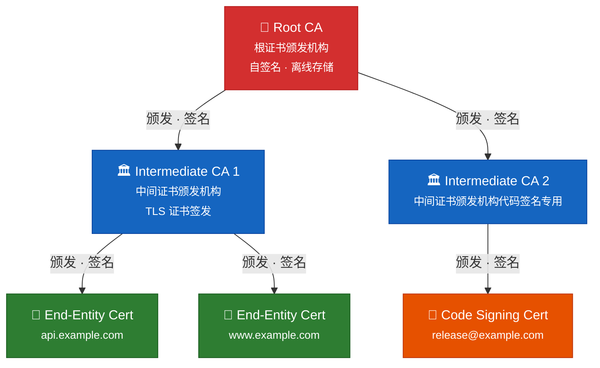
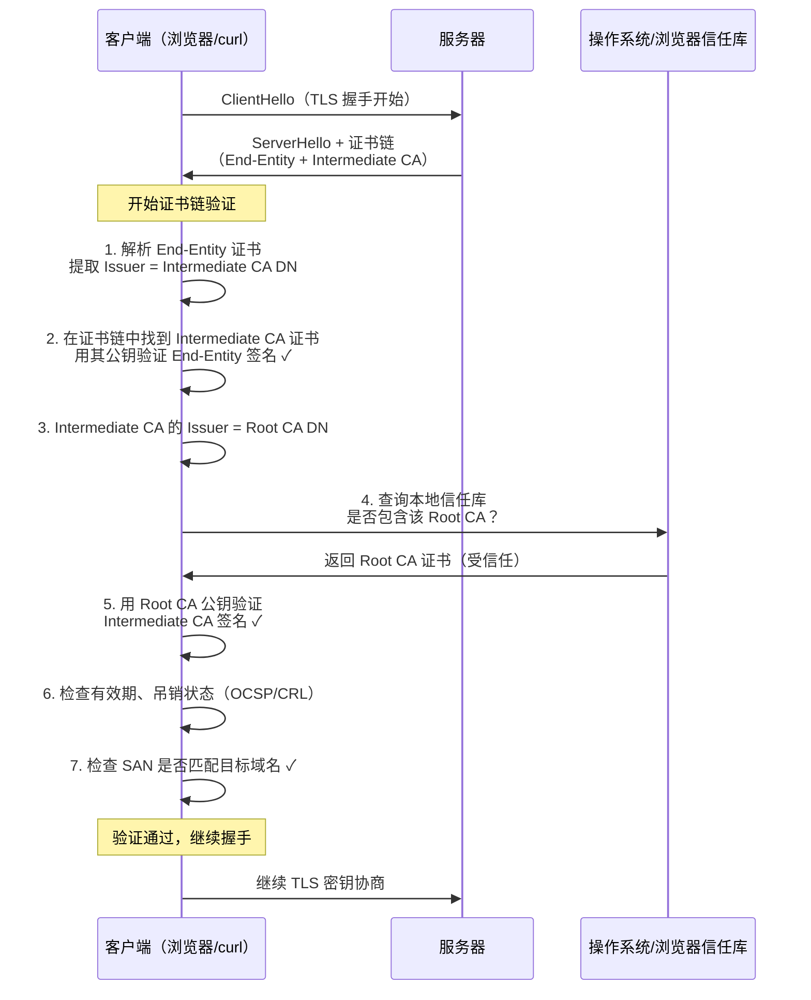
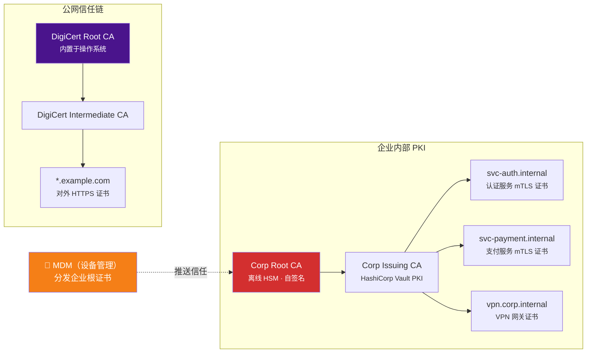
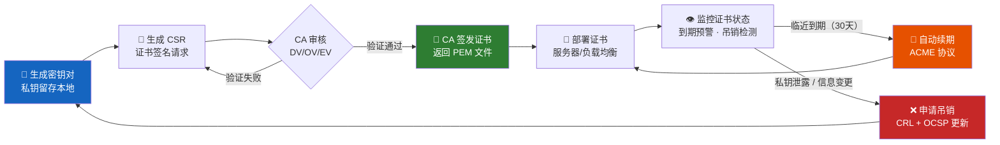
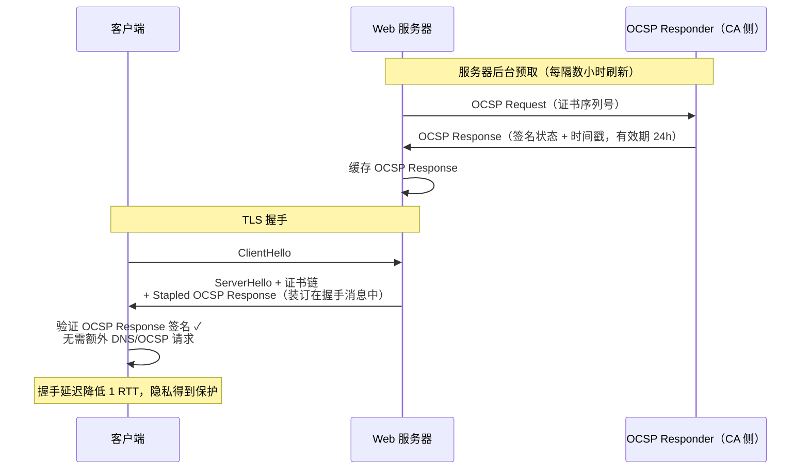

> 📋 **前置知识**：[TLS 1.3详解](/guide/basics/tls)、[网络安全基础](/guide/attacks/encryption)
> ⏱️ **阅读时间**：约18分钟

# PKI与数字证书：公钥基础设施全解析

公钥基础设施（Public Key Infrastructure，PKI）是现代互联网安全的基石。每一次 HTTPS 连接的建立、每一封 S/MIME 签名邮件的发送、每一个代码签名包的验证，背后都依赖 PKI 提供的信任机制。本文从非对称加密原理出发，逐层深入 X.509 证书结构、CA 层次体系、证书生命周期管理，最终落地企业私有 CA 的工程实践。

---

## 一、非对称加密基础回顾

### 1.1 公钥/私钥的数学直觉

非对称加密（Asymmetric Cryptography）基于数学上的**单向函数**：正向计算极易，逆向求解在计算上不可行。

| 算法 | 数学难题 | 典型密钥长度 | 场景 |
|------|---------|------------|------|
| RSA | 大整数分解 | 2048 / 4096 bit | 传统 TLS、代码签名 |
| ECDSA | 椭圆曲线离散对数 | 256 / 384 bit（P-256, P-384） | 现代 TLS、DNSSEC |
| Ed25519 | Edwards 曲线 | 256 bit | SSH、现代签名场景 |

::: tip 为什么企业应优先选择 ECDSA P-256？
相比 RSA-2048，ECDSA P-256 提供等同的安全强度，但握手计算量减少约 90%、证书体积更小，显著降低 TLS 握手延迟——这对高并发服务尤为关键。
:::

### 1.2 核心操作映射

```
加密：使用接收方公钥加密  →  只有接收方私钥可解密
签名：使用发送方私钥签名  →  任何持有公钥的人可验证真实性
```

PKI 的核心问题正在于此：**如何安全地分发公钥，并证明某个公钥确实属于某个实体？** 这便是数字证书存在的根本意义。

---

## 二、数字证书（X.509）深度解析

### 2.1 X.509 证书结构

X.509 v3 是目前使用最广泛的证书格式，由 ASN.1（Abstract Syntax Notation One）定义，DER 编码后通常以 PEM（Base64）形式存储。

```bash
# 查看证书完整结构
openssl x509 -in certificate.pem -text -noout

# 查看证书有效期
openssl x509 -in certificate.pem -dates -noout

# 验证证书签名
openssl verify -CAfile ca-chain.pem certificate.pem
```

一张完整的 X.509 v3 证书包含以下核心字段：

```
TBSCertificate（待签名证书体）
├── Version: v3
├── SerialNumber: 唯一序列号（CA 范围内唯一）
├── Signature: 签名算法（sha256WithRSAEncryption / ecdsa-with-SHA256）
├── Issuer: 颁发者 DN（Distinguished Name）
│   ├── C=CN（国家）
│   ├── O=Example Corp（组织）
│   └── CN=Example Intermediate CA（通用名）
├── Validity
│   ├── NotBefore: 2025-01-01 00:00:00 UTC
│   └── NotAfter:  2026-01-01 00:00:00 UTC
├── Subject: 证书主体 DN
├── SubjectPublicKeyInfo: 公钥 + 算法标识
└── Extensions（v3 扩展）
    ├── Subject Alternative Name (SAN)
    ├── Key Usage
    ├── Extended Key Usage
    ├── Basic Constraints
    ├── CRL Distribution Points
    └── Authority Information Access (OCSP)
SignatureValue: CA 私钥对 TBSCertificate 哈希的签名
```

### 2.2 SAN vs CN：现代实践

早期证书通过 `Common Name (CN)` 字段标识域名，但这已被废弃。自 2017 年起，主流浏览器（Chrome、Firefox）**仅识别 SAN（Subject Alternative Name）扩展**中的域名。

```bash
# 生成包含 SAN 的 CSR 配置
cat > san.cnf << 'EOF'
[req]
distinguished_name = req_distinguished_name
req_extensions = v3_req
prompt = no

[req_distinguished_name]
C  = CN
O  = Example Corp
CN = api.example.com

[v3_req]
keyUsage = keyEncipherment, dataEncipherment
extendedKeyUsage = serverAuth
subjectAltName = @alt_names

[alt_names]
DNS.1 = api.example.com
DNS.2 = api-internal.example.com
IP.1  = 192.168.1.100
EOF

openssl req -new -newkey ec -pkeyopt ec_paramgen_curve:P-256 \
  -keyout server.key -out server.csr \
  -config san.cnf -nodes
```

### 2.3 证书类型对比

| 类型 | 验证级别 | 验证内容 | 适用场景 |
|------|---------|---------|---------|
| DV（Domain Validation） | 域名控制权 | DNS 或文件验证 | 内部服务、开发环境 |
| OV（Organization Validation） | 组织真实性 | 营业执照、电话确认 | 企业对外网站 |
| EV（Extended Validation） | 严格法律实体 | 律师意见函、人工审核 | 金融、电商平台 |
| 通配符（Wildcard）| 同上（DV/OV/EV）| 覆盖 `*.example.com` | 多子域名场景 |
| 多域名（SAN/UCC） | 同上 | 一张证书含多个域名 | 微服务网关 |

::: warning 通配符证书的安全边界
通配符仅覆盖**一级子域名**（`*.example.com` 覆盖 `api.example.com`，但不覆盖 `v2.api.example.com`）。在零信任架构下，通配符证书还带来横向移动风险——一旦私钥泄露，所有子域名均受影响。推荐使用自动化证书管理（cert-manager + ACME）替代通配符。
:::

---

## 三、PKI 信任链体系

### 3.1 层次结构

PKI 采用树形信任层次，每个节点的可信度依赖上级 CA 的背书。



**为什么需要中间 CA？**

根 CA 的私钥一旦泄露，整个 PKI 体系即刻崩溃。因此根 CA 通常：
- **严格离线**，存储于 HSM（Hardware Security Module，硬件安全模块）
- 每年仅上线数次，用于签发或吊销中间 CA 证书
- 部署在物理隔离机房，双人操作规程（Two-Person Integrity）

中间 CA 承担日常证书签发，即使被攻破，吊销中间 CA 证书即可止损，根 CA 不受影响。

### 3.2 信任链验证过程



### 3.3 证书透明度（Certificate Transparency，CT）

2013 年，Google 提出 CT 机制，要求所有公共 CA 签发的证书**必须记录到公开的 CT 日志（Append-only Log）**，否则 Chrome 拒绝信任。

```bash
# 检查证书的 CT 日志记录（SCT 扩展）
openssl x509 -in certificate.pem -text -noout | grep -A 20 "CT Precertificate"

# 通过 crt.sh 查询域名已签发证书
curl -s "https://crt.sh/?q=example.com&output=json" | \
  jq '.[].name_value' | sort -u | head -20
```

CT 的价值在于：任何人都可以监控针对自己域名签发的证书，及时发现**未经授权的证书签发**（如中间人攻击场景中的欺诈证书）。

---

## 四、CA 类型与选型

### 4.1 公共 CA vs 私有内部 CA

| 维度 | 公共 CA（Let's Encrypt / DigiCert） | 私有内部 CA（ADCS / Vault PKI） |
|------|-----------------------------------|---------------------------------|
| 信任范围 | 全球浏览器/操作系统默认信任 | 仅企业内网设备（需手动下发根证书） |
| 适用场景 | 对外服务、面向公网用户 | 内部微服务 mTLS、VPN、内网系统 |
| 证书费用 | 免费（Let's Encrypt）或按年付费 | 基础设施成本（HSM、运维） |
| 自动化 | ACME 协议（cert-manager） | Vault API / ADCS Web Enrollment |
| 吊销响应 | CT + OCSP，公开可查 | 内网 OCSP/CRL，速度更快 |
| 合规审计 | WebTrust / ETSI 外部审计 | 内部合规，自主可控 |

### 4.2 混合 PKI 架构

企业通常同时维护两套 PKI：



---

## 五、证书生命周期管理

### 5.1 完整生命周期流程



### 5.2 CSR 生成与证书申请

```bash
# Step 1: 生成 ECDSA P-256 私钥（勿提交到版本控制）
openssl genpkey -algorithm EC -pkeyopt ec_paramgen_curve:P-256 \
  -out private/server.key

# Step 2: 生成 CSR
openssl req -new \
  -key private/server.key \
  -out csr/server.csr \
  -subj "/C=CN/O=Example Corp/CN=api.example.com" \
  -addext "subjectAltName=DNS:api.example.com,DNS:api-v2.example.com"

# Step 3: 验证 CSR 内容
openssl req -in csr/server.csr -text -noout -verify

# 使用 Let's Encrypt（ACME）自动申请
certbot certonly --dns-cloudflare \
  --dns-cloudflare-credentials ~/.secrets/cloudflare.ini \
  -d api.example.com -d api-v2.example.com \
  --key-type ecdsa --elliptic-curve secp256r1
```

### 5.3 吊销机制：CRL vs OCSP

当证书因私钥泄露、员工离职或信息变更需要作废时，吊销机制确保客户端能够获知。

**CRL（Certificate Revocation List，证书吊销列表）**

- CA 定期发布已吊销证书序列号的**签名列表**
- 客户端缓存 CRL，定期更新（通常 24 小时）
- 缺点：列表可能很大（大型 CA 的 CRL 可达数十 MB）；存在更新延迟

**OCSP（Online Certificate Status Protocol，在线证书状态协议）**

- 客户端实时向 CA 的 OCSP Responder 查询单张证书状态
- 响应仅含 good / revoked / unknown 及签名时间戳
- 缺点：增加 TLS 握手延迟；隐私问题（CA 知晓用户访问哪个网站）

**OCSP Stapling（OCSP 装订）**——最佳实践

服务器预先向 OCSP Responder 查询并缓存签名响应，在 TLS 握手时直接附带给客户端，消除额外 RTT 和隐私泄露：



```nginx
# Nginx 启用 OCSP Stapling
ssl_stapling on;
ssl_stapling_verify on;
ssl_trusted_certificate /etc/nginx/ca-chain.pem;
resolver 8.8.8.8 valid=300s;
resolver_timeout 5s;
```

::: tip 验证 OCSP Stapling 是否生效
```bash
openssl s_client -connect api.example.com:443 \
  -status -servername api.example.com < /dev/null 2>&1 | \
  grep -A 20 "OCSP response"
```
输出中应看到 `OCSP Response Status: successful (0x0)` 和 `Cert Status: Good`。
:::

---

## 六、企业 PKI 实践

### 6.1 HashiCorp Vault PKI 引擎

Vault PKI Secrets Engine 是构建内部 CA 最流行的开源方案之一，支持动态证书签发、短期证书策略和细粒度访问控制。

```bash
# 1. 启用 PKI 引擎
vault secrets enable -path=pki pki
vault secrets tune -max-lease-ttl=87600h pki

# 2. 生成根 CA（生产环境建议离线 HSM 生成，通过 CSR 上传）
vault write -field=certificate pki/root/generate/internal \
  common_name="Corp Root CA" \
  key_type="ec" \
  key_bits=256 \
  ttl="87600h" > corp-root-ca.crt

# 3. 启用中间 CA 引擎
vault secrets enable -path=pki_int pki
vault secrets tune -max-lease-ttl=43800h pki_int

# 4. 生成中间 CA CSR
vault write -format=json pki_int/intermediate/generate/internal \
  common_name="Corp Issuing CA" key_type="ec" key_bits=256 | \
  jq -r '.data.csr' > pki_int.csr

# 5. 用根 CA 签发中间 CA 证书
vault write -format=json pki/root/sign-intermediate \
  csr=@pki_int.csr format=pem_bundle ttl="43800h" | \
  jq -r '.data.certificate' > intermediate.cert.pem

# 6. 导入签名后的中间 CA 证书
vault write pki_int/intermediate/set-signed \
  certificate=@intermediate.cert.pem

# 7. 创建证书签发角色（Role）
vault write pki_int/roles/microservices \
  allowed_domains="internal.corp" \
  allow_subdomains=true \
  max_ttl="720h" \
  key_type="ec" \
  key_bits=256

# 8. 签发证书（服务启动时调用）
vault write pki_int/issue/microservices \
  common_name="svc-auth.internal.corp" \
  alt_names="svc-auth-v2.internal.corp" \
  ttl="24h"
```

::: warning 短期证书策略（Short-lived Certificate）
Vault PKI 的杀手级特性是**极短 TTL 证书**（如 24 小时或更短）。当证书生命周期足够短时：
- 即使私钥泄露，攻击窗口极小
- 无需依赖 OCSP/CRL（吊销在到期前已失效）
- 配合 Vault Agent 自动续期，服务无感知

Netflix 等公司在内部服务间 mTLS 场景中使用**有效期仅 4 小时**的证书。
:::

### 6.2 cert-manager（Kubernetes 场景）

```yaml
# ClusterIssuer：使用 Vault PKI 作为后端 CA
apiVersion: cert-manager.io/v1
kind: ClusterIssuer
metadata:
  name: vault-issuer
spec:
  vault:
    server: https://vault.corp.internal:8200
    path: pki_int/sign/microservices
    auth:
      kubernetes:
        mountPath: /v1/auth/kubernetes
        role: cert-manager

---
# Certificate：自动签发和续期
apiVersion: cert-manager.io/v1
kind: Certificate
metadata:
  name: svc-payment-tls
  namespace: payments
spec:
  secretName: svc-payment-tls-secret
  duration: 24h
  renewBefore: 4h          # 到期前 4 小时自动续期
  privateKey:
    algorithm: ECDSA
    size: 256
    rotationPolicy: Always  # 每次续期轮换私钥
  dnsNames:
    - svc-payment.payments.svc.cluster.local
  issuerRef:
    name: vault-issuer
    kind: ClusterIssuer
```

cert-manager 的控制器会在证书到期前 `renewBefore` 指定时间自动触发续期流程，更新 Kubernetes Secret，并通知依赖该 Secret 的 Pod 重载证书（配合 `reloader` 控制器或在 `volumeMounts` 中使用文件监听）。

### 6.3 企业 PKI 完整架构

```mermaid
graph TB
    subgraph 离线根 CA 基础设施
        HSM["🔒 HSM（硬件安全模块）\n存储根 CA 私钥"]
        OfflineCA["Root CA 服务器\n（物理隔离 · 双人操作）"]
        HSM --- OfflineCA
    end

    subgraph Vault 集群（在线中间 CA）
        VaultA["Vault Node A"]
        VaultB["Vault Node B"]
        VaultC["Vault Node C"]
        VaultA -.- VaultB -.- VaultC
        VHSM["☁️ Cloud HSM\n（AWS CloudHSM / Azure Dedicated HSM）"]
        VHSM -.- VaultA
    end

    subgraph 证书消费方
        K8S["Kubernetes\ncert-manager"]
        VPN["VPN 网关\n（StrongSwan / WireGuard）"]
        LB["负载均衡\n（NGINX / Envoy）"]
        MDME["移动设备\n（MDM SCEP 协议）"]
    end

    subgraph 监控与审计
        MON["证书监控\n（x509-certificate-exporter）"]
        PROM["Prometheus + Grafana\n到期预警 Dashboard"]
        AUDIT["Vault Audit Log\n→ SIEM（Splunk / ELK）"]
    end

    OfflineCA -->|"线下签发\nIntermediate CA 证书"| VaultA
    VaultA -->|"动态签发\n短期证书"| K8S
    VaultA -->|"动态签发"| VPN
    VaultA -->|"动态签发"| LB
    VaultA -->|"SCEP 协议"| MDME
    K8S --> MON
    LB --> MON
    MON --> PROM
    VaultA --> AUDIT

    style HSM fill:#d32f2f,color:#fff
    style OfflineCA fill:#b71c1c,color:#fff
    style VaultA fill:#1565c0,color:#fff
    style VaultB fill:#1565c0,color:#fff
    style VaultC fill:#1565c0,color:#fff
    style PROM fill:#e65100,color:#fff
```

---

## 七、mTLS：服务间双向认证

标准 TLS 仅验证**服务器身份**（客户端匿名）。在零信任架构中，服务间通信需要双向认证——客户端也需出示证书，即 mTLS（Mutual TLS）。

```bash
# 服务器端：要求客户端证书
# Nginx 配置 mTLS
ssl_verify_client on;
ssl_client_certificate /etc/nginx/client-ca.pem;  # 信任的客户端 CA

# 应用层可通过请求头获取客户端证书信息
# $ssl_client_s_dn  - 客户端证书 Subject DN
# $ssl_client_verify - 验证结果（SUCCESS/FAILED）
```

```bash
# 客户端：携带客户端证书发起请求
curl --cert client.pem --key client.key \
     --cacert ca-chain.pem \
     https://svc-payment.internal.corp/api/charge

# 使用 openssl 测试 mTLS 连接
openssl s_client \
  -connect svc-payment.internal.corp:443 \
  -cert client.pem \
  -key client.key \
  -CAfile ca-chain.pem \
  -servername svc-payment.internal.corp
```

### mTLS 在服务网格中的应用

Istio / Linkerd 等服务网格可自动为网格内所有服务注入 Sidecar 代理，实现**透明 mTLS**：

- 应用代码无需感知证书管理
- Istiod（控制平面）通过 SPIFFE/SPIRE 标准为每个工作负载颁发 SVID（SPIFFE Verifiable Identity Document）
- 证书 TTL 通常为 24 小时，自动轮换

::: danger 常见安全陷阱
**不要跳过证书验证！** 以下代码在生产环境中是严重安全漏洞：

```python
# ❌ 绝对禁止
requests.get(url, verify=False)

# ✅ 正确做法：指定 CA 证书
requests.get(url, verify='/path/to/ca-chain.pem',
             cert=('/path/to/client.pem', '/path/to/client.key'))
```

`InsecureRequestWarning` 不是可以忽略的警告，而是在告诉你连接可能已被中间人劫持。
:::

---

## 八、运维监控与到期预警

### 8.1 证书有效期监控

```bash
# 检查本地证书到期时间
openssl x509 -in certificate.pem -noout -enddate

# 检查远程服务器证书（含完整链）
echo | openssl s_client -connect api.example.com:443 \
  -servername api.example.com 2>/dev/null | \
  openssl x509 -noout -dates

# 批量检查多个域名（脚本示例）
for domain in api.example.com www.example.com auth.example.com; do
  expiry=$(echo | openssl s_client -connect "$domain:443" \
    -servername "$domain" 2>/dev/null | \
    openssl x509 -noout -enddate 2>/dev/null | cut -d= -f2)
  echo "$domain: $expiry"
done
```

### 8.2 Prometheus 指标监控

```yaml
# x509-certificate-exporter 配置
watchFiles:
  - /etc/nginx/tls/*.pem
  - /etc/vault/tls/*.pem
watchKubeSecrets:
  - namespace: payments
    secretName: svc-payment-tls-secret

# Prometheus 告警规则
groups:
  - name: certificate-expiry
    rules:
      - alert: CertificateExpiresIn30Days
        expr: |
          (x509_cert_not_after - time()) / 86400 < 30
        for: 1h
        labels:
          severity: warning
        annotations:
          summary: "证书即将到期：{{ $labels.filepath }}"
          description: "证书将在 {{ $value | humanizeDuration }} 后到期"

      - alert: CertificateExpiresIn7Days
        expr: |
          (x509_cert_not_after - time()) / 86400 < 7
        for: 10m
        labels:
          severity: critical
```

---

## 九、总结：企业 PKI 最佳实践清单

| 实践项 | 建议 |
|--------|------|
| 根 CA 保护 | 离线存储，HSM 持有私钥，双人操作规程 |
| 证书算法 | ECDSA P-256（对外）/ Ed25519（内部 SSH）|
| 有效期策略 | 对外：90 天（ACME 自动续期）；内部服务：24 小时 |
| 吊销机制 | 启用 OCSP Stapling；内部 CA 使用短期证书替代吊销 |
| 密钥存储 | 私钥权限 `600`；生产私钥永不出服务器；使用 Vault Transit 或 HSM |
| 证书透明度 | 订阅 CT 监控告警（crt.sh API / Facebook CT Monitor）|
| mTLS | 服务网格内启用；服务间通信零信任原则 |
| 监控告警 | 到期前 30 天 Warning，7 天 Critical；接入 PagerDuty/钉钉 |
| 自动化 | cert-manager + ACME/Vault；人工续期是事故的温床 |
| 合规审计 | Vault Audit Log 接入 SIEM；证书变更纳入变更管理流程 |

::: tip 延伸阅读
- [RFC 5280](https://datatracker.ietf.org/doc/html/rfc5280) — X.509 PKI 标准
- [RFC 8555](https://datatracker.ietf.org/doc/html/rfc8555) — ACME 协议规范
- [Certificate Transparency RFC 6962](https://datatracker.ietf.org/doc/html/rfc6962)
- [SPIFFE/SPIRE](https://spiffe.io/) — 云原生身份标准
- [HashiCorp Vault PKI 文档](https://developer.hashicorp.com/vault/docs/secrets/pki)
:::
