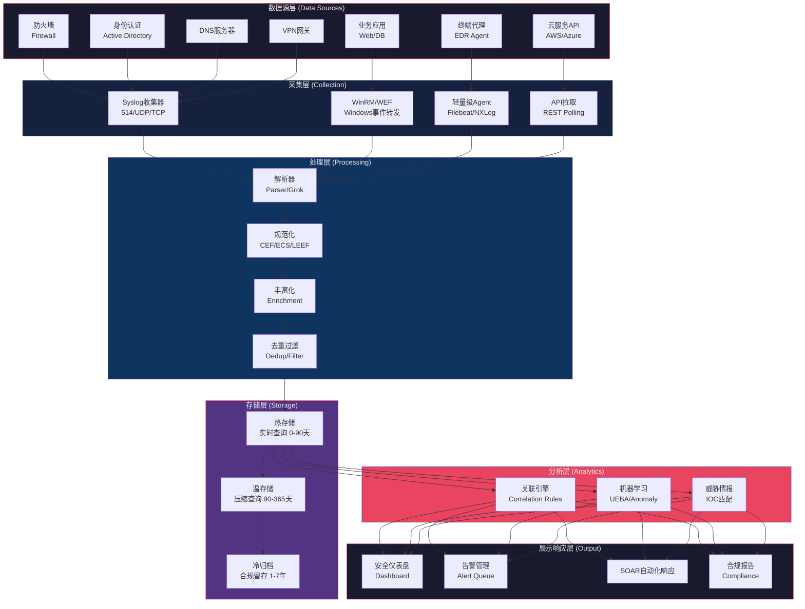
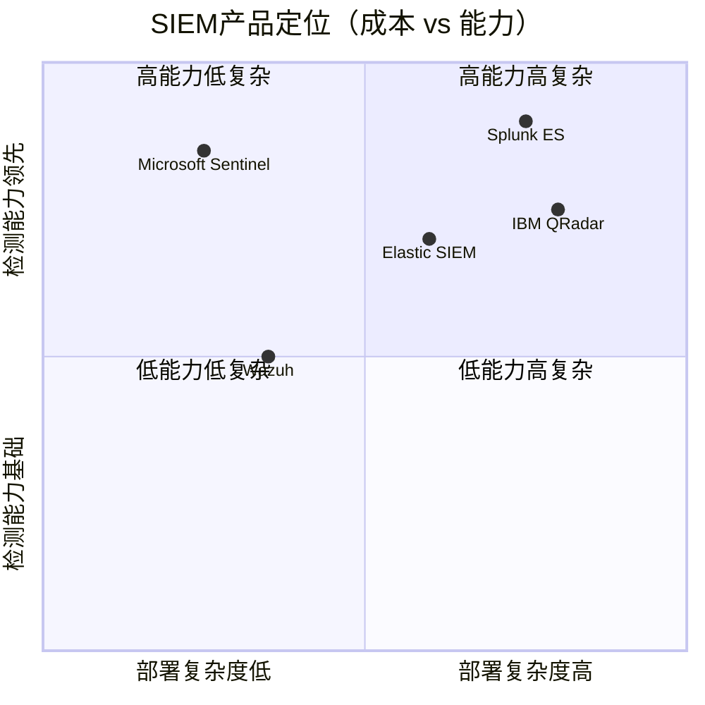
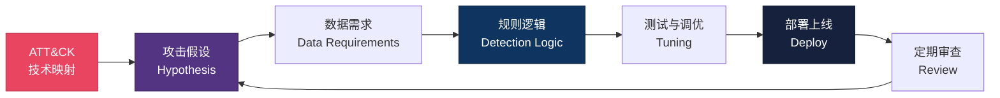
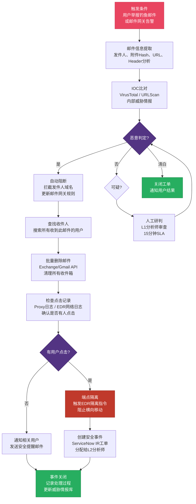

> <Icon name="clipboard-list" color="cyan" /> **前置知识**：[IDS/IPS系统](/guide/security/ids-ips)、[网络监控](/guide/ops/monitoring)
> ⏱ **阅读时间**：约20分钟

# SIEM与安全运营中心：企业威胁检测与响应体系

现代企业的网络边界已经消失。攻击者潜伏在合法账号背后，横向移动数周才发动真正的破坏。防火墙告警了，EDR也告警了，但没有人把这两条告警关联起来——这正是 **SIEM（Security Information and Event Management，安全信息与事件管理）** 要解决的核心问题。

---

## 第一层：为什么需要SIEM——单点防御的致命盲区

### 1.1 碎片化安全的困境

大多数企业已经部署了防火墙（Firewall）、入侵检测系统（IDS）、端点检测与响应（EDR）、威胁情报（Threat Intelligence）等多类安全产品。然而，每个产品都在自己的"孤岛"中工作：

- 防火墙看到了异常的出站流量，但不知道发起者是哪个用户账号
- AD（Active Directory）看到了一次密码喷洒攻击，但不知道攻击者下一步的横向移动
- DNS 服务器看到了 C2（Command & Control）域名的查询，但没有关联到具体的主机 IP

**APT（高级持续性威胁）攻击链通常横跨多个系统**，单一产品只能看到"冰山一角"，攻击者正是利用这种碎片化进行逃逸。

::: warning 典型攻击场景
一次成功的 BEC（商业邮件欺诈）攻击链路：
1. 钓鱼邮件绕过邮件网关（邮件安全未告警）
2. 用户点击链接，恶意宏执行（EDR 产生低优先级告警）
3. 攻击者获取凭证，从异地 IP 登录 VPN（VPN 日志存在但无人审查）
4. 横向移动到财务系统（内网流量分析缺失）
5. 数据外传（出站流量告警被忽略）

**每个阶段都有信号，但没有系统把它们串联起来。**
:::

### 1.2 SIEM的核心价值主张

SIEM 通过以下三个核心能力弥补碎片化盲区：

| 能力维度 | 具体表现 |
|----------|----------|
| **聚合（Aggregation）** | 统一采集所有安全日志，消除数据孤岛 |
| **关联（Correlation）** | 跨系统、跨时间窗口的事件关联分析 |
| **上下文（Context）** | 结合资产、身份、威胁情报丰富告警信息 |

---

## 第二层：SIEM架构——五层数据处理体系

企业级 SIEM 并非一个单一软件，而是一套完整的数据采集、处理、分析和响应体系。



### 2.1 数据采集层——让每个设备"开口说话"

采集层是 SIEM 的基础，决定了系统能"看到"多少。

**Syslog 采集**（适用于防火墙、路由器、交换机）：
```
# rsyslog 配置示例：将日志转发到 SIEM 采集器
*.* @@siem-collector.corp.local:514  # TCP传输，保证可靠性
# 加密传输（生产环境推荐）
*.* action(type="omfwd" target="siem.corp.local" port="6514"
          protocol="tcp" StreamDriver="gtls"
          StreamDriverMode="1" StreamDriverAuthMode="anon")
```

**Windows 事件转发（WEF）**：
```xml
<!-- 订阅关键安全事件 -->
<Subscription xmlns="http://schemas.microsoft.com/2006/03/windows/events/subscription">
  <SubscriptionId>SecurityCritical</SubscriptionId>
  <Query>
    <![CDATA[
      <QueryList>
        <Query><Select Path="Security">
          *[System[(EventID=4624 or EventID=4625 or EventID=4648
            or EventID=4720 or EventID=4728 or EventID=4732
            or EventID=4756 or EventID=7045)]]
        </Select></Query>
      </QueryList>
    ]]>
  </Query>
</Subscription>
```

::: tip 必须采集的核心日志源清单

| 日志源 | 关键事件 | 优先级 |
|--------|----------|--------|
| Windows AD/DC | 4624/4625（登录）、4768/4769（Kerberos）、4776（NTLM）| P0 必须 |
| 防火墙/UTM | 允许/拒绝策略、NAT记录、VPN连接 | P0 必须 |
| DNS 服务器 | 所有查询记录（含响应），尤其 NX Domain | P0 必须 |
| VPN 网关 | 认证成功/失败、地理位置、连接时长 | P0 必须 |
| EDR 代理 | 进程创建、网络连接、文件操作、注册表变更 | P1 重要 |
| 邮件网关 | 发件人/收件人、附件Hash、SPF/DKIM结果 | P1 重要 |
| Web 代理/CASB | URL访问、数据上传、DLP事件 | P1 重要 |
| 云控制台 | IAM变更、S3/Blob访问、配置变更 | P1 重要 |
| 数据库 | 特权查询、批量导出、Schema变更 | P2 建议 |
| 负载均衡器 | 后端响应码、客户端IP、请求量 | P2 建议 |
:::

### 2.2 数据处理层——标准化是关联分析的前提

来自不同厂商的日志格式各异，必须经过**解析（Parsing）→ 规范化（Normalization）→ 丰富化（Enrichment）**三个步骤。

**规范化目标格式（ECS - Elastic Common Schema）**：
```json
{
  "@timestamp": "2024-03-15T08:23:41.000Z",
  "event.category": "authentication",
  "event.type": "start",
  "event.outcome": "failure",
  "source.ip": "203.0.113.45",
  "source.geo.country_name": "China",
  "destination.ip": "10.10.1.100",
  "user.name": "admin",
  "host.name": "DC01.corp.local",
  "rule.name": "Windows-4625-FailedLogin",
  "threat.indicator.ip": "203.0.113.45",
  "tags": ["brute-force-candidate", "external-source"]
}
```

**丰富化（Enrichment）** 是提升告警质量的关键步骤：
- **IP 信誉查询**：与 VirusTotal、AbuseIPDB、内部 IOC 库比对
- **地理位置**：MaxMind GeoIP 标注国家、城市、ASN
- **资产上下文**：关联 CMDB，判断目标是否为关键资产
- **用户身份**：关联 LDAP/HR 系统，获取部门、职级、异常行为基线

### 2.3 存储层——冷热分层的经济学

SIEM 存储的核心矛盾：**日志量大（TB/天）× 查询要快 × 合规要留存长**。

| 层级 | 典型时间窗口 | 存储介质 | 查询速度 | 成本 |
|------|-------------|---------|---------|------|
| 热存储（Hot） | 0-90天 | SSD / NVMe | 秒级 | 高 |
| 温存储（Warm） | 90-365天 | HDD / 压缩索引 | 分钟级 | 中 |
| 冷归档（Cold） | 1-7年 | 对象存储 S3/HDFS | 小时级 | 低 |

::: warning EPS（每秒事件数）规划指引
EPS 是 SIEM 选型和容量规划的核心指标。粗略估算：

- **小型企业**（< 500 终端）：500-2,000 EPS
- **中型企业**（500-5,000 终端）：2,000-20,000 EPS
- **大型企业**（> 5,000 终端）：20,000-500,000 EPS

实际部署时，**日志量 = EPS × 86,400秒 × 平均日志大小（约500B）**

5,000 EPS × 86,400 × 500B ≈ **216 GB/天**，年存储约 **79 TB**（含压缩可降至 20-30 TB）
:::

---

## 第三层：主流SIEM产品横向对比



### 3.1 产品能力对比矩阵

| 特性 | Splunk ES | Microsoft Sentinel | Elastic SIEM | IBM QRadar |
|------|-----------|-------------------|--------------|------------|
| **部署模式** | 本地/云 | 纯云（Azure）| 本地/云/混合 | 本地/云 |
| **数据规模** | PB级 | 几乎无限（按摄入计费）| 大规模，需调优 | TB-PB级 |
| **ML 检测** | MLTK，强 | Azure ML 内置，强 | ML Node，中等 | QRadar AI，中等 |
| **SOAR 集成** | SOAR（原 Phantom）| Logic Apps + Sentinel SOAR | Elastic 集成 | QRadar SOAR |
| **ATT&CK 覆盖** | 高，ESCU 内容包 | 高，Analytics Rules | 中，Prebuilt Rules | 中等 |
| **许可模式** | 按数据量（GB/天）| 按摄入量（GB/天）| 按节点/摄入 | 按设备数（EPS）|
| **适合场景** | 成熟SOC，预算充足 | 已有Azure生态的企业 | 预算敏感，技术团队强 | 传统金融/政府 |

### 3.2 Microsoft Sentinel——云原生SIEM的代表

Sentinel 的核心优势在于与 Azure 生态的深度集成：

```kql
// Sentinel KQL 查询示例：检测不可能旅行（Impossible Travel）
let timeDelta = 1h;
SigninLogs
| where TimeGenerated > ago(24h)
| where ResultType == "0"  // 登录成功
| project TimeGenerated, UserPrincipalName, IPAddress,
          Location = tostring(LocationDetails.city),
          Country = tostring(LocationDetails.countryOrRegion)
| join kind=inner (
    SigninLogs
    | where TimeGenerated > ago(24h)
    | where ResultType == "0"
    | project TimeGenerated2=TimeGenerated, UserPrincipalName,
              IPAddress2=IPAddress, Country2=tostring(LocationDetails.countryOrRegion)
) on UserPrincipalName
| where TimeGenerated2 > TimeGenerated
| where TimeGenerated2 - TimeGenerated < timeDelta
| where Country != Country2
| project UserPrincipalName, FirstLogin=TimeGenerated, FirstCountry=Country,
          SecondLogin=TimeGenerated2, SecondCountry=Country2,
          TimeDiff=TimeGenerated2 - TimeGenerated
| order by TimeDiff asc
```

### 3.3 Splunk ES——大型SOC的首选

Splunk 的 **ESCU（Enterprise Security Content Update）** 提供了 1000+ 开箱即用的检测规则：

```spl
| tstats summariesonly=true count min(_time) as firstTime max(_time) as lastTime
  FROM datamodel=Authentication.Authentication
  WHERE Authentication.action=failure
  BY Authentication.user Authentication.src Authentication.dest
| rename Authentication.* as *
| stats count as failure_count dc(dest) as target_count by user src
| where failure_count > 10 AND target_count > 3
| eval threat_score = failure_count * target_count
| sort -threat_score
| head 20
```

---

## 第四层：检测规则设计——从噪音到信号

### 4.1 关联规则设计框架

有效的检测规则必须回答三个问题：**检测什么攻击技术？需要哪些数据源？误报率可接受吗？**



### 4.2 横向移动检测——实战规则示例

**MITRE ATT&CK T1021.002 - SMB/Windows Admin Shares（横向移动）**：

```yaml
# 规则元数据
rule_name: "Lateral Movement via Admin Shares"
mitre_technique: "T1021.002"
severity: HIGH
data_sources:
  - Windows Security Event Log (4624, 4648, 5140)
  - Network Flow (445/TCP)

# 检测逻辑（伪代码）
detection:
  condition: all of:
    - event_id: 5140  # 网络共享访问
      share_name: "\\\\*\\\\(ADMIN$|C$|IPC$)"
      access_mask: "0x1"  # 写入权限
    - within_5min:
        - event_id: 4624  # 成功登录
          logon_type: 3   # 网络登录
          source_ip: != localhost
    - NOT whitelist:
        - src_ip: backup_servers
        - src_ip: sccm_servers
        - user: svc_backup

# 误报抑制
false_positive_tuning:
  - 排除已知IT运维账号和备份服务器
  - 要求目标主机不是已知文件服务器
  - 时间窗口内要求至少3个不同目标

# 响应建议
response:
  - 确认源主机是否有恶意进程
  - 检查同一时间窗口内的认证事件
  - 触发主机隔离评估
```

### 4.3 告警质量管理——减少告警疲劳

::: danger 告警疲劳是 SOC 团队的头号杀手
研究表明，SOC 分析师平均每天处理 **10,000+ 条告警**，其中真正需要响应的不足 **5%**。过多的误报会导致分析师麻木，真正的高危告警被淹没在噪音中。
:::

**误报率调优方法论**：

1. **白名单管理**：IT 运维操作、自动化任务、已知漏洞扫描 IP
2. **基线学习**：针对每个实体（用户、主机）建立行为基线，偏差才告警
3. **告警聚合**：同一攻击链的多条告警合并为一个 Incident（事件）
4. **风险评分**：不再依赖单一 High/Medium/Low，改用 0-100 动态风险分

**告警质量 KPI 目标**：

| 指标 | 理想目标 | 警戒线 |
|------|---------|--------|
| 误报率（False Positive Rate）| < 5% | > 20% |
| 真正阳性率（True Positive Rate）| > 80% | < 50% |
| 告警关闭率（Closure Rate）| > 95%/天 | < 70%/天 |
| 升级准确率（Escalation Accuracy）| > 90% | < 60% |

---

## 第五层：SOAR与SOC运营——从检测到闭环

### 5.1 SOAR——安全响应的自动化引擎

SOAR（Security Orchestration, Automation and Response，安全编排与自动化响应）是现代 SOC 的"肌肉"，将重复性的响应动作自动化，使分析师聚焦在真正需要判断的案例上。

**典型 SOAR Playbook——钓鱼邮件响应**：



### 5.2 SOAR核心能力模块

**自动封禁 IP（示例：Python + Palo Alto API）**：

```python
import requests

class FirewallOrchestrator:
    def __init__(self, fw_host: str, api_key: str):
        self.base_url = f"https://{fw_host}/api"
        self.api_key = api_key

    def block_ip(self, malicious_ip: str, reason: str, duration_hours: int = 24) -> dict:
        """
        自动将恶意 IP 加入 EDL（外部动态列表）并推送封禁策略
        """
        # 1. 更新动态黑名单
        payload = {
            "type": "op",
            "cmd": f"""<request><address-group><add>
                <name>SIEM-Auto-Block</name>
                <member>{malicious_ip}</member>
            </add></address-group></request>""",
            "key": self.api_key
        }
        response = requests.post(self.base_url, params=payload, verify=False)

        # 2. 记录审计日志
        return {
            "action": "ip_blocked",
            "ip": malicious_ip,
            "reason": reason,
            "duration_hours": duration_hours,
            "timestamp": "2024-03-15T09:00:00Z",
            "status": "success" if response.status_code == 200 else "failed"
        }

    def isolate_endpoint(self, hostname: str, justification: str) -> dict:
        """
        通过 EDR API 隔离受感染终端
        """
        # CrowdStrike Falcon API 示例
        edr_endpoint = "https://api.crowdstrike.com/devices/entities/devices-actions/v2"
        headers = {"Authorization": f"Bearer {self.get_token()}"}
        body = {
            "action_name": "contain",
            "ids": [self.get_device_id(hostname)],
            "comment": justification
        }
        response = requests.post(edr_endpoint, json=body, headers=headers)
        return {"hostname": hostname, "isolated": response.status_code == 202}
```

**ServiceNow 工单自动创建**：

```python
def create_incident_ticket(alert_data: dict) -> str:
    """
    根据 SIEM 告警自动创建 ServiceNow 安全事件工单
    """
    snow_url = "https://company.service-now.com/api/now/table/sn_si_incident"
    headers = {
        "Content-Type": "application/json",
        "Accept": "application/json"
    }

    ticket_body = {
        "short_description": f"[SIEM自动创建] {alert_data['rule_name']}",
        "description": f"""
检测时间：{alert_data['timestamp']}
告警规则：{alert_data['rule_name']}
ATT&CK技术：{alert_data['mitre_technique']}
风险评分：{alert_data['risk_score']}/100
涉及资产：{alert_data['affected_assets']}
事件摘要：{alert_data['summary']}

建议响应步骤：
{alert_data['recommended_actions']}
        """,
        "priority": "1" if alert_data['risk_score'] > 80 else "2",
        "category": "Security Incident",
        "assignment_group": "SOC-L2" if alert_data['risk_score'] > 70 else "SOC-L1",
        "u_siem_alert_id": alert_data['alert_id'],
        "u_mitre_technique": alert_data['mitre_technique']
    }

    response = requests.post(snow_url, json=ticket_body,
                             auth=("siem_integration", "API_KEY"), headers=headers)
    ticket_number = response.json()['result']['number']
    return ticket_number
```

### 5.3 SOC 运营成熟度模型


### 5.4 SOC 核心运营指标（KPI）

现代 SOC 的运营效果通过以下关键指标量化：

**时间类指标**：

| 指标 | 英文 | 定义 | 行业基准 | 优秀目标 |
|------|------|------|---------|---------|
| 平均检测时间 | MTTD | 从攻击发生到首次发现的时间 | 197天 (Ponemon) | < 24小时 |
| 平均响应时间 | MTTR | 从发现到完成遏制的时间 | 69天 (Ponemon) | < 4小时 |
| 平均确认时间 | MTTA | 从告警触发到分析师确认的时间 | 通常60-120分钟 | < 15分钟 |
| 平均恢复时间 | MTRS | 从确认到系统完全恢复的时间 | 取决于事件等级 | < 8小时 |

**质量类指标**：

```
告警处理率 = 已关闭告警 / 总告警 × 100%  →  目标 > 95%/天
真正阳性率 = 确认攻击事件 / 总升级事件 × 100%  →  目标 > 40%
误报率 = 误报告警 / 总告警 × 100%  →  目标 < 10%
SLA 达标率 = 按时响应事件数 / 总事件数 × 100%  →  目标 > 98%
覆盖率 = 已覆盖ATT&CK技术数 / 相关ATT&CK技术总数  →  目标 > 70%
```

::: tip SOC 运营仪表盘关键视图推荐

建议 SOC 主仪表盘包含以下视图模块：

1. **实时告警队列**：按优先级排序，显示 SLA 剩余时间
2. **MTTD/MTTR 趋势图**：按周/月展示改进趋势
3. **ATT&CK 热力图**：哪些战术技术检测最活跃
4. **告警来源分布**：识别噪音最多的日志源
5. **分析师工作负载**：防止团队过载
6. **TOP 10 受攻击资产**：聚焦高价值目标保护
:::

---

## 企业实施路线图

### 分阶段建设建议

**第一阶段（0-3个月）：夯实数据基础**
- 完成核心日志源接入（AD、防火墙、DNS、VPN）
- 建立日志保留策略和存储架构
- 部署基础检测规则（暴力破解、异常登录）
- 培训 L1 分析师基础操作流程

**第二阶段（3-6个月）：提升检测能力**
- 接入 EDR、邮件网关、云服务日志
- 上线 UEBA（用户实体行为分析）
- 建立 Playbook 和基础 SOAR 自动化
- 实现 MTTD < 48小时

**第三阶段（6-12个月）：主动防御转型**
- 开展定期威胁狩猎（每周）
- 建立内部威胁情报共享
- 红队演练验证检测有效性
- 目标 MTTD < 24小时，MTTR < 4小时

::: warning 常见建设误区

1. **"买了SIEM就有安全了"**：SIEM 是工具，SOC 运营团队和流程才是核心
2. **日志接入越多越好**：无规则的海量日志只会造成告警洪水，优先接入高价值源
3. **开箱即用规则不调优**：默认规则误报率极高，必须针对企业环境持续调优
4. **忽视告警闭环**：告警如果没有人处理和记录结果，SIEM 投资等于浪费
5. **轻视人员培训**：工具再好，分析师能力不足也无法发挥价值
:::

---

## 总结

SIEM 与 SOC 的建设是一场持续的能力提升旅程，而非一次性的产品部署。成功的企业安全运营能力需要三个要素协同发力：

- **数据**：完整、高质量的日志采集是一切分析的基础
- **技术**：关联分析、ML 异常检测和 SOAR 自动化提升响应效率
- **人员与流程**：训练有素的分析师和标准化的响应流程是最终的决策者

随着攻击技术的不断演进，建议企业定期参照 **MITRE ATT&CK** 框架评估检测覆盖率，并通过持续的红蓝对抗演练验证 SOC 能力的有效性。

---

*相关阅读：[零信任安全架构](/guide/security/zero-trust) | [网络流量分析](/guide/ops/packet-analysis) | [安全架构设计](/guide/attacks/security-arch)*
