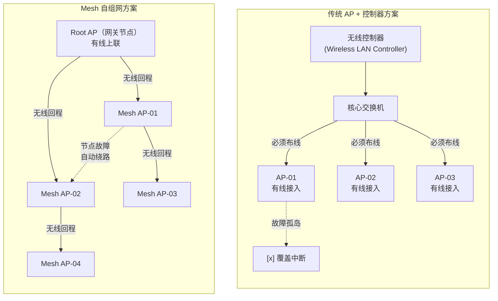
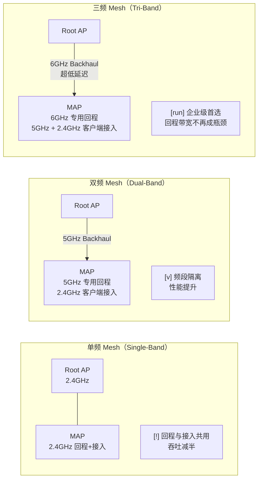
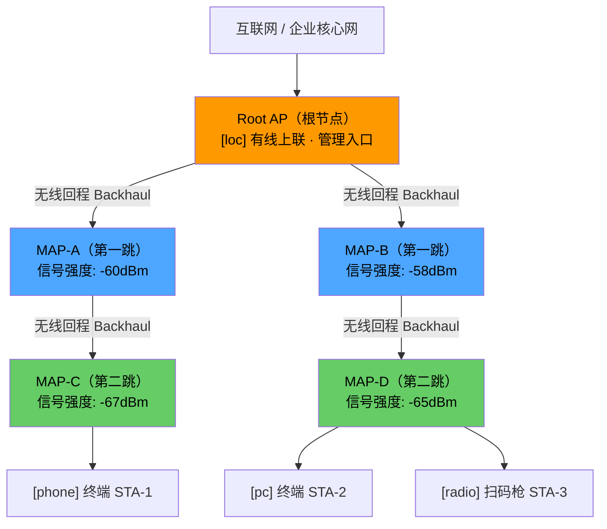
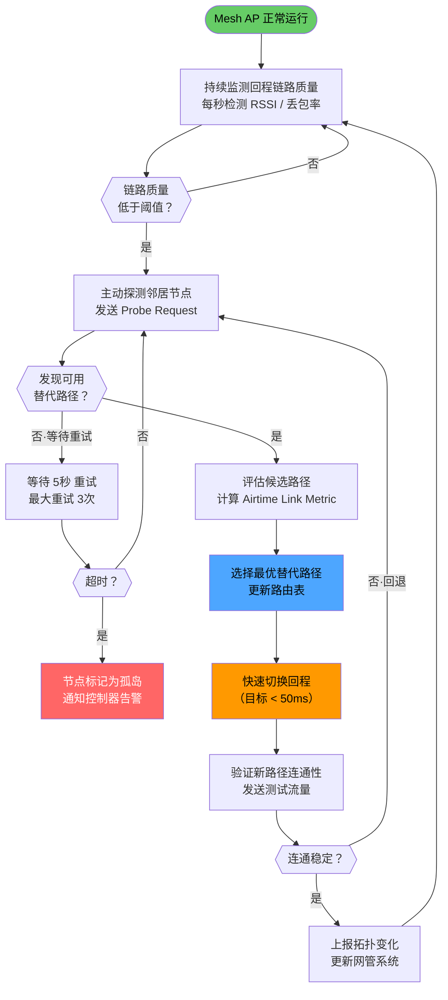
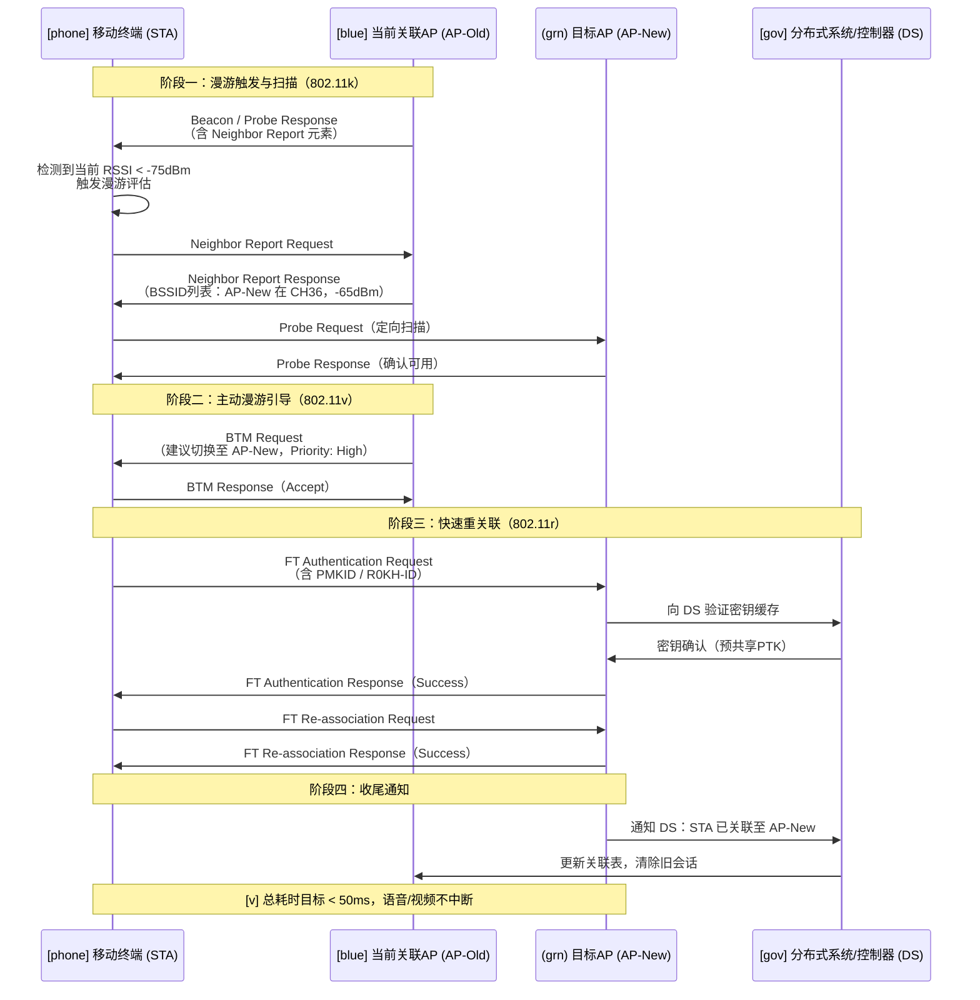

> <Icon name="clipboard-list" color="cyan" /> **前置知识**：[Wi-Fi 6/7标准](/guide/wireless/wifi-standards)、[网络拓扑设计](/guide/architecture/topology)
> ⏱ **阅读时间**：约16分钟

# Mesh无线网络：无缝漫游架构深度解析

---

## 第一部分：场景引入——传统无线架构的痛点

### 一个真实的企业困境

2019年，某制造企业在其10万平方米的仓储园区部署了传统的"胖AP（Fat AP）+ 有线交换机"方案。网络建成后问题接踵而至：

- 叉车司机在园区内移动时，平板电脑频繁断线，WMS（仓库管理系统）订单丢失
- 仓库角落信号盲区多，每增加一个AP就要额外铺设一段网线，改造成本极高
- 某个AP故障，其覆盖区域完全断网，直到运维人员到场处理才恢复

这个困境的核心矛盾是：**传统有线回程的无线网络，其覆盖扩展能力和故障韧性，与现代大型动态场景的需求之间存在结构性矛盾。**

### 传统方案 vs Mesh 方案对比



Mesh网络的核心价值在于三个维度：**无线回程（Wireless Backhaul）消除布线依赖**、**自愈路由消除单点故障**、**无缝漫游提升移动体验**。

::: tip 最佳实践
Mesh并非万能替代方案。在AP密度高、有线基础设施完善的场景（如数据中心机房、办公楼层），传统控制器方案的性能和可管理性依然占优。Mesh的核心优势体现在**有线部署成本极高**或**覆盖拓扑动态变化**的场景中。
:::

---

## 第二部分：概念建模——Mesh网络的基本构成

### 节点角色分类

无线Mesh网络（Wireless Mesh Network，WMN）由以下角色构成：

| 角色 | 英文名称 | 功能描述 | 有线上联 |
|------|----------|----------|----------|
| **根节点** | Root AP / MAP（Mesh Access Point）with Ethernet Backhaul | 连接有线网络，是Mesh域的出口 | <Icon name="check-circle-2" color="green" /> 必须 |
| **Mesh节点** | MAP（Mesh Access Point）| 通过无线回程中继，覆盖延伸区域 | <Icon name="x-circle" color="danger" /> 可选 |
| **客户端** | STA（Station）| 终端设备，连接最近的MAP接入网络 | — |

一个健壮的Mesh域通常采用**混合回程**设计：核心区域Root AP有线上联保证带宽，边缘MAP无线回程灵活延伸覆盖。

### 回程链路设计：三种典型架构



::: warning 注意
单频Mesh在工程上几乎已被淘汰。单频模式下，回程流量和客户端流量共享同一个无线信道，导致理论吞吐量减半，每跳再减半，三跳后可用带宽不足初始值的15%。**企业场景请至少选用双频Mesh**。
:::

### Mesh域的逻辑结构



**跳数（Hop Count）**是Mesh设计中的关键参数。每增加一跳，无线回程引入的延迟约为1-3ms，带宽损耗约为30-50%。企业级部署通常将最大跳数控制在**2-3跳**以内。

---

## 第三部分：原理拆解——路由与自愈机制

### 802.11s 协议：Mesh的路由大脑

802.11s是IEEE定义的无线Mesh网络标准，其核心是**HWMP（Hybrid Wireless Mesh Protocol，混合无线Mesh协议）**。HWMP结合了两种路由模式：

**1. 主动模式（Proactive HWMP）**
Root AP周期性广播`RANN（Root Announcement）`帧，所有Mesh节点维护到根节点的路径表。这类似于有线网络中的生成树协议（STP），确保每个节点都知道回家的路。

**2. 按需模式（On-demand HWMP）**
当某个节点需要与非相邻节点通信时，发起`PREQ（Path Request）`泛洪，目标节点回应`PREP（Path Reply）`，路径动态建立。

### 路径选择指标：Airtime Link Metric

802.11s 不使用跳数作为路由指标，而是引入了**空口时间链路指标（Airtime Link Metric，ALM）**，计算公式为：

```
ALM = [ O + Bt / r ] × (1 / (1 - e_pt))²
```

其中：
- `O`：协议开销（固定值，8192微秒）
- `Bt`：测试帧大小（8192比特）
- `r`：信道传输速率（Mbps）
- `e_pt`：误帧率（0~1之间）

ALM值越小，链路质量越好。这意味着**高速率、低误帧率的路径优先被选择**，比单纯的跳数指标更贴近实际网络质量。

::: tip 最佳实践
主流商业Mesh产品（如Cisco Catalyst、Aruba Instant Mesh、华为AirEngine Mesh）在802.11s基础上叠加了专有优化指标，综合考量RSSI（接收信号强度指示）、信道利用率、链路稳定性和历史丢包率，路径选择精度显著优于纯开源实现。
:::

### 故障自愈机制

Mesh的自愈能力是其区别于传统无线架构的核心特性。以下是典型的故障切换流程：



::: danger 避坑
Mesh自愈不等于零中断。从链路质量下降触发检测，到完成路径切换，整个过程通常需要**50ms~500ms**，具体时长取决于硬件性能和协议实现。对于VoIP、实时视频会议等时延敏感业务，建议在关键区域部署**有线回程冗余**，而非完全依赖无线自愈。
:::

---

## 第四部分：实战关联——无缝漫游的三剑客

漫游（Roaming）是移动终端在不同AP覆盖区域间切换的过程。传统802.11漫游存在**200ms以上的重关联延迟**，足以导致VoIP通话中断。无缝漫游通过以下三个协议协同解决这一问题：

### 802.11k：邻近AP上报

**802.11k（无线资源管理，Radio Resource Management）** 让AP能够向关联的客户端提供**邻居列表（Neighbor Report）**，列出周围信号质量较好的AP信息（BSSID、信道、频段）。

作用：客户端无需在所有信道上全量扫描，可直接测量邻居列表中的AP信号，**将漫游触发前的扫描时间从数百毫秒缩短到数十毫秒**。

### 802.11r：快速BSS过渡

**802.11r（Fast BSS Transition，快速基本服务集过渡）** 解决的是漫游时的认证延迟问题。

传统WPA2/WPA3漫游需要完整的四次握手（4-way handshake）和802.1X认证，整个过程耗时超过100ms。802.11r引入**FT（Fast Transition）协议**，将安全密钥预先缓存在相邻AP上，漫游时只需执行简化的两次握手，**认证时间压缩至20ms以下**。

### 802.11v：BSS过渡管理

**802.11v（BSS过渡管理，BSS Transition Management）** 赋予AP主动"推动"客户端漫游的能力。当AP检测到某客户端信号过弱，或需要负载均衡时，向客户端发送`BTM Request（BSS Transition Management Request）`帧，建议其切换到质量更好的AP。

::: tip 最佳实践
三个协议通常被称为"**802.11k/r/v**漫游三件套"，需同时启用才能发挥协同效果。仅开启其中一两个，漫游体验提升有限。iPhone（iOS 9+）、Android 10+以及现代Windows平台均已支持这三个协议。
:::

### 完整漫游决策序列图



### 漫游参数调优建议

| 参数 | 推荐值（企业场景） | 说明 |
|------|-----------------|------|
| 漫游触发阈值（RSSI） | -72 ~ -75 dBm | 过高导致频繁漫游，过低导致切换过晚 |
| 最小RSSI接受关联 | -80 dBm | 低于此值拒绝客户端关联，引导其连接更近AP |
| 802.11r（FT） | 启用 FT over DS | 适用于集中式控制器架构 |
| 802.11k（RRM） | 启用 Neighbor Report | 所有AP开启，确保邻居列表完整 |
| 802.11v（BTM） | 启用，Disassociation Imminent | 配合负载均衡策略 |
| 漫游重试间隔 | 5秒 | 防止客户端在两个AP之间"乒乓" |

---

## 第五部分：认知升级——企业级Mesh深度考量

### 企业Mesh vs 家用Mesh：本质差异

| 对比维度 | 家用Mesh | 企业Mesh |
|---------|---------|---------|
| **管理模式** | APP自动配置，即插即用 | 集中控制器（Controller-based）或云管理 |
| **回程设计** | 通常双频，偶有三频 | 三频为主，支持专用回程频段（6GHz） |
| **漫游协议** | 部分支持802.11r/k/v | 全量支持802.11k/r/v，加企业私有优化 |
| **认证体系** | WPA3-Personal（预共享密钥） | 802.1X + RADIUS + EAP，支持证书认证 |
| **QoS能力** | 基础WMM | 细粒度DSCP标记、队列调度、带宽策略 |
| **可扩展性** | 通常6-10个节点上限 | 数百至数千节点，支持跨站点漫游 |
| **故障定位** | 手机APP告警 | SNMP/Syslog/NetFlow，与ITSM集成 |
| **典型场景** | 家庭、小型办公室 | 园区、仓储、医院、展览场馆 |
| **代表产品** | Eero、TP-Link Deco | Cisco Catalyst Mesh、Aruba Instant On、华为AirEngine |

::: tip 最佳实践
企业选型时，重点评估以下四点：①控制器是否支持跨子网漫游（L3 Roaming）；②是否支持RF自动优化（Auto RF / RRM）；③RADIUS集成是否原生支持；④是否提供基于流量的SLA保障（而非仅覆盖保障）。
:::

### 大型园区Mesh部署案例

以一个30万平方米的物流园区为例，其Mesh部署方案如下：

**网络分层设计**

```
核心层：4个Root AP，有线万兆上联核心交换机，均匀分布于园区四角建筑机房
汇聚层：16个MAP（第一跳），三频设计，6GHz专用回程至Root AP
接入层：48个MAP（第二跳），覆盖仓库货架区域、装卸区、停车场
```

**信道规划策略**

| 频段 | 用途 | 信道规划 |
|------|------|---------|
| 2.4GHz | 低速IoT设备（RFID读取器、传感器） | 仅使用1/6/11三个非重叠信道 |
| 5GHz | 移动终端客户端接入 | 36/40/44/48/149/153/157/161，按蜂窝复用 |
| 6GHz | 专用回程 Backhaul | PSC（Preferred Scanning Channel）信道，自动协商 |

**回程链路规划原则**

- Root AP间距不超过150米（6GHz回程有效距离）
- 每个Root AP承载的MAP数量不超过8个（保证回程带宽充足）
- 关键区域（装卸站台）MAP部署有线回程作为冗余
- 所有MAP回程信号强度要求 ≥ -65dBm

::: danger 避坑
**切勿在同一Mesh域内混用不同厂商的AP**。802.11s标准定义了基础互操作性，但各厂商在漫游优化、快速自愈、QoS优先级等关键特性上均使用私有协议扩展，混用会导致这些高级特性完全失效，退化为低效的标准模式。企业部署请坚持**单一厂商单一产品线**原则。
:::

### 干扰规避与RF优化

企业Mesh的长期稳定运行依赖**自动RF管理（Automatic Radio Frequency Management，Auto RF）**：

1. **动态信道调整（Dynamic Channel Assignment，DCA）**：控制器持续监测相邻AP的信道占用情况，自动调整AP工作信道，避免同频干扰。

2. **发射功率控制（Transmit Power Control，TPC）**：根据客户端分布和AP密度，动态调整发射功率，在覆盖与干扰之间取得平衡。

3. **频谱分析（Spectrum Analysis）**：识别非802.11干扰源（如微波炉、蓝牙设备、雷达信号），并将相关信道从可用列表中剔除。

4. **回程链路质量监控**：实时监测每条回程链路的SNR（信噪比）、PER（误包率）和吞吐量，在质量恶化前触发路径预切换。

::: warning 注意
6GHz频段（Wi-Fi 6E/7）在部分国家和地区的室外使用受到法规限制，需遵守当地无线电管理法规（中国：工业和信息化部无线电管理局规定）。在申请6GHz室外部署许可时，需提供详细的频率规划方案和干扰保护承诺。
:::

---

## 附录：Mesh关键术语速查

| 术语 | 全称 | 中文解释 |
|------|------|---------|
| WMN | Wireless Mesh Network | 无线Mesh网络 |
| MAP | Mesh Access Point | Mesh接入点 |
| HWMP | Hybrid Wireless Mesh Protocol | 混合无线Mesh协议 |
| ALM | Airtime Link Metric | 空口时间链路指标 |
| FT | Fast Transition | 快速BSS过渡 |
| BTM | BSS Transition Management | BSS过渡管理 |
| RRM | Radio Resource Management | 无线资源管理 |
| DCA | Dynamic Channel Assignment | 动态信道分配 |
| TPC | Transmit Power Control | 发射功率控制 |
| RSSI | Received Signal Strength Indicator | 接收信号强度指示 |
| SNR | Signal-to-Noise Ratio | 信噪比 |
| PER | Packet Error Rate | 误包率 |
| PTK | Pairwise Transient Key | 成对临时密钥（WPA加密） |

---

## 延伸阅读

- [802.11s 标准全文（IEEE）](https://standards.ieee.org/ieee/802.11s/4070/)
- [Wi-Fi Alliance 漫游认证（Wi-Fi CERTIFIED Agile Multiband）](https://www.wi-fi.org/discover-wi-fi/wi-fi-certified-agile-multiband)
- [RFC 6130：MANET Neighborhood Discovery Protocol](https://www.rfc-editor.org/rfc/rfc6130)
- 本站：[企业无线规划方法论](/guide/architecture/design-best-practices)
- 本站：[QoS流量整形实战](/guide/qos/traffic-shaping)
