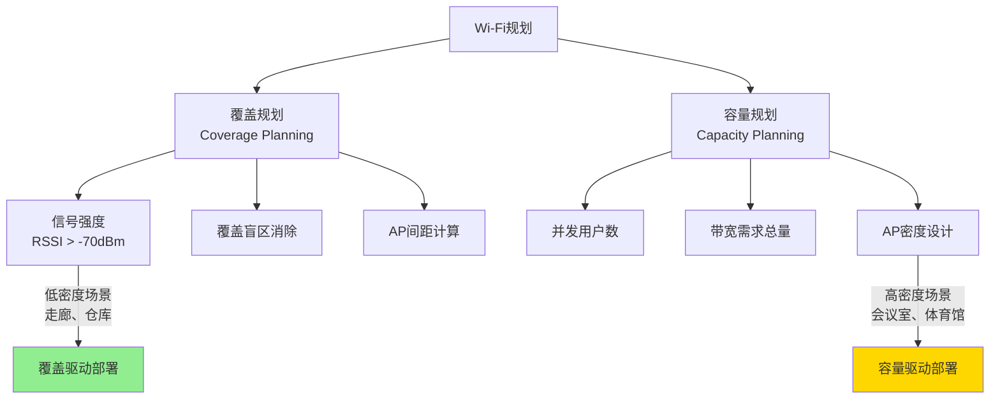
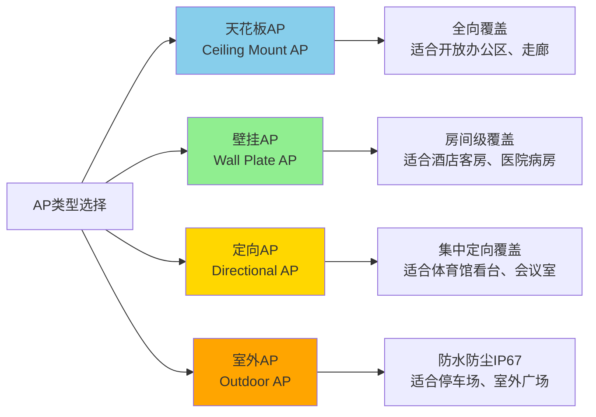
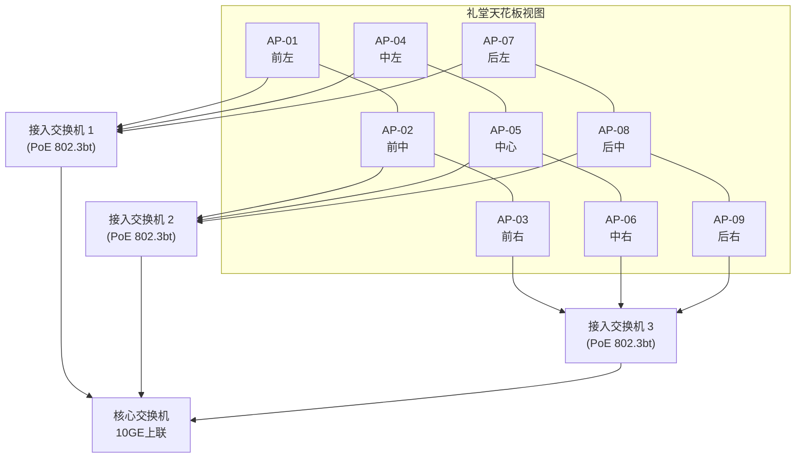
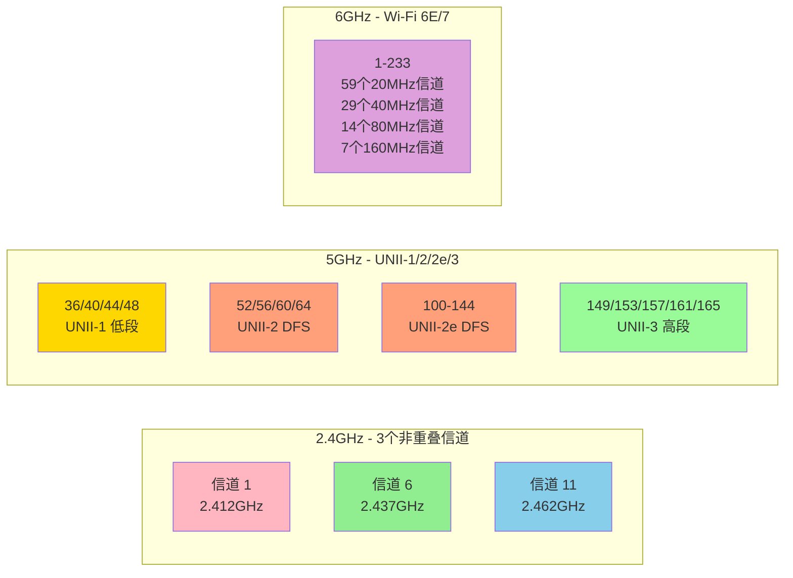
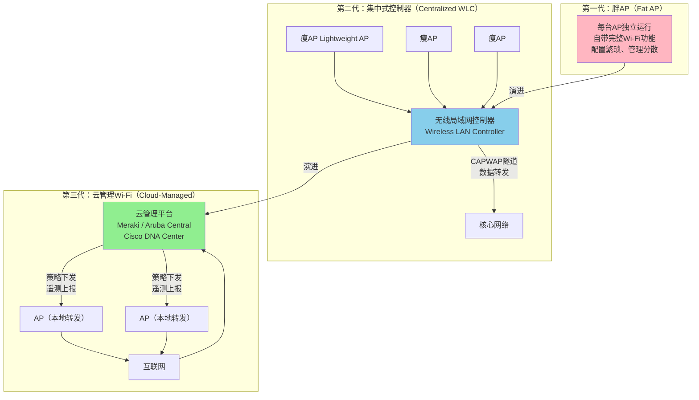
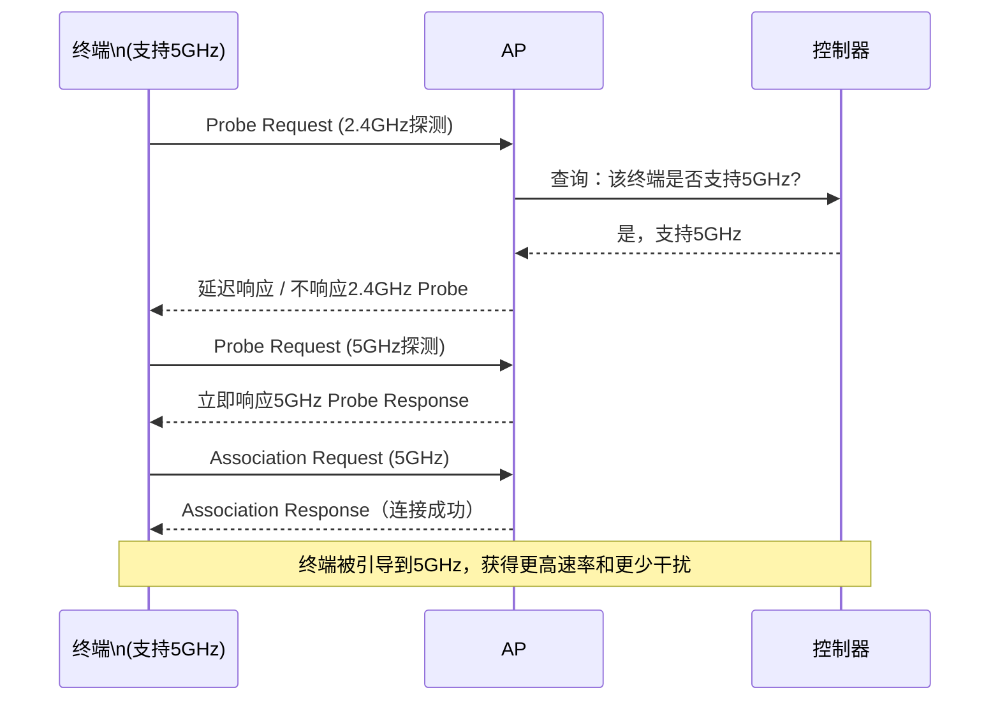
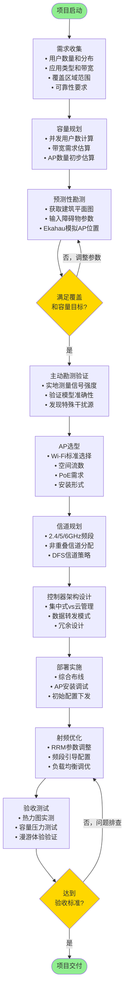

> <Icon name="clipboard-list" color="cyan" /> **前置知识**：[Wi-Fi 6/7标准](/guide/wireless/wifi-standards)、[企业网络架构](/guide/enterprise/traditional)
> ⏱ **阅读时间**：约20分钟

# 企业Wi-Fi规划与射频优化

## 导言：一次失败的部署

某制造企业的网络工程师按照"每层一台AP"的简单原则，在5层办公楼里装了5台AP。上线第一天，3楼会议室召开全员视频会议，50人同时连接，视频卡顿、语音断续，IT电话被打爆。

问题不在AP的品牌，不在带宽——主干链路是千兆的。问题在于：**这不是覆盖问题，而是容量问题**。一台AP同时服务50台终端，信道争用导致实际吞吐量下降超过80%。

企业Wi-Fi规划从来不是"把AP装上去"这么简单。它涉及容量计算、勘测设计、信道规划、射频调优四个相互关联的工程环节。本文系统拆解每一个环节。

---

## 第一部分：容量规划方法论

### 覆盖 vs 容量：两个完全不同的问题

大多数企业Wi-Fi失败的根源，在于把"覆盖规划"当成"容量规划"来做。

**覆盖规划**解决的是：信号能到哪里？  
**容量规划**解决的是：多少用户能同时使用，且体验不下降？



### 用户密度计算

企业环境的容量规划从用户密度开始。核心公式：

```
AP数量（容量驱动）= 总并发用户数 ÷ 单AP推荐并发用户数
```

Wi-Fi 6（802.11ax）理论上每AP可支持更多并发，但工程实践中的经验值：

| 场景类型 | 单AP推荐并发用户数 | 典型应用 |
|----------|-------------------|----------|
| 普通办公区 | 25-30 | 邮件、办公软件 |
| 高密度会议室 | 15-20 | 视频会议、协作工具 |
| 礼堂/体育场 | 10-15 | 活动直播、大型会议 |
| 仓库/制造车间 | 20-30 | 扫码枪、WMS系统 |
| 医院病房 | 15-20 | 医疗设备、移动查房 |

::: tip 最佳实践
容量规划时，将理论并发用户数乘以 **1.3 的冗余系数**。会议室等波动大的场景建议乘以 **1.5**。无线网络流量具有突发性，平均负载达到60%就会出现明显的性能下降。
:::

### 带宽需求估算

并发用户数只是第一步，还需要估算每用户的带宽需求：

```
总带宽需求 = 并发用户数 × 每用户平均带宽 × 同时使用率
```

常见企业应用的带宽参考值：

| 应用类型 | 每用户带宽需求 |
|----------|---------------|
| 视频会议（1080p） | 3-5 Mbps |
| VoIP语音 | 0.1-0.5 Mbps |
| 办公文档协作 | 1-3 Mbps |
| 视频流媒体 | 5-25 Mbps |
| 云桌面（VDI） | 5-10 Mbps |

以100人会议室为例：
- 并发用户：100人
- 主要应用：视频会议 (3 Mbps/人)
- 同时使用率：80%
- 总带宽需求：100 × 3 × 0.8 = **240 Mbps**

Wi-Fi 6 单AP的实际可用吞吐量约为理论速率的40-50%（受环境因素影响）。AX3000级别AP实际吞吐约1.2-1.5 Gbps，因此该场景需要 **至少2台AP** 承载容量，但通常部署3-4台以确保信道规划余量。

---

## 第二部分：Site Survey（无线勘测）

### 为什么不能跳过勘测

建筑结构对无线信号的影响远超大多数工程师的预期。以下是常见障碍物的信号衰减系数（2.4GHz/5GHz）：

| 障碍物类型 | 2.4GHz衰减 | 5GHz衰减 |
|-----------|-----------|---------|
| 普通隔断墙（石膏板） | 3-5 dB | 5-8 dB |
| 砖墙（20cm） | 6-15 dB | 10-20 dB |
| 钢筋混凝土墙 | 10-15 dB | 15-25 dB |
| 金属门/电梯门 | 15-20 dB | 20-30 dB |
| 玻璃幕墙（贴膜） | 8-15 dB | 12-18 dB |

5GHz信号穿透能力比2.4GHz弱约30-40%，这意味着在相同环境下，5GHz需要更多的AP数量才能保证覆盖。

::: warning 注意
玻璃幕墙上的金属镀膜（Low-E玻璃）会导致5GHz信号衰减高达20-30 dB，实际上相当于一堵砖墙。如果办公室有大量Low-E玻璃，必须在勘测阶段测量实际衰减值，不能套用理论数据。
:::

### 勘测工具与方法

**预测性勘测（Predictive Survey）**：

在实际部署前，使用软件工具基于建筑平面图进行模拟：
- **Ekahau AI Pro**：业界标准工具，导入CAD图纸后可自动建议AP位置和数量
- **iBwave Wi-Fi**：适用于大型复杂环境，如机场、医院

典型工作流：
1. 导入建筑平面图（CAD格式或PDF）
2. 标注障碍物材质和厚度
3. 设置目标覆盖参数（RSSI阈值、信噪比要求）
4. 软件输出AP建议位置和信道分配

**主动勘测（Active Survey）**：

在建筑实地采集信号数据，验证预测模型：
- 使用笔记本电脑或专用勘测设备（Ekahau Sidekick）
- 按网格路线行走，每1-3米采集一个数据点
- 生成热力图（Heatmap），直观呈现信号分布

### 热力图解读

一张合格的企业级Wi-Fi热力图应包含以下指标：

| 指标 | 优秀 | 合格 | 不合格 |
|------|------|------|--------|
| 信号强度（RSSI） | > -65 dBm | -65 ~ -70 dBm | < -70 dBm |
| 信噪比（SNR） | > 25 dB | 20-25 dB | < 20 dB |
| 信道干扰（CCI） | < -85 dBm | -80 ~ -85 dBm | > -80 dBm |
| 数据速率（PHY Rate） | > 300 Mbps | 150-300 Mbps | < 150 Mbps |

::: tip 最佳实践
企业核心办公区域的目标RSSI应设定为 **-65 dBm或更好**，而非仅满足 -70 dBm的基本连通标准。-65 dBm是Wi-Fi 6高速调制（1024-QAM）稳定工作的临界值，低于此值终端会自动降速。
:::

---

## 第三部分：AP部署设计

### AP类型选择



**天花板AP**是企业最常见的选型。关键参数对比：

| 参数 | 企业入门级 | 企业中端 | 企业高端 |
|------|-----------|---------|---------|
| 代表型号 | Cisco 9115 | Aruba AP-515 | Cisco 9136 |
| Wi-Fi标准 | Wi-Fi 6 | Wi-Fi 6E | Wi-Fi 6E |
| 空间流 | 4×4 MIMO | 4×4 MIMO | 8×8 MIMO |
| 最大速率 | 5.4 Gbps | 7.8 Gbps | 11 Gbps |
| 推荐场景 | 普通办公 | 高密度办公 | 大型礼堂/体育场 |

### AP间距计算

AP间距的核心目标是确保相邻AP的信号在-70 dBm时形成20%的重叠区域（漫游缓冲区）。

工程简化公式：

```
AP覆盖半径（m）= 10^((EIRP - PL_threshold) / (10 × n))
```

其中：
- EIRP = 发射功率 + 天线增益（dBm + dBi）
- PL_threshold = 目标覆盖边缘的路径损耗（dB）
- n = 路径损耗指数（自由空间=2，办公室=2.8-3.5，走廊=1.5-2）

**实用经验值**（5GHz，目标RSSI = -67 dBm）：

| 环境类型 | AP间距建议 |
|----------|-----------|
| 开放办公区（低隔断） | 15-20 m |
| 标准办公室（混凝土隔墙） | 12-15 m |
| 密集隔断区域 | 8-12 m |
| 走廊 | 25-35 m |

::: danger 避坑
**不要用2.4GHz的覆盖范围来规划AP间距。** 很多工程师看到2.4GHz信号覆盖更远，就把AP间距拉大。结果是5GHz覆盖存在盲区，而现代终端几乎都优先连接5GHz/6GHz。以5GHz最差频段（5.8GHz）的覆盖范围来确定AP间距，是正确的设计原则。
:::

### 密集部署场景：高密度会议室

以300人礼堂为例，密集部署方案：



密集部署关键配置：
1. 使用 **802.3bt（PoE++）**，最大90W，支持Wi-Fi 6E AP的4个无线电模块同时工作
2. 将AP发射功率**主动降低至8-12 dBm**，减少信道干扰
3. 启用 **Minimum RSSI Threshold**（最低连接信号门限），强制低信号终端漫游到更近的AP
4. 为礼堂场景单独建SSID，限制每AP关联用户数（通常25-30）

---

## 第四部分：信道规划

### 三频段信道全景



### 2.4GHz：三信道模型的坚守

2.4GHz频段只有3个真正的非重叠信道（1、6、11）。这是20年不变的事实，任何声称"可以使用信道2、3、4"的方案都会引入同频干扰（Co-Channel Interference，CCI）。

企业环境中，2.4GHz的真实挑战：
- 微波炉、蓝牙设备、ZigBee设备共用2.4GHz频段
- 邻居Wi-Fi网络造成的信道占用
- 信道宽度只能使用20MHz（使用40MHz会让CCI问题翻倍）

**2.4GHz的战略地位正在下降**：Wi-Fi 6E和Wi-Fi 7的主要战场在5GHz和6GHz。2.4GHz的价值在于支持老旧设备（IoT传感器、条码扫描枪），以及提供穿墙覆盖补充。

### 5GHz：DFS信道的得与失

5GHz有24个以上的非重叠20MHz信道，但分为两类：

**非DFS信道**（UNII-1和UNII-3）：
- 信道36、40、44、48（UNII-1）
- 信道149、153、157、161、165（UNII-3）
- 无需雷达检测，可直接使用
- 缺点：信道数量有限，高密度部署容易造成CCI

**DFS信道**（Dynamic Frequency Selection，动态频率选择，UNII-2和UNII-2e）：
- 信道52-64和100-144
- 法规要求：与雷达系统（气象雷达、机场雷达）共享频段
- AP必须先监听60秒（Channel Availability Check）才能使用
- 一旦检测到雷达，必须在10秒内切换信道

::: warning 注意
**机场和雷达站附近不要使用DFS信道**。若AP误判背景射频噪声为雷达信号，会触发信道切换，导致所有关联终端临时断线（约10-30秒）。在机场、港口、军事设施周边部署时，优先使用非DFS信道，并在勘测阶段检测实际雷达干扰环境。
:::

### 6GHz：Wi-Fi 6E的新大陆

6GHz频段（5.925-7.125 GHz，美国/部分国家已开放）提供了1200MHz的全新频谱：
- **59个**20MHz信道
- **29个**40MHz信道  
- **14个**80MHz信道
- **7个**160MHz信道

6GHz的根本优势：**全新干净的频谱**，没有任何老旧设备。所有6GHz设备都支持Wi-Fi 6E或Wi-Fi 7，且需要WPA3认证。

6GHz信道规划建议：
- 优先分配给视频会议、云桌面等时延敏感型应用
- 利用广泛的160MHz信道实现高吞吐低时延
- 注意：6GHz穿透能力比5GHz更弱，AP密度需要相应提高约20-30%

### 企业典型信道分配方案

一栋三层办公楼的信道规划（每层6台AP）：

```
1楼：AP-101(信道36) AP-102(信道149) AP-103(信道44) AP-104(信道157) AP-105(信道52) AP-106(信道161)
2楼：AP-201(信道44) AP-202(信道157) AP-203(信道36) AP-204(信道149) AP-205(信道60) AP-206(信道165)
3楼：AP-301(信道48) AP-302(信道161) AP-303(信道52) AP-304(信道149) AP-305(信道36) AP-306(信道157)
```

关键原则：垂直方向上的AP（如AP-101与AP-201）应使用不同的信道，避免楼层间干扰。

---

## 第五部分：无线控制器架构

### 三代架构演进



### CAPWAP协议：瘦AP的通信基础

CAPWAP（Control And Provisioning of Wireless Access Points，无线接入点控制与配置协议）是瘦AP（Lightweight AP）与控制器之间的标准通信协议（RFC 5415）。

CAPWAP有两个通道：
- **控制信道**（Control Channel）：UDP 5246，加密传输AP配置、状态、统计信息
- **数据信道**（Data Channel）：UDP 5247，转发用户数据（隧道模式下）

两种数据转发模式：

| 模式 | 说明 | 优点 | 缺点 |
|------|------|------|------|
| 集中转发（Central Switching） | 所有用户流量通过CAPWAP隧道转发到控制器 | 统一策略执行，便于管理 | 控制器成为瓶颈，带宽浪费 |
| 本地转发（Local Switching） | 用户流量在本地直接转发，只有控制流量走隧道 | 低延迟，控制器无带宽压力 | 策略执行分散，排障复杂 |

::: tip 最佳实践
分支机构场景强烈推荐**本地转发模式**。若使用集中转发，分支用户的每个数据包都要绕到总部控制器再返回，增加了50-200ms以上的不必要延迟，且总部带宽消耗随分支用户数线性增长。
:::

### 主流厂商方案对比

| 维度 | Cisco WLC（传统） | Cisco Meraki | Aruba Central | Huawei iMaster NCE |
|------|-----------------|-------------|--------------|-------------------|
| 管理模式 | 本地部署控制器 | 云管理SaaS | 云管理SaaS | 云/混合部署 |
| 部署复杂度 | 高 | 低 | 低 | 中 |
| 许可模式 | 买断 + 智能许可 | 年度订阅 | 年度订阅 | 弹性订阅 |
| 离线可用性 | 完全可用 | 有限可用（缓存策略） | 有限可用 | 完全可用 |
| AI/ML能力 | 有限（需DNA Center） | 内置 | 强（Aruba AI Insights） | 强 |
| 适合规模 | 大型企业 | 中小企业/分布式 | 各类规模 | 大型企业/运营商 |

### 云管理Wi-Fi的核心优势

**零接触部署（Zero-Touch Provisioning，ZTP）**：  
AP上架通电后，自动通过互联网找到云管理平台，下载配置，无需现场工程师介入。对于拥有数百个分支的零售连锁、银行网点，这一特性将部署成本降低60%以上。

**统一可视化**：  
一个控制台管理全国所有AP，实时查看每台AP的关联用户数、信道利用率、射频质量，异常AP自动告警。

**OTA固件升级**：  
集中推送固件更新，可定时在低峰期执行，避免手动逐台升级的运维负担。

---

## 第六部分：射频优化（RF Optimization）

### RRM：无线网络的"自动驾驶"

RRM（Radio Resource Management，无线资源管理）是现代企业Wi-Fi控制器的核心智能功能，包含三个子系统：

**TPC（Transmit Power Control，发射功率控制）**：
- 控制器周期性收集所有AP的RSSI信息
- 如果相邻AP信号重叠过多（覆盖空洞风险低），自动降低发射功率
- 如果某AP宕机，周边AP自动提升功率填补覆盖空洞
- 目标：相邻AP之间形成15-20%的信号重叠区

**DCA（Dynamic Channel Assignment，动态信道分配）**：
- 持续扫描周边信道的干扰情况
- 自动选择干扰最小的信道
- DCA触发条件：信道利用率超过80%，或检测到雷达信号（DFS）
- 调整时机：通常选择凌晨低负载时段执行

**ARM（Adaptive Radio Management，自适应射频管理，Aruba专有）**：
- 综合考量覆盖、容量、干扰三维度
- 结合AI学习历史模式（如每周一早9点流量激增）
- 提前预调整信道和功率配置

### 频段引导（Band Steering）



频段引导的实现原理：
1. 控制器记录每台终端是否发送过5GHz的Probe Request
2. 当检测到支持5GHz的终端在2.4GHz发起连接时，延迟或拒绝2.4GHz响应
3. 终端超时后重试，切换到5GHz频段探测
4. AP正常响应5GHz连接请求

::: warning 注意
**频段引导对只支持2.4GHz的设备不生效**，这类设备（部分IoT传感器、老旧手持终端）只会一直尝试2.4GHz。应将此类设备集中接入专用2.4GHz SSID，避免占用5GHz AP的关联表资源。
:::

### 负载均衡（Client Load Balancing）

当某台AP负载过高而相邻AP负载较低时，控制器触发负载均衡：

**拒绝关联法（Association Denial）**：
- 当AP关联用户数超过阈值（如30个用户）
- 延迟或拒绝新终端的关联请求
- 终端在超时后重新探测，连接到信号次优但负载更低的相邻AP

**802.11v BSS Transition（网络引导过渡）**：
- AP向已连接的终端发送BSS Transition Management Request帧
- 主动"建议"终端切换到指定的目标AP
- 相比拒绝关联法，终端体验更平滑（无断线感知）

### 实战调优示例：Cisco WLC配置片段

以下是Cisco WLC（Wireless LAN Controller）的RRM配置参考：

```
! 启用TPC自动功率控制
config 802.11a txpower global auto
config 802.11b txpower global auto

! 设置TPC功率调整步长（dBm）
config advanced 802.11a tpc-version 2
config advanced 802.11a power-update-interval 600

! 启用DCA自动信道分配
config advanced 802.11a channel global auto
config advanced 802.11a channel-update-interval 600

! 设置最小发射功率（防止功率过低）
config 802.11a txpower min 8

! 配置频段引导
config band-select probe-response enable
config band-select probe-cycle-count 2
config band-select probe-response-expire 500
config band-select client-rssi -80

! 配置客户端负载均衡
config load-balancing window 5
config load-balancing denial 3
```

---

## 第七部分：完整规划流程与认知升级

### 企业Wi-Fi规划全流程



### 从"装AP"到"射频工程"的思维转变

企业Wi-Fi规划的核心认知升级：

**第一层认知：覆盖驱动**  
"把AP装上去，信号格格满就行"。这是大多数人的起点，也是大多数无线网络故障的根源。

**第二层认知：容量驱动**  
理解信道争用（Channel Contention）机制，明白AP数量不够和AP太多都会造成性能下降。密集部署时，低发射功率 + 高AP密度 优于 高发射功率 + 低AP密度。

**第三层认知：频谱工程**  
把Wi-Fi频谱看作有限的共享资源。信道规划、DFS管理、6GHz频段利用，本质上都是频谱资源的工程化分配问题。

**第四层认知：系统化运维**  
Wi-Fi网络不是"一次部署、永久运行"的静态基础设施。用户模式变化、新设备引入、物理环境改变，都要求持续的射频优化和重新勘测。建立周期性的无线网络健康评估机制，是成熟企业网络运维团队的标志。

**第五层认知：业务驱动**  
最终目标不是信号格格满，而是业务应用的稳定运行。理解不同业务应用的网络特征（时延敏感型、带宽密集型、高可靠型），并将这些需求映射到无线网络的QoS策略、SSID设计和AP部署密度上，是网络工程师到网络架构师的跨越。

---

## 总结：工程师的校准清单

部署企业Wi-Fi前，用这个清单校准你的方案：

- [ ] 是否完成了容量计算？（不只是覆盖计算）
- [ ] 是否进行了预测性勘测并验证？
- [ ] 5GHz覆盖半径是否作为AP间距的决定性因素？
- [ ] 信道规划是否避免了垂直方向的同频干扰？
- [ ] DFS信道使用是否评估了雷达干扰风险？
- [ ] 高密度场景是否配置了Minimum RSSI Threshold？
- [ ] 是否使用本地转发模式（分支场景）？
- [ ] RRM是否启用并配置了合理的调整间隔？
- [ ] 是否有周期性射频优化和健康评估计划？

> **延伸阅读**：[Wi-Fi 6/7技术标准](/guide/wireless/wifi-standards) · [企业网络冗余设计](/guide/qos/redundancy) · [网络监控与运维](/guide/ops/monitoring)
