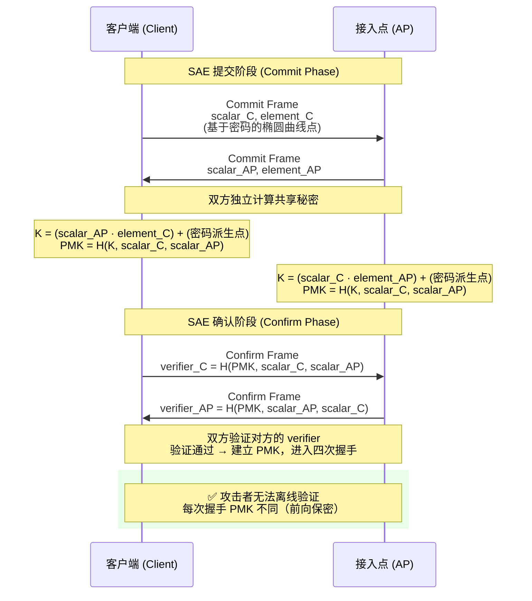
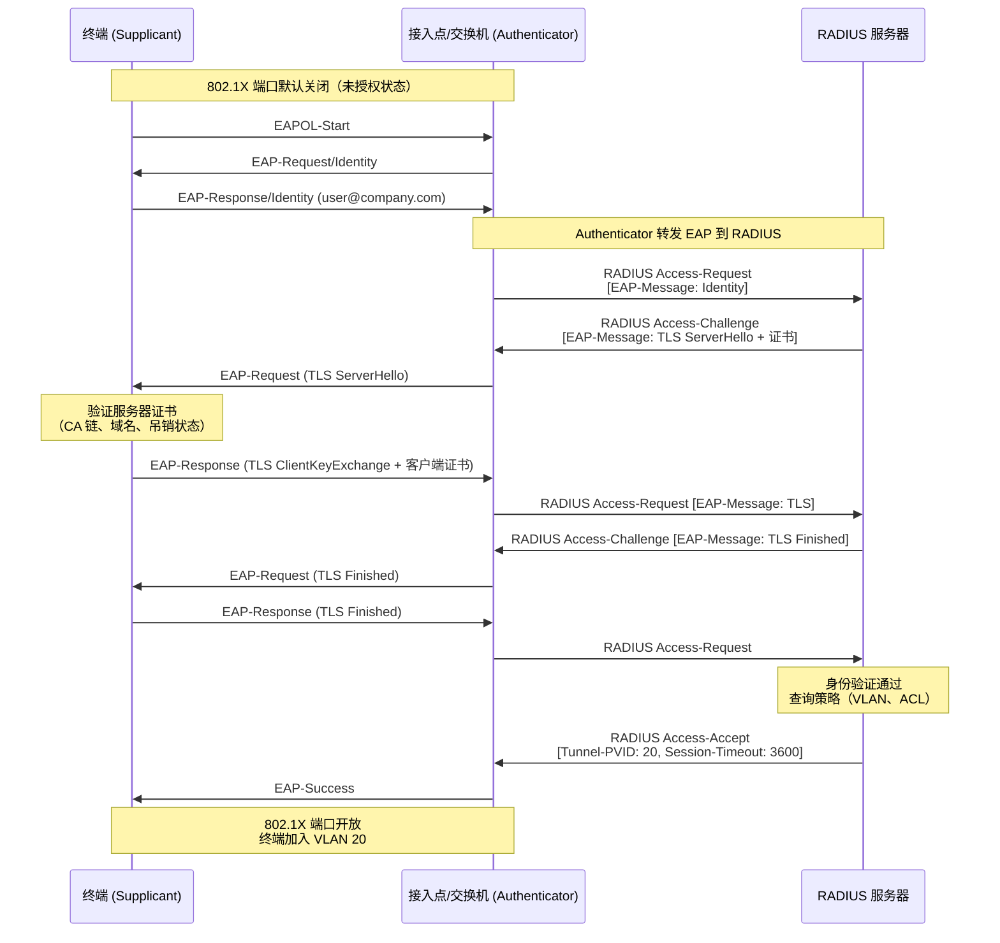
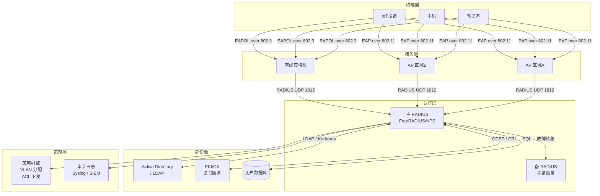
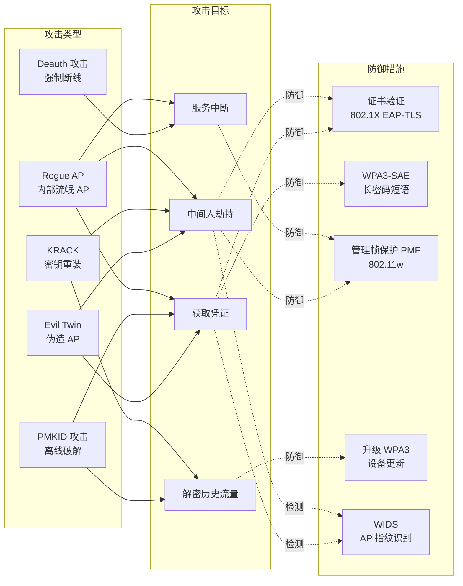

> 📋 **前置知识**：[网络安全基础](/guide/security/firewall)、[IPSec与加密](/guide/security/ipsec)
> ⏱️ **阅读时间**：约18分钟

# Wi-Fi安全：WPA3与企业级认证体系

2017年，安全研究员发现了一个名为 KRACK（Key Reinstallation Attack，密钥重装攻击）的漏洞，它影响了几乎所有支持 WPA2 的设备——从手机到智能电视，从企业 AP（接入点）到家用路由器。攻击者无需破解密码，只需在握手过程中注入特定帧，便能解密受害者的全部无线流量。

这一事件加速了 Wi-Fi 联盟（Wi-Fi Alliance）推出 WPA3（Wi-Fi Protected Access 3）的进程。但对企业安全架构师来说，协议升级只是开始——真正的挑战是如何在数千台设备并存的环境中，构建一套可验证、可审计、可快速响应的无线安全体系。

本文从协议演进出发，深入 WPA3 的密码学原理，再到企业级 802.1X 的完整部署，给出一套可落地的无线安全框架。

---

## 第一部分：WPA 演进史——每一代都是对上一代失败的回应

### 从 WEP 到 WPA3

```
WEP（1997）          ──→  WPA（2003）          ──→  WPA2（2004）         ──→  WPA3（2018）
│                         │                         │                         │
│ RC4 流密码              │ TKIP 临时修复            │ AES-CCMP               │ AES-GCMP-256
│ 24-bit IV（太短）        │ 向后兼容旧硬件            │ CCMP 取代 TKIP          │ SAE 握手
│ 静态共享密钥             │ PSK + 802.1X            │ 四次握手                 │ 前向保密
│                         │                         │                         │ OWE 开放加密
└─ 被破解：1分钟           └─ TKIP 已弃用            └─ KRACK攻击              └─ 当前标准
```

**WEP 的致命伤**：24 位初始化向量（IV，Initialization Vector）太短，在流量繁忙的网络中几分钟内就会循环复用，配合 RC4 的统计弱点，攻击者收集约 40,000 个数据包就能恢复密钥。

**WPA 是过渡期补丁**：TKIP（Temporal Key Integrity Protocol，临时密钥完整性协议）在 WEP 硬件上用软件实现了每包密钥混合，延缓了危机，但从未被设计为长期方案。

**WPA2 的硬伤——四次握手离线攻击**：

```
客户端 ──→ AP：Association Request
AP ──→ 客户端：ANonce（随机数）
客户端 ──→ AP：SNonce + MIC（消息完整性码）   ←── 攻击者抓包
AP ──→ 客户端：GTK（组临时密钥）

攻击者离线操作：
  字典词条 → PBKDF2(密码, SSID, 4096轮) = PMK
  PMK + ANonce + SNonce + MAC地址 → PTK → 计算 MIC
  对比抓包中的 MIC → 匹配则密码正确
```

PBKDF2 哈希迭代 4096 次，但 GPU 集群每秒仍能尝试数百万次，8 位数字密码在专业设备面前形同虚设。

> 💡 **思考题**：WPA2 的离线攻击为什么比在线暴力破解更危险？攻击者在整个过程中需要保持与目标网络的连接吗？

---

## 第二部分：WPA3 核心创新——密码学的范式升级

### 2.1 SAE——告别字典攻击

SAE（Simultaneous Authentication of Equals，对等同步认证）是 WPA3 最重要的创新，它基于 Dragonfly 密钥交换协议，从根本上改变了密码验证方式。

**核心思想**：双方都不传输任何能离线验证密码的信息。每次认证产生独立的会话密钥，即使将来密码泄露，历史会话依然安全。



**SAE 为什么能抵抗离线攻击**：攻击者即使抓到全部握手包，也无法离线枚举密码——因为验证需要完成一次完整的椭圆曲线运算，而这只能在线进行，AP 会限制失败次数并增加延迟（防止在线暴力破解）。

::: tip 最佳实践
WPA3-Personal 部署时，仍应使用长度 ≥ 20 字符的随机密码短语。SAE 极大提高了攻击成本，但密码强度是纵深防御的基础层。
:::

### 2.2 前向保密（Forward Secrecy）

WPA2 的 PMK（Pairwise Master Key，成对主密钥）由密码直接派生，长期固定。一旦密码泄露，过去所有录制的流量都可以解密。

WPA3-SAE 的每次握手生成一个全新的、临时的 PMK，通过椭圆曲线 Diffie-Hellman 交换实现：

```
WPA2：密码 → PMK（固定）→ PTK1, PTK2, PTK3...
              ↑ 密码泄露后，历史 PTK 可被推导出

WPA3-SAE：密码 + 随机数 → PMK1（临时）→ PTK1
           密码 + 随机数 → PMK2（临时）→ PTK2
                          ↑ 每次独立，历史会话安全
```

### 2.3 OWE——开放网络也能加密

机场、咖啡馆的开放 Wi-Fi 从未有过加密——任何人都能用 Wireshark 嗅探到同一热点下其他用户的 HTTP 流量。

OWE（Opportunistic Wireless Encryption，机会性无线加密）让开放网络也能透明加密，且无需任何密码：

```
传统开放网络：
  客户端 → AP：明文关联
  数据：全部明文传输，任何人可嗅探

OWE 开放网络：
  客户端 ←→ AP：DH 密钥交换（无需密码）
  数据：每对客户端-AP 使用独立的加密密钥
  旁路攻击者：只看到密文，无法解密
```

::: warning 注意
OWE 只解决被动嗅探问题，不验证 AP 身份。Evil Twin 攻击（伪造 AP）在 OWE 网络仍然有效。公共网络上的敏感操作仍应叠加 HTTPS 或 VPN。
:::

### 2.4 Easy Connect（DPP 协议）

传统的物联网设备配网是企业无线管理的噩梦——无屏设备如何安全地加入 WPA3 网络？

Easy Connect 基于 DPP（Device Provisioning Protocol，设备配置协议），通过扫描 QR 码或 NFC 触碰，将设备公钥带外传输，AP 用它为设备生成专属凭证：

```
1. 管理员扫描设备背面的 QR 码（含设备公钥）
2. 配置器（Configurator，通常是手机）向 AP 提交设备信息
3. AP 生成针对该设备的连接器（Connector）
4. 设备使用连接器认证，无需手动输入密码
```

> 💡 **思考题**：DPP 的 QR 码包含设备的公钥，如果攻击者提前拍下 QR 码，能否冒充该设备接入网络？为什么？

---

## 第三部分：802.1X 企业认证——身份不是密码

家庭网络用 PSK（Pre-Shared Key，预共享密钥），企业网络用 802.1X。原因很简单：

```
PSK 的问题（企业场景）：
  ✗ 员工离职后，密码必须全部更换
  ✗ 无法区分不同用户的流量日志
  ✗ 无法基于用户身份下发不同策略（VLAN、ACL）
  ✗ 密码泄露难以溯源

802.1X 的价值：
  ✓ 每人独立凭证，离职即撤销
  ✓ 完整的认证日志，每次连接可追溯
  ✓ 基于身份动态分配 VLAN
  ✓ 支持证书认证，无密码风险
```

### 3.1 EAP 协议家族

EAP（Extensible Authentication Protocol，可扩展认证协议）是 802.1X 的认证载体，有多种实现：

| 协议 | 服务端证书 | 客户端证书 | 安全性 | 适用场景 |
|------|-----------|-----------|--------|---------|
| EAP-TLS | 必须 | 必须 | 最高 | 企业内网，有 PKI 基础设施 |
| PEAP | 必须 | 无需 | 高 | 用户名+密码认证，最常用 |
| EAP-TTLS | 必须 | 无需 | 高 | Linux 客户端，灵活内部协议 |
| EAP-FAST | 可选 | 无需 | 中高 | Cisco 环境，PAC 文件管理 |

::: tip 最佳实践
**优先选择 EAP-TLS**：双向证书认证，没有密码可被钓鱼，是零信任无线架构的基石。如果 PKI 基础设施尚未就绪，PEAP-MSCHAPv2 是过渡期的最佳选择，但务必验证服务器证书。
:::

### 3.2 802.1X 完整认证流程



### 3.3 RADIUS 服务器架构

RADIUS（Remote Authentication Dial-In User Service，远程认证拨号用户服务）是 802.1X 认证的后端核心：



**RADIUS 服务器选型参考**：

```
开源方案：
  FreeRADIUS    ─ 最成熟的开源选择，支持所有 EAP 类型
  Radsecproxy   ─ RADIUS over TLS，适合多站点安全传输

商业方案：
  Microsoft NPS     ─ AD 环境的自然选择，深度集成
  Cisco ISE         ─ 全功能 NAC + 策略引擎，适合大型企业
  Aruba ClearPass   ─ 多厂商无线环境，设备画像能力强
  Portnox Cloud     ─ 云原生 RADIUS，适合混合办公

关键配置参数（以 FreeRADIUS 为例）：
  auth_type = EAP
  eap {
    default_eap_type = tls
    tls-config tls-common {
      certificate_file = /etc/ssl/certs/radius.pem
      private_key_file = /etc/ssl/private/radius.key
      ca_file = /etc/ssl/certs/ca-chain.pem
      check_crl = yes
    }
  }
```

::: danger 避坑
**绝对不能关闭 RADIUS 共享密钥（Shared Secret）验证**。AP 与 RADIUS 之间的共享密钥应使用随机生成的 32+ 字符字符串，不要使用公司名称、IP 地址等可猜测的值。共享密钥泄露意味着攻击者可以伪造 RADIUS 响应。
:::

> 💡 **思考题**：在企业部署中，如果 RADIUS 服务器宕机，802.1X 认证将无法完成，所有用户断网。你会如何设计高可用架构？本地缓存凭证又带来哪些安全隐患？

---

## 第四部分：常见攻击与防御体系

### 4.1 主要攻击向量



### 4.2 Evil Twin 攻击详解与防御

攻击者用相同 SSID 建立一个信号更强的伪 AP，附近设备会自动连接，流量经攻击者转发，形成完美的中间人位置：

```
正常连接：
  用户 ──→ 合法 AP（BSSID: AA:BB:CC:DD:EE:FF）──→ 互联网

Evil Twin 攻击：
  攻击者架设伪 AP（BSSID: 11:22:33:44:55:66，但 SSID 相同）
  发送 Deauth 帧踢走用户
  用户重连 → 自动选择信号更强的伪 AP
  攻击者 ← 用户流量 → 攻击者转发 → 互联网
```

**防御手段**：

| 防御层 | 具体措施 | 效果 |
|--------|---------|------|
| 协议层 | 部署 802.1X EAP-TLS，终端验证服务器证书 | 连接伪 AP 后认证失败，自动断开 |
| 管理帧 | 启用 PMF（Protected Management Frames）即 802.11w | Deauth 帧需要签名，伪造无效 |
| 检测层 | WIDS 监控新出现的同名 SSID，MAC 地址与已知 AP 不符触发告警 | 快速发现攻击 |
| 客户端 | 配置 Wi-Fi Profile，锁定允许连接的 BSSID 列表 | 根本上阻止连接伪 AP |

### 4.3 PMKID 攻击（WPA2 特有）

2018 年，Jens Steube（Hashcat 作者）发现攻击者无需等待客户端连接，只需向 AP 发送关联请求，AP 会在响应中携带 PMKID：

```
PMKID = HMAC-SHA1-128(PMK, "PMK Name" || AP_MAC || Client_MAC)
      = HMAC-SHA1-128(PBKDF2(密码, SSID), ...)

攻击者提取 PMKID 后，即可离线暴力破解 PSK
不再需要等待合法客户端的四次握手

WPA3-SAE：无 PMKID 概念，此攻击完全无效
```

::: tip 最佳实践
WPA2 网络应配置 **随机 SSID**（避免使用公司名称），因为 SSID 是 PBKDF2 盐值的一部分。固定可预测的 SSID 让彩虹表攻击成为可能。WPA3 从根本上消除此问题。
:::

### 4.4 Deauth 攻击与 PMF

802.11 管理帧（Management Frame）在 WPA2 中是明文且未认证的。任何人可以伪造带有合法客户端 MAC 地址的 Deauth 帧，强制目标设备断线：

```
# 攻击工具示例（仅用于了解原理，勿用于非授权网络）
aireplay-ng --deauth 100 -a [AP-BSSID] -c [Client-MAC] wlan0mon

# PMF (802.11w) 启用后，管理帧携带 MIC，伪造的 Deauth 帧被拒绝
# WPA3 强制要求 PMF，WPA2 需要显式启用
```

::: warning 注意
即使启用了 PMF，广播 Deauth 帧（目标为 FF:FF:FF:FF:FF:FF）仍然有效，因为广播管理帧无法被 MIC 保护。完全消除 Deauth 攻击需要 802.11ax（Wi-Fi 6）的 BSS Coloring 与 Target Wake Time 机制配合。
:::

---

## 第五部分：企业部署最佳实践

### 5.1 SSID 设计原则

企业无线网络的 SSID 规划直接影响安全边界和运维效率：

```
推荐的多 SSID 分层设计：

Corp-Internal（内网）
  ├─ 认证：802.1X + EAP-TLS
  ├─ 加密：WPA3-Enterprise（GCMP-256）
  ├─ VLAN：10（员工）
  └─ 策略：完整内网访问

Corp-Contractor（承包商）
  ├─ 认证：802.1X + PEAP
  ├─ 加密：WPA3-Enterprise
  ├─ VLAN：20（受限访问）
  └─ 策略：仅访问指定服务器段

Corp-IoT（物联网）
  ├─ 认证：802.1X + 设备证书
  ├─ 加密：WPA2/WPA3 混合
  ├─ VLAN：30（隔离）
  └─ 策略：出站仅允许特定云端点

Guest（访客）
  ├─ 认证：Captive Portal（强制门户）
  ├─ 加密：WPA3-OWE（或 WPA2 开放）
  ├─ VLAN：99（仅互联网）
  └─ 策略：完全隔离，带宽限速
```

::: danger 避坑
**不要将访客网络和内网设备放在同一 VLAN**，无论访客网络是否有密码。访客 VLAN 应在防火墙级别隔离，禁止访问 RFC1918 地址段（10.0.0.0/8、172.16.0.0/12、192.168.0.0/16）。
:::

### 5.2 证书生命周期管理

EAP-TLS 的最大运维挑战是证书管理。企业 PKI（Public Key Infrastructure，公钥基础设施）是整个体系的信任锚：

```
证书链结构：
  根 CA（离线存储，10-20年）
    └─ 中间 CA（联机签发，5年）
         ├─ RADIUS 服务器证书（1-2年）
         └─ 客户端证书（1年，与员工账号绑定）

关键运维流程：
  1. 证书预警：到期前 60 天发送告警
  2. 自动续签：通过 SCEP/EST 协议自动为设备颁发新证书
  3. 即时吊销：员工离职 → AD 账号禁用 → 同步吊销 RADIUS 客户端证书
  4. CRL/OCSP：RADIUS 服务器配置实时吊销状态检查

MDM 集成（推荐）：
  Microsoft Intune / Jamf / VMware Workspace ONE
  → 统一推送 Wi-Fi Profile（含 CA 证书、EAP 配置）
  → 自动化设备证书申请和续期
  → 设备合规检查与网络准入联动
```

::: tip 最佳实践
使用 **SCEP（Simple Certificate Enrollment Protocol，简单证书注册协议）** 与 MDM 系统集成，实现客户端证书的全生命周期自动化管理。人工管理证书的企业，往往因为证书过期导致大规模断网事故。
:::

### 5.3 无线入侵防御系统（WIDS）

WIDS（Wireless Intrusion Detection System，无线入侵防御系统）是企业无线安全的"眼睛"：

```
WIDS 核心检测能力：
  
  ① 流氓 AP（Rogue AP）检测
     ─ 扫描空口，发现未注册 AP
     ─ 有线侧关联验证（同 SSID 但 MAC 不在注册表）
     ─ 对接有线侧交换机，定位物理端口
  
  ② Evil Twin 检测
     ─ 监控同 SSID 的多个 BSSID
     ─ 信号强度异常（信号突然增强的 AP）
  
  ③ 异常行为检测
     ─ 大量 Deauth 帧（Deauth 攻击特征）
     ─ 扫描探测（Probe Request 风暴）
     ─ 认证失败次数异常（暴力破解）
  
  ④ 客户端异常
     ─ 同一 MAC 在多个 AP 同时出现
     ─ 已知恶意设备指纹

配置示例（Cisco WLC）：
  wlan wids-profile enterprise-wids
    detect rogue-ap enable
    detect rogue-client enable  
    detect ad-hoc-rogue enable
    detect deauthentication-flood enable threshold 100
    detect association-flood enable threshold 50
    signature enable
```

### 5.4 合规与审计要求

企业无线安全不仅是技术问题，也是合规问题：

```
PCI DSS 3.2.1（支付卡行业）：
  要求 11.1：每季度扫描无线接入点，检测未授权 AP
  要求 4.1：持卡人数据传输使用强密码学保护
  → 持卡人数据网络禁用 WEP 和 TKIP

ISO 27001（信息安全管理）：
  A.13.1.1：网络控制措施
  A.9.1.2：网络和网络服务的访问控制
  → 要求文档化无线安全策略

HIPAA（医疗行业）：
  要求对 PHI（受保护健康信息）传输加密
  → 医疗设备网络强制使用 WPA2-Enterprise 或以上

NIST SP 800-153（政府/军事参考）：
  推荐 WPA3-Enterprise 192 位安全模式
  强制 PMF（802.11w）
  要求 EAP-TLS 双向证书认证
```

> 💡 **思考题**：企业正在将部分 IoT 设备迁移到无线网络，这些设备只支持 WPA2-PSK 且无法升级固件。如何在不降低整体安全水位的前提下，允许这些设备接入？

---

## 认知升级：无线安全的三层思维模型

学完 WPA3 协议和 802.1X 流程，你可能对具体的密码学和配置有了清晰认识。但企业安全实践中，更重要的是建立系统性思维：

**第一层：协议正确性**
WPA3-SAE 解决了密码验证的根本问题，EAP-TLS 建立了基于证书的身份体系。这是你能控制的"数学保障"层——选对协议，不被已知攻击打穿。

**第二层：实现与配置**
最好的协议也可能因为错误配置失效。服务器证书不验证、RADIUS 共享密钥过简、PMF 未启用——每一项都是一个被绕过的机会。安全审计的价值，正在于发现协议正确但配置错误的漏洞。

**第三层：运营与响应**
无线安全是动态的。攻击者会在你的 WIDS 规则之外探索新向量，新设备会绕过你的准入策略，证书过期会在最糟糕的时机导致中断。**持续监控、定期演练、快速响应**，才是企业无线安全的真正护城河。

```
无线安全成熟度模型：

L1 基础合规    → 使用 WPA2/WPA3，禁止 WEP，启用防火墙隔离
L2 身份管控    → 802.1X + RADIUS，基于身份的 VLAN 分配
L3 深度防护    → EAP-TLS + PKI，PMF 强制，WIDS 部署
L4 持续运营    → SIEM 集成，自动化合规检查，红队演练
L5 零信任无线  → 设备健康状态联动，动态策略，持续验证
```

---

## 快速参考

### WPA3 vs WPA2 关键差异

| 特性 | WPA2 | WPA3 |
|------|------|------|
| 个人版握手 | 四次握手（PSK） | SAE（Dragonfly） |
| 离线字典攻击 | 可行 | 不可行 |
| 前向保密 | 无 | 有 |
| PMF | 可选 | 强制 |
| 开放网络加密 | 无 | OWE |
| 最大加密强度 | AES-CCMP-128 | AES-GCMP-256 |
| 设备配网 | 手动 | DPP（Easy Connect） |

### 企业部署检查清单

```
[ ] AP 固件更新至最新版本
[ ] 启用 WPA3-Enterprise（或 WPA2/WPA3 过渡模式）
[ ] 强制 PMF（802.11w）
[ ] 部署 802.1X + EAP-TLS（或 PEAP 作为过渡）
[ ] RADIUS 服务器高可用（主备配置）
[ ] 服务器证书由企业 CA 签发，配置 OCSP
[ ] 客户端证书通过 MDM 自动管理
[ ] SSID 按角色分层，VLAN 隔离
[ ] WIDS 启用并接入 SIEM
[ ] 每季度无线安全扫描（合规要求）
[ ] 访客网络完全隔离，启用带宽限制
[ ] 禁止私接 AP（802.1X 端口认证防护有线侧）
```

---

## 延伸阅读

- [Wi-Fi Alliance WPA3 规范](https://www.wi-fi.org/discover-wi-fi/security)：官方协议文档
- [RFC 5281 EAP-TTLS](https://www.rfc-editor.org/rfc/rfc5281)：EAP-TTLS 完整规范
- [NIST SP 800-153](https://csrc.nist.gov/publications/detail/sp/800-153/final)：无线局域网安全指南
- [Dragonfly Key Exchange](https://www.rfc-editor.org/rfc/rfc7664)：SAE 底层密码学原语
- [FreeRADIUS 官方文档](https://freeradius.org/documentation/)：开源 RADIUS 服务器配置参考
