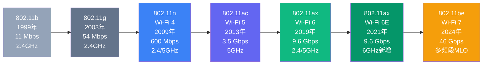
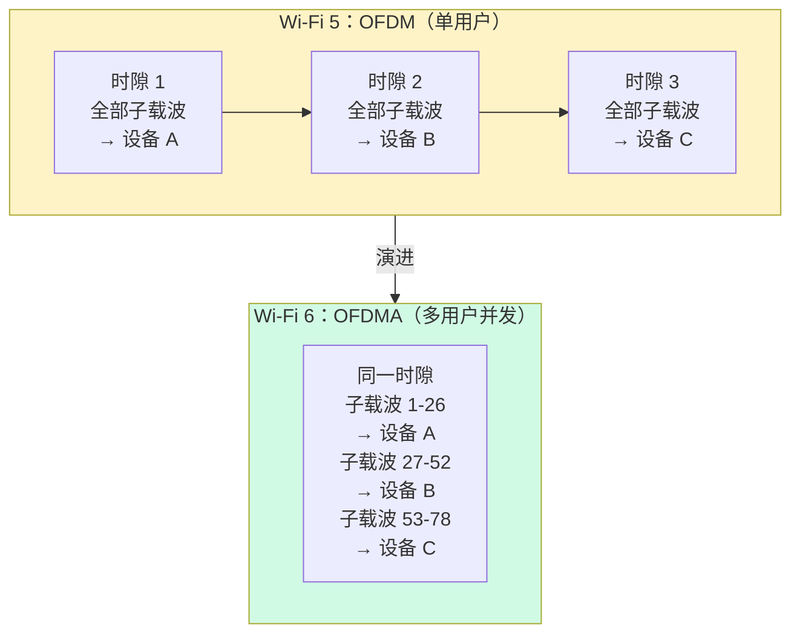
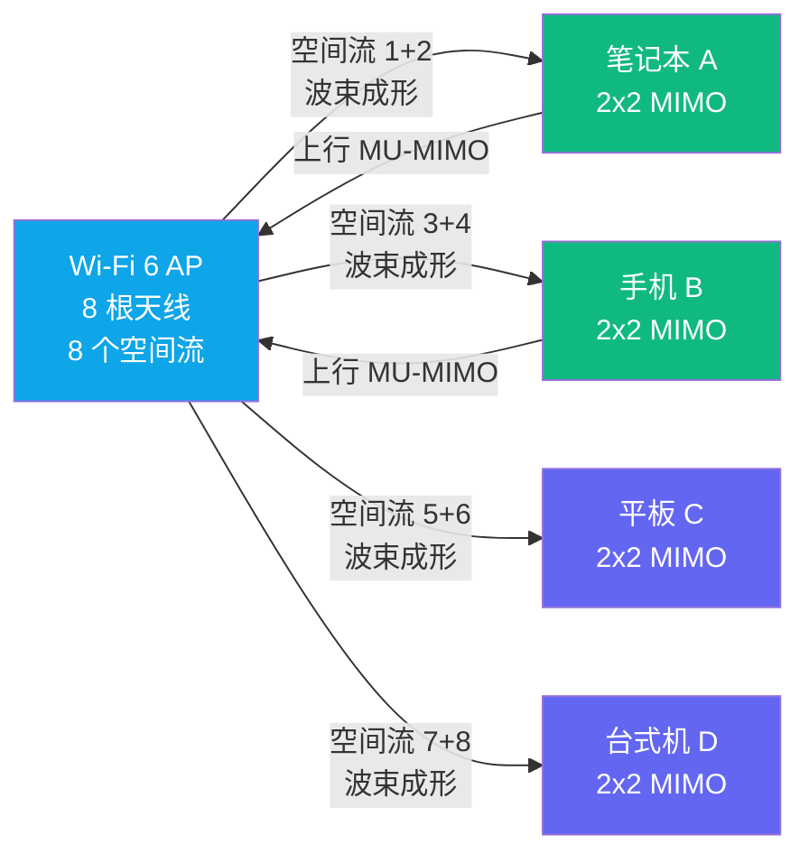
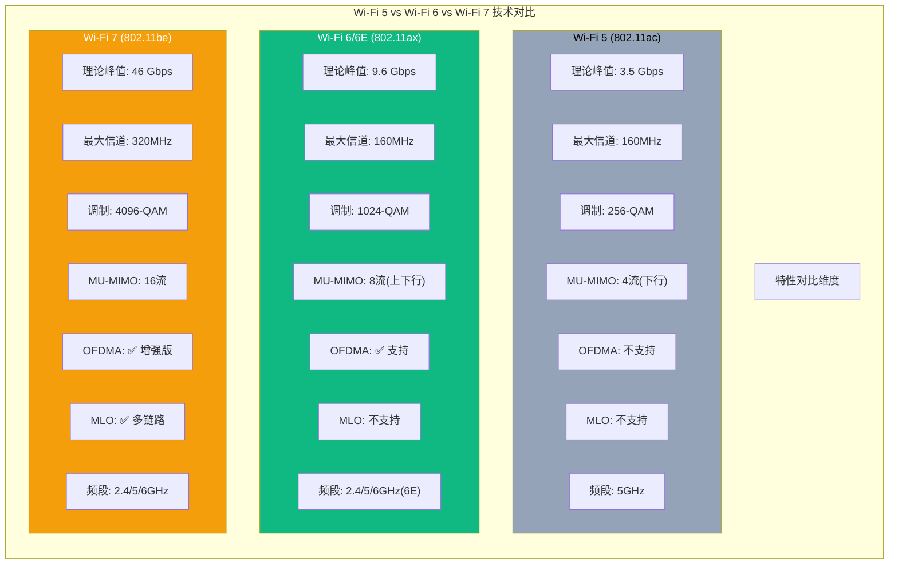
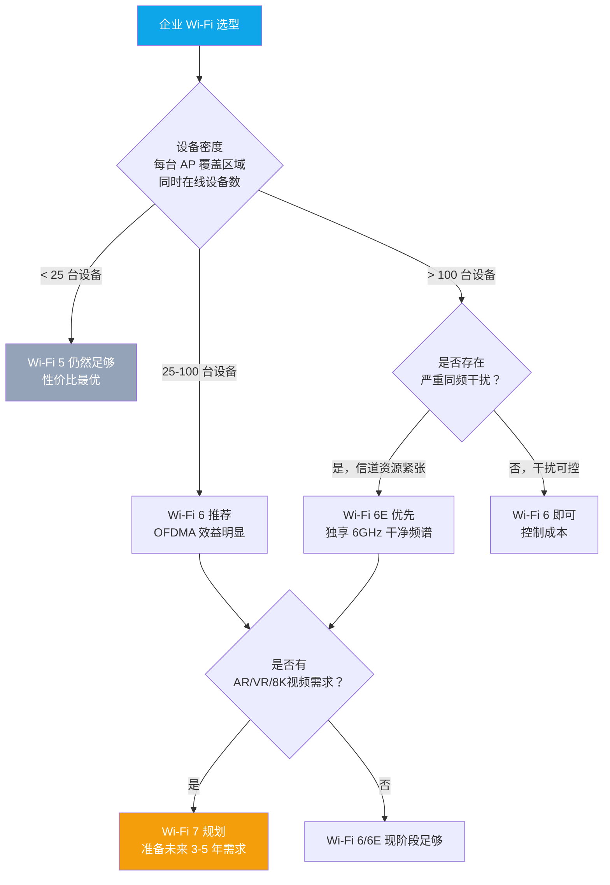
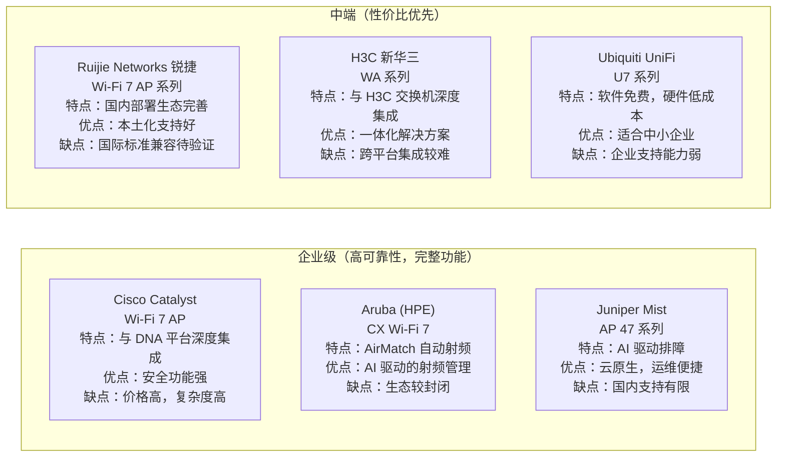
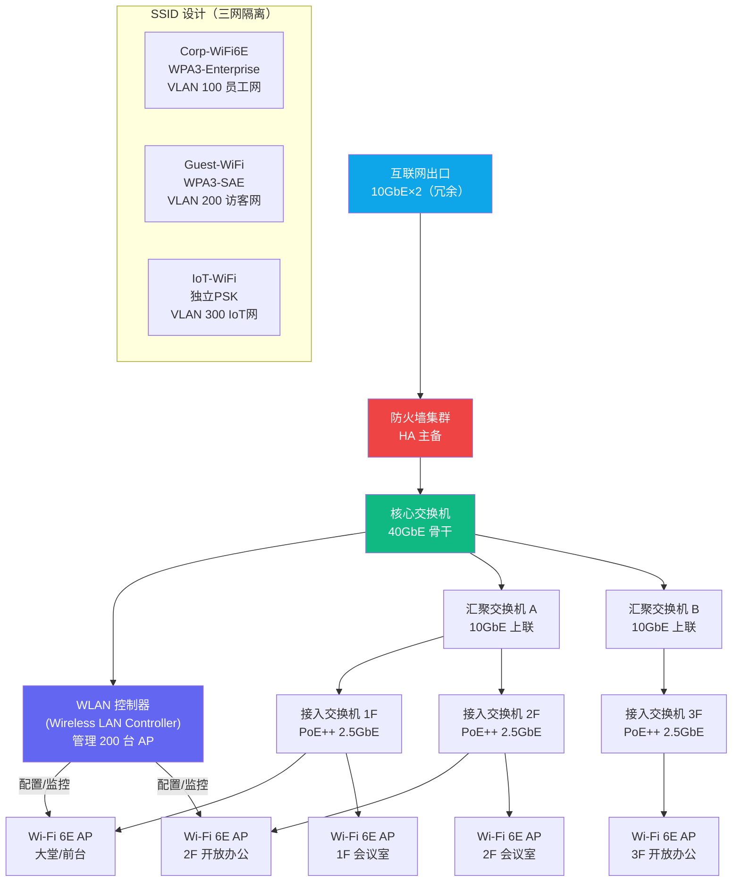

> 📋 **前置知识**：[网络基础模型](/guide/basics/osi)、[以太网交换](/guide/basics/switching)
> ⏱️ **阅读时间**：约 20 分钟

# Wi-Fi 6/6E/7：无线网络新纪元

---

## 为什么我们需要更快的 Wi-Fi？

**2019 年，某大型互联网公司的北京总部会议室。**

早上 9 点，周一例会刚开始。投影仪连着笔记本，Zoom 视频会议卡成了幻灯片，技术总监的 PPT 加载到一半就停住了。楼道里的同事抱怨说手机上的钉钉消息发不出去，楼层里同时在线的设备已经超过 300 台——每个人都有手机、笔记本，不少人还带着智能手表。

这不是带宽不够的问题。运营商的光纤已经跑满了千兆。**真正的瓶颈在空中。**

无线频谱是共享的物理资源。就像高峰期的高速公路，即使路面足够宽，如果所有车辆都用同一套交通规则争抢入口匝道，堵车就无法避免。传统 Wi-Fi（802.11ac，即 Wi-Fi 5）的接入机制让每台设备轮流独占信道，设备越多，每台设备等待的时间就越长，体感速度就越差。

**Wi-Fi 6（802.11ax）的出现，正是为了解决这个问题——不是简单地"提速"，而是从根本上重新设计无线访问机制。**

> 💡 **思考题**：为什么同一根百兆光纤接入，有线连接的电脑能跑满带宽，而 Wi-Fi 接入的手机却只有 20Mbps？问题出在哪个环节？

---

## Wi-Fi 标准演进历史

Wi-Fi 从 1999 年的 802.11b 发展至今，每一代标准都对应着特定时代的网络需求。



关键里程碑解读：

| 标准 | 品牌名 | 年份 | 理论峰值 | 核心突破 |
|------|--------|------|---------|---------|
| 802.11b | — | 1999 | 11 Mbps | Wi-Fi 商业化起步 |
| 802.11g | — | 2003 | 54 Mbps | OFDM 引入，兼容 2.4GHz |
| 802.11n | Wi-Fi 4 | 2009 | 600 Mbps | MIMO 多天线，双频段 |
| 802.11ac | Wi-Fi 5 | 2013 | 3.5 Gbps | MU-MIMO（下行），波束成形 |
| 802.11ax | Wi-Fi 6 | 2019 | 9.6 Gbps | OFDMA，上下行MU-MIMO，BSS Coloring，TWT |
| 802.11ax | Wi-Fi 6E | 2021 | 9.6 Gbps | 新增 6GHz 频段，14 个 80MHz 信道 |
| 802.11be | Wi-Fi 7 | 2024 | 46 Gbps | MLO 多链路，320MHz，4096-QAM |

::: tip 命名规则
Wi-Fi Alliance 从 2018 年开始推行 Wi-Fi 4/5/6/7 的简化命名，便于消费者识别。但工程师在设备配置和标准文档中仍然使用 802.11 后缀命名。
:::

---

## Wi-Fi 6 (802.11ax) 核心技术

Wi-Fi 6 的技术革新不是单点突破，而是一套系统性的信道利用率优化。下面逐一拆解其四大核心机制。

### OFDMA：多用户频谱复用

**从"轮流使用"到"同时共享"。**

Wi-Fi 5 使用 OFDM（正交频分复用，Orthogonal Frequency Division Multiplexing）技术——信道内的所有子载波（Subcarrier）在同一时刻只服务一个用户。当设备 A 传输数据时，设备 B 只能等待。

Wi-Fi 6 引入 OFDMA（正交频分多址，Orthogonal Frequency Division Multiple Access），将信道在**时域和频域**同时切分，形成资源单元（RU，Resource Unit）。AP（接入点，Access Point）可以在同一时间槽内同时调度多个用户，每个用户占用不同的子载波组合。



**资源单元（RU）大小**：

| RU 类型 | 子载波数 | 适用场景 |
|---------|---------|---------|
| RU-26 | 26 个 | IoT 设备、小包数据 |
| RU-52 | 52 个 | 普通手机应用 |
| RU-106 | 106 个 | 视频流媒体 |
| RU-242 | 242 个 | 20MHz 全信道 |
| RU-484 | 484 个 | 40MHz 全信道 |
| RU-996 | 996 个 | 80MHz 全信道 |

**实际效果**：在高密度场景（如会议室 50 台设备同时在线），OFDMA 可将每台设备的等待延迟降低至原来的 1/4 以下，整体吞吐量提升 4 倍左右。

> 💡 **思考题**：OFDMA 对大文件传输场景（如备份服务器）有明显提升吗？为什么？（提示：考虑 RU 的粒度和调度开销。）

### MU-MIMO：多用户多天线

Wi-Fi 5 已引入下行 MU-MIMO（多用户多输入多输出，Multi-User Multiple Input Multiple Output），支持同时向最多 4 台设备发射独立数据流。

Wi-Fi 6 将其升级为**上下行双向 MU-MIMO**，并将空间流数从 4 提升至 **8**。



::: warning 注意
MU-MIMO 的效益高度依赖客户端设备的支持。如果终端设备只支持 1×1 MIMO（如部分低端 IoT 设备），AP 的多流能力完全无法发挥。在选型 AP 时，需评估实际终端设备的 MIMO 能力分布。
:::

### BSS Coloring：空间复用提升

**同频干扰是高密度部署的头号杀手。**

在传统 Wi-Fi 中，当某台设备监测到信道上有任何其他信号（哪怕来自完全不相关的 AP），它都会触发 CSMA/CA（载波侦听多路访问/冲突避免，Carrier Sense Multiple Access with Collision Avoidance）退避机制，停止发送数据等待信道空闲。

Wi-Fi 6 引入 BSS Coloring（基本服务集着色，Basic Service Set Coloring）机制：为每个 BSS（基本服务集）分配一个 1-63 的"颜色"标识，写入每个数据帧的头部。

- 当设备检测到的信号属于**不同颜色**（不同 BSS），则判断为"可忽略干扰"，直接发送数据
- 当信号属于**相同颜色**（同一 BSS），才正常执行退避

**效果**：在多 AP 部署的高密度场景中，BSS Coloring 可减少约 20-30% 的不必要信道等待时间。

::: tip 最佳实践
部署多台 Wi-Fi 6 AP 时，务必通过控制器配置 BSS Color 自动分配，避免相邻 AP 使用相同颜色。主流控制器（如 Cisco Catalyst Center、Aruba Central）已支持自动 BSS Color 冲突检测与重新分配。
:::

### TWT：目标唤醒时间

TWT（Target Wake Time，目标唤醒时间）是专为物联网（IoT）设备优化的省电机制。

**传统方案**：设备必须定期"唤醒"侦听 AP 的 Beacon 帧，即使没有数据传输，这个轮询本身也消耗电量。

**TWT 方案**：AP 与每台设备单独协商唤醒时间表。设备在约定的时间窗口才会唤醒，其余时间完全进入深度睡眠。

```
TWT 调度示意（5 台 IoT 设备）：

时间轴：|------|------|------|------|------|------|
         0ms    20ms   40ms   60ms   80ms   100ms

传感器 A：[唤醒]              [唤醒]
传感器 B：       [唤醒]              [唤醒]
传感器 C：              [唤醒]              [唤醒]
传感器 D：[唤醒]       [唤醒]       [唤醒]
传感器 E：                     [唤醒]

效果：
  - 同一时刻唤醒的设备数大幅减少 → 信道竞争降低
  - 设备睡眠时间延长 → 电池寿命提升 3-7 倍
```

::: tip 最佳实践
在智慧仓储、智慧农业等 IoT 密集场景，TWT 是 Wi-Fi 6 的最大价值点之一。部署时建议为 IoT 设备单独划分 SSID（服务集标识符），并在 AP 上开启 TWT 独立调度策略。
:::

---

## Wi-Fi 6E：6GHz 频段的突破

Wi-Fi 6E 并非全新标准，而是将 Wi-Fi 6（802.11ax）扩展至 **6GHz 频段**（5.925–7.125 GHz）运行。

**为什么 6GHz 频段如此珍贵？**

```
频段对比：

2.4GHz 频段：
  总带宽：83.5 MHz
  非重叠信道：3 个（信道 1/6/11）
  已经极度拥挤（微波炉、蓝牙、Zigbee 都在这）

5GHz 频段：
  总带宽：约 500 MHz（各国差异）
  非重叠 80MHz 信道：约 6 个
  已有大量 Wi-Fi 5/6 设备占用

6GHz 频段（Wi-Fi 6E 新增）：
  总带宽：1200 MHz（美国开放，中国部分开放）
  非重叠 80MHz 信道：14 个
  非重叠 160MHz 信道：7 个
  几乎全是新设备，干扰极低
```

**6GHz 的代价**：频率越高，穿墙能力越弱。6GHz 信号在穿越一堵混凝土墙后，衰减比 2.4GHz 多约 10-15dB，相当于覆盖半径缩短 40-50%。这意味着 6GHz 部署需要更高的 AP 密度。

::: warning 注意
Wi-Fi 6E 在中国大陆的 6GHz 频段使用受到管制。截至 2025 年，工信部已批准室内低功率使用部分 6GHz 频段（5.925-6.425 GHz），但户外高功率使用仍受限制。企业部署前需确认当地监管政策。
:::

**Wi-Fi 6E 的理想场景**：

- 高密度会议室（需要低干扰的干净频谱）
- 视频制作工作站（需要稳定的 160MHz 宽信道）
- 医疗设备接入（对干扰敏感，需要专用频谱）
- AR/VR 设备（需要极低延迟和大带宽）

> 💡 **思考题**：一栋 10 层的写字楼，每层 20 间办公室，你会如何规划 2.4GHz、5GHz、6GHz 三个频段的使用策略？

---

## Wi-Fi 7 (802.11be)：下一代无线

Wi-Fi 7 于 2024 年正式发布，其定位是为 AR/VR、8K 视频、云游戏等极致带宽需求场景提供无线基础设施。它引入了三项颠覆性技术。

### MLO 多链路操作

MLO（Multi-Link Operation，多链路操作）是 Wi-Fi 7 最核心的创新，彻底改变了客户端与 AP 的关联方式。

```mermaid
graph TD
    subgraph AP7["Wi-Fi 7 AP（Multi-Link AP）"]
        L24["2.4GHz 链路\n40MHz 信道"]
        L5["5GHz 链路\n160MHz 信道"]
        L6["6GHz 链路\n320MHz 信道"]
    end

    subgent Client["Wi-Fi 7 客户端"]

    L24 <-->|"链路 1：低延迟控制"| Client
    L5 <-->|"链路 2：均衡数据流"| Client
    L6 <-->|"链路 3：高带宽数据流"| Client

    subgraph MLO_Mode["MLO 工作模式"]
        M1["同步传输模式\n三链路同时传输\n聚合带宽最大化"]
        M2["异步传输模式\n链路独立调度\n延迟最小化"]
        M3["负载均衡模式\n数据包级别路由\n跨链路均衡"]
    end

    style AP7 fill:#0ea5e9,color:#fff
    style Client fill:#10b981,color:#fff
    style MLO_Mode fill:#fef3c7
```

**MLO 解决的核心问题**：

1. **带宽聚合**：三个频段同时传输，理论带宽可达 46 Gbps
2. **延迟保障**：如果某个频段出现拥塞，数据包自动切换到空闲频段，无感知切换
3. **可靠性提升**：关键数据包可在多个链路上同时发送，任何一条链路成功即可

::: tip 最佳实践
MLO 的完整效益需要 AP 和客户端双方都支持 Wi-Fi 7。目前（2025年）支持 Wi-Fi 7 MLO 的终端设备包括 iPhone 16 系列、部分 Android 旗舰机型和 Intel Core Ultra 芯片组的笔记本。
:::

### 4096-QAM 调制

QAM（正交幅度调制，Quadrature Amplitude Modulation）决定了每个无线符号（Symbol）携带的信息量。

| 调制方式 | 每符号比特数 | Wi-Fi 标准 |
|---------|------------|-----------|
| 64-QAM | 6 bits | Wi-Fi 4/5 |
| 256-QAM | 8 bits | Wi-Fi 5/6 |
| 1024-QAM | 10 bits | Wi-Fi 6 |
| **4096-QAM** | **12 bits** | **Wi-Fi 7** |

从 1024-QAM 到 4096-QAM，每符号多携带 2 bit，理论上可提升约 20% 的频谱效率。

::: warning 注意
高阶调制对信号质量（SNR，信噪比）要求极高。4096-QAM 需要 SNR 高于 **51 dB** 才能稳定工作，这意味着客户端与 AP 之间需要保持较近距离（通常 < 5 米），在大型办公室或工厂环境中往往无法发挥效益。
:::

### 320MHz 信道

Wi-Fi 7 将最大信道宽度从 160MHz 翻倍至 **320MHz**，信道仅在 6GHz 频段可用（因为只有 6GHz 拥有足够的连续带宽）。

```
6GHz 频段信道规划（部分示例）：

总带宽：1200 MHz

80MHz 信道：  [CH1][CH5][CH9][CH13]...[CH57] (14个)
160MHz 信道： [  CH1  ][  CH9  ]...[  CH49  ] (7个)
320MHz 信道： [     CH1     ][     CH17    ]...(3个)

320MHz 信道在标准使用中占用整个 6GHz 频段的 1/4，
在多 AP 场景需要仔细规划信道复用，避免相邻 AP 干扰。
```

---

## 核心技术对比



以下是结构化的完整对比表格：

| 技术特性 | Wi-Fi 5 (802.11ac) | Wi-Fi 6 (802.11ax) | Wi-Fi 6E | Wi-Fi 7 (802.11be) |
|---------|-------------------|-------------------|----------|-------------------|
| 理论峰值速率 | 3.5 Gbps | 9.6 Gbps | 9.6 Gbps | 46 Gbps |
| 最大信道宽度 | 160 MHz | 160 MHz | 160 MHz | **320 MHz** |
| 最高调制 | 256-QAM | 1024-QAM | 1024-QAM | **4096-QAM** |
| 空间流数 | 4（下行） | 8（上下行） | 8（上下行） | 16（上下行） |
| OFDMA | 不支持 | ✅ 上下行 | ✅ 上下行 | ✅ 增强 |
| MU-MIMO | 下行 | 上下行 | 上下行 | 上下行 |
| MLO 多链路 | ✗ | ✗ | ✗ | ✅ |
| BSS Coloring | ✗ | ✅ | ✅ | ✅ |
| TWT 节能 | ✗ | ✅ | ✅ | ✅ 增强 |
| 可用频段 | 5GHz | 2.4/5GHz | 2.4/5/**6GHz** | 2.4/5/**6GHz** |
| 目标场景 | 家用/中密度 | 高密度企业 | 超高密度/低干扰 | 极限性能/AR/VR |

---

## 企业部署实战

### 适用场景选型

选择 Wi-Fi 标准不是追新，而是对业务需求的精准匹配。



**具体场景推荐**：

| 场景 | 推荐标准 | 关键理由 |
|------|---------|---------|
| 普通办公室（< 50人） | Wi-Fi 6 | OFDMA 提升多设备并发体验 |
| 大型开放式办公区（> 200人） | Wi-Fi 6E | 6GHz 提供干净频谱，减少干扰 |
| 医院病房/手术室 | Wi-Fi 6E | 需要高可靠性，医疗设备密集 |
| 展览馆/体育场 | Wi-Fi 6E | 极高密度（>500台/AP覆盖区域） |
| 工厂/仓库 IoT 部署 | Wi-Fi 6 | TWT 延长传感器电池寿命 |
| 视频制作/广播间 | Wi-Fi 7 | 需要 320MHz 稳定大带宽 |
| 学校教室 | Wi-Fi 6 | 每间教室 30-50 台设备 |

### 部署注意事项

**1. AP 部署密度**

```
经验值（高密度会议室场景）：

Wi-Fi 5 AP：建议 15-20 台设备/AP
Wi-Fi 6 AP：建议 50-75 台设备/AP（OFDMA 提升并发）
Wi-Fi 6E AP：建议 100+ 台设备/AP（6GHz 频段干净）

注意：以上为并发活跃设备数，非关联设备总数。
```

**2. 有线回传（Backhaul）规划**

::: danger 避坑
许多企业升级到 Wi-Fi 6 AP 后性能提升不明显，原因是忘记升级有线回传。Wi-Fi 6 AP 的峰值吞吐量可达数 Gbps，如果接入交换机端口是 1GbE，有线侧立即成为瓶颈。

**规则**：
- Wi-Fi 6 AP → 至少 1GbE 有线回传，推荐 **2.5GbE 或 5GbE**
- Wi-Fi 6E AP → 推荐 **5GbE 或 10GbE** 有线回传
- Wi-Fi 7 AP → 推荐 **10GbE** 有线回传
:::

**3. 信道规划**

```
2.4GHz 信道规划（三信道复用）：
AP 1: 信道 1
AP 2: 信道 6
AP 3: 信道 11
AP 4: 信道 1（与 AP 1 保持足够物理距离）

5GHz 信道规划（使用 80MHz 非重叠信道）：
AP 1: 信道 36 (36-48)
AP 2: 信道 52 (52-64)
AP 3: 信道 100 (100-112)
AP 4: 信道 149 (149-161)
```

**4. WPA3 安全强制**

Wi-Fi 6/6E/7 设备均原生支持 WPA3（Wi-Fi 保护访问第三版，Wi-Fi Protected Access 3）。企业网络应强制启用：

- **WPA3-Enterprise**：用于员工设备，配合 802.1X 和 RADIUS 认证
- **WPA3-SAE**（Simultaneous Authentication of Equals）：替代 WPA2-PSK，防止离线字典攻击
- **PMF**（Protected Management Frames，保护管理帧）：防止 Deauth 攻击

::: tip 最佳实践
为企业 WLAN 设计三网隔离架构：
1. **员工网络**：WPA3-Enterprise + 802.1X，VLAN 隔离
2. **访客网络**：WPA3-SAE + 带宽限速 + 强制 Portal 认证
3. **IoT 网络**：独立 SSID + 严格 ACL + TWT 开启

三网在同一套 AP 基础设施上运行，但通过 VLAN 和策略严格隔离。
:::

**5. 漫游优化**

在多 AP 部署中，终端在 AP 间切换（漫游）会导致短暂断线。推荐配置：

- **802.11r**（FT，Fast BSS Transition）：漫游时间从 200ms 降至 50ms 以下
- **802.11k**：邻居报告，帮助终端发现更好的 AP
- **802.11v**：AP 主动引导终端切换到更合适的 AP（BSS Transition Management）

这三者合称"**RVK 三件套**"，是企业 Wi-Fi 漫游的标准配置。

### 主流厂商对比（中立视角）



| 厂商 | 产品线 | Wi-Fi 7 支持 | 管理方式 | 适用规模 | 参考价格（AP） |
|------|--------|------------|---------|---------|------------|
| Cisco | Catalyst 9136/9166 | ✅ | DNA Center / Meraki 云 | 大型企业 | ¥8,000-20,000 |
| Aruba (HPE) | AP-730 系列 | ✅ | Aruba Central 云 | 中大型企业 | ¥6,000-15,000 |
| Juniper | AP47 / AP45 | ✅ | Mist AI 云 | 中大型企业 | ¥5,000-12,000 |
| 锐捷 | RG-AP880 系列 | ✅ | RG-WS 控制器 / 云 | 国内各规模 | ¥2,000-6,000 |
| 新华三 | WA6638/WA7638 | ✅ | iMC / 云平台 | 国内中大型 | ¥3,000-8,000 |
| Ubiquiti | UniFi U7 Pro | ✅ | UniFi Controller | 中小企业 | ¥1,500-3,000 |

::: tip 最佳实践
选型建议优先级：

1. **优先看控制器**：AP 只是射频硬件，控制器决定运维体验。评估前先体验控制器的 UI 和 API。
2. **关注回传设备兼容性**：是否支持 PoE++ (802.3bt，60W)？Wi-Fi 7 AP 功耗普遍达到 30-50W。
3. **考察本地支持能力**：国际品牌在偏远地区的 RMA（返修）周期可能超过 2 周。
4. **规划生命周期**：Wi-Fi 6E AP 的生命周期通常 5-7 年，与现有交换机/控制器平台的演进路线需一致。
:::

::: danger 避坑
**避免"最快"陷阱**：部分厂商宣传的"Wi-Fi 7, 30 Gbps"是理论极值，需要所有频段同时以最大调制运行，现实中基本不可能达到。评估时要关注**实际平均吞吐量**和**并发用户下的延迟**，而非峰值速率。

**避免"信道越宽越好"**：320MHz 信道在 6GHz 频段只有 3 个可用，多 AP 共存时信道复用极为有限，相邻 AP 极易互相干扰。大多数场景下 80MHz 或 160MHz 是更务实的选择。
:::

---

## 企业部署架构示例

以下是一个典型的 2000 人规模总部办公楼的 Wi-Fi 6E 部署架构：



---

## 总结与下一步

### 知识回顾

| 技术 | 解决的问题 | 适用场景 |
|------|-----------|---------|
| OFDMA | 多设备并发竞争信道 | 高密度办公室、会议室 |
| MU-MIMO (上下行) | 多用户同时收发 | 中高密度场景 |
| BSS Coloring | 相邻 AP 同频干扰 | 多 AP 密集部署 |
| TWT | IoT 设备电池寿命 | 智慧楼宇、工厂 |
| 6GHz 频段（Wi-Fi 6E） | 频谱拥挤，干扰严重 | 极高密度场景 |
| MLO（Wi-Fi 7） | 单链路带宽/延迟瓶颈 | AR/VR、超高带宽应用 |
| 4096-QAM（Wi-Fi 7） | 提升频谱效率 | 近距离、高 SNR 场景 |
| 320MHz（Wi-Fi 7） | 单流带宽不足 | 视频制作、特定专业场景 |

### 认知升级：Wi-Fi 不只是"无线"

Wi-Fi 6/7 标准的演进揭示了一个更深层的规律：**无线网络的瓶颈已经从"速率"转移到"调度效率"**。

- Wi-Fi 4/5 时代：我的设备能跑多快？（单设备性能）
- Wi-Fi 6/6E 时代：这么多设备怎么高效共享频谱？（多设备并发调度）
- Wi-Fi 7 时代：如何突破单链路限制，在物理上并行？（多链路聚合）

这与有线网络的演进路径高度相似：从单核到多核，从单链路到链路聚合（LACP），从单路径到 ECMP 等价多路径路由。**无线和有线的融合趋势将在 Wi-Fi 7 时代更加明显**。

### 下一步学习路径

- **深入 RF 规划**：了解 [无线射频规划工具](https://www.ekahau.com/) 的使用方法
- **理解 WLAN 安全**：深入学习 [802.1X 与 RADIUS 认证](/guide/security/zero-trust)
- **关联 SD-WAN**：企业无线如何与 [SD-WAN 架构](/guide/sdwan/concepts) 融合，实现统一接入管理
- **云网管理**：探索云控制器（Cisco Meraki、Aruba Central）如何实现跨地域无线网络统一运维

> 💡 **终极思考题**：Wi-Fi 7 的 MLO 技术与 SD-WAN 的多链路聚合思想有何相似之处？如果要在企业网络中设计"有线 + 无线"的统一 QoS 策略，你会从哪些维度来规划？

---

*本文参考标准：IEEE 802.11ax-2021、IEEE 802.11be-2024，Wi-Fi Alliance 官方技术白皮书。技术规格以最终发布版本为准。*
